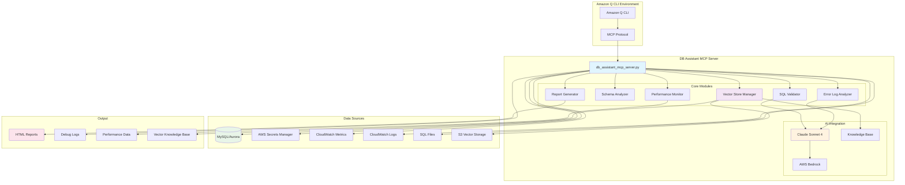
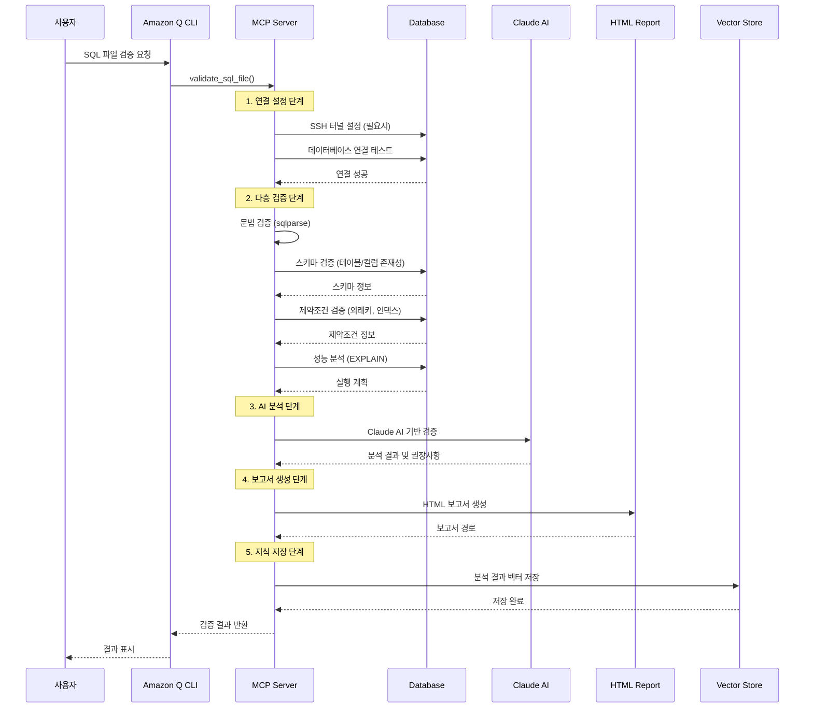
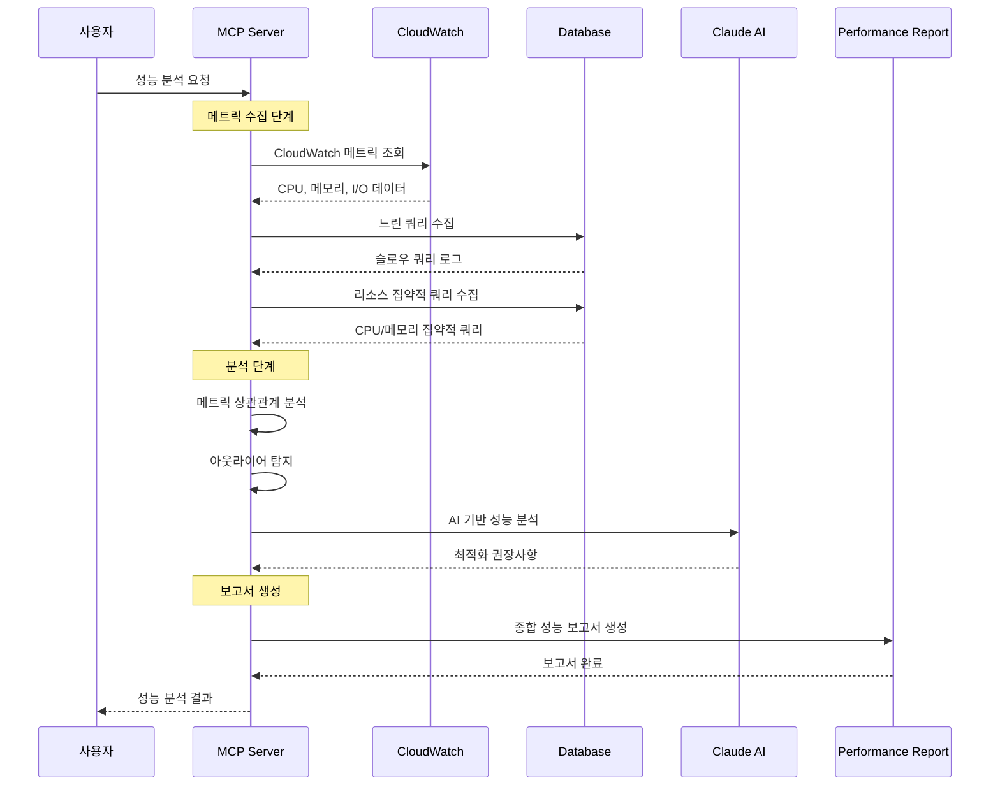
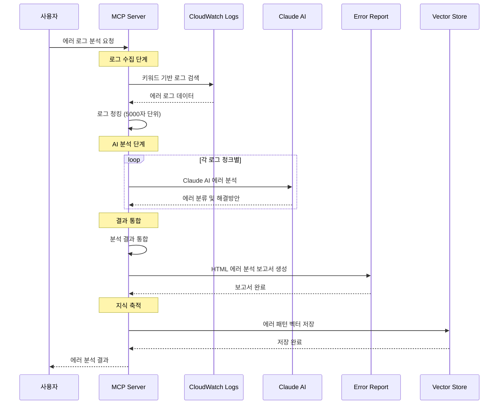

# 🗄️ DB Assistant MCP Server

**SQL 검증 및 성능분석을 위한 Amazon Q CLI MCP 서버**

[](https://python.org)
[](https://aws.amazon.com)
[](https://modelcontextprotocol.io)

## 📋 목차

- [🎯 개요](#-개요)
- [🏗️ 아키텍처](#️-아키텍처)
- [🔄 작동방식과 데이터 흐름](#-작동방식과-데이터-흐름)
- [⚙️ 함수 실행 순서](#️-함수-실행-순서)
- [✨ 주요 기능](#-주요-기능)
- [🔧 환경 설치](#-환경-설치)
- [🚀 간단한 예제 (실습)](#-간단한-예제-실습)
- [📊 고급 기능](#-고급-기능)
- [📁 파일 구조](#-파일-구조)
- [🔍 문제 해결](#-문제-해결)

## 🎯 개요

DB Assistant MCP Server는 **DDL 검증**, **데이터베이스 스키마 분석**, **성능 모니터링**, **에러 로그 분석**을 하나의 통합 서버에서 제공하는 Amazon Q CLI용 MCP(Model Context Protocol) 서버입니다.

### 🌟 핵심 가치

- **🔍 포괄적 검증**: 문법, 스키마, 제약조건, AI 기반 검증을 통합 제공
- **⚡ 실시간 분석**: 데이터베이스 성능 메트릭 실시간 모니터링
- **🤖 AI 지원**: Claude Sonnet 4를 활용한 고급 SQL 분석
- **📊 시각화**: HTML 기반 상세 보고서 자동 생성
- **🔗 통합 연결**: SSH 터널, AWS Secrets Manager 완벽 지원
- **🧠 지식 관리**: 벡터 저장소를 통한 분석 결과 축적 및 재활용

### 🎯 주요 사용 사례

- **개발팀**: SQL 코드 품질 검증 및 최적화
- **DBA**: 데이터베이스 성능 모니터링 및 문제 진단
- **DevOps**: CI/CD 파이프라인에서 자동화된 SQL 검증
- **데이터 엔지니어**: 스키마 변경 영향도 분석
- **운영팀**: 에러 로그 분석 및 장애 대응

## 🏗️ 아키텍처

### 시스템 아키텍처 다이어그램



## 🔄 작동방식과 데이터 흐름

### 1. 기본 SQL 검증 워크플로우



### 2. 성능 모니터링 워크플로우



### 3. 에러 로그 분석 워크플로우



## ⚙️ 함수 실행 순서

### 1. 초기화 및 설정 함수들

```python
# 1. 서버 초기화
__init__()
├── Bedrock 클라이언트 초기화
├── Knowledge Base 설정
├── 기본 리전 설정
└── 성능 임계값 설정

# 2. 연결 설정
get_secret() → setup_ssh_tunnel() → test_database_connection()
```

### 2. SQL 검증 함수 실행 순서

```python
# 메인 검증 함수
validate_sql_file(filename, database_secret)
├── 1. list_sql_files() # SQL 파일 목록 확인
├── 2. get_secret(database_secret) # DB 연결 정보 조회
├── 3. setup_ssh_tunnel() # SSH 터널 설정 (필요시)
├── 4. test_database_connection() # 연결 테스트
├── 5. parse_ddl_statements() # SQL 구문 파싱
├── 6. validate_individual_ddl_statements() # 개별 구문 검증
│   ├── 6.1. validate_schema_with_cursor() # 스키마 검증
│   ├── 6.2. validate_constraints_with_cursor() # 제약조건 검증
│   ├── 6.3. execute_explain_with_cursor() # 성능 분석
│   └── 6.4. check_performance_issues() # 성능 문제 탐지
├── 7. query_knowledge_base() # Knowledge Base 조회
├── 8. validate_with_claude() # Claude AI 검증
├── 9. generate_html_report() # HTML 보고서 생성
└── 10. save_to_vector_store() # 결과 벡터 저장
```

### 3. 성능 모니터링 함수 실행 순서

```python
# 종합 성능 분석
generate_comprehensive_performance_report()
├── 1. setup_cloudwatch_client() # CloudWatch 클라이언트 설정
├── 2. collect_db_metrics() # 메트릭 수집
├── 3. collect_slow_queries() # 느린 쿼리 수집
├── 4. collect_cpu_intensive_queries() # CPU 집약적 쿼리
├── 5. collect_memory_intensive_queries() # 메모리 집약적 쿼리
├── 6. collect_temp_space_intensive_queries() # 임시공간 집약적 쿼리
├── 7. analyze_metric_correlation() # 상관관계 분석
├── 8. detect_metric_outliers() # 아웃라이어 탐지
├── 9. perform_regression_analysis() # 회귀 분석
└── 10. generate_performance_html_report() # 성능 보고서 생성
```

### 4. 에러 로그 분석 함수 실행 순서

```python
# 에러 로그 분석
analyze_aurora_mysql_error_logs()
├── 1. _get_secrets_by_keyword() # 키워드로 시크릿 검색
├── 2. convert_kst_to_utc() # 시간대 변환
├── 3. get_log_events() # CloudWatch 로그 수집
├── 4. _split_log_content() # 로그 청킹
├── 5. _analyze_error_logs_with_claude() # Claude AI 분석
├── 6. _generate_error_log_html_report() # HTML 보고서 생성
└── 7. save_to_vector_store() # 분석 결과 저장
```

### 5. 벡터 저장소 관리 함수 순서

```python
# 벡터 저장소 워크플로우
save_to_vector_store()
├── 1. _check_content_similarity() # 중복 검사
├── 2. _search_similar_content() # 유사 내용 검색
├── 3. _analyze_content_conflicts() # 충돌 분석
├── 4. _extract_keywords() # 키워드 추출
├── 5. 로컬 파일 저장 (Markdown)
├── 6. S3 업로드
└── 7. sync_knowledge_base() # Knowledge Base 동기화
```

## ✨ 주요 기능

### 🔍 SQL 검증 엔진

#### 1. 다층 검증 시스템
- **문법 검증**: SQL 구문 오류 탐지 (sqlparse 활용)
- **스키마 검증**: 테이블/컬럼 존재성 확인
- **제약조건 검증**: 외래키, 인덱스 충돌 검사
- **AI 검증**: Claude Sonnet 4를 활용한 고급 분석

#### 2. 지원하는 SQL 구문
```sql
-- DDL 구문
CREATE TABLE, ALTER TABLE, DROP TABLE
CREATE INDEX, DROP INDEX
CREATE VIEW, DROP VIEW

-- DML 구문  
SELECT, INSERT, UPDATE, DELETE
WITH (CTE) 구문

-- 고급 구문
STORED PROCEDURES, FUNCTIONS
TRIGGERS, CONSTRAINTS
```

### 📊 성능 모니터링

#### 1. 실시간 메트릭 수집
- CPU 사용률, 메모리 사용량
- I/O 통계, 네트워크 처리량
- 연결 수, 락 상태
- 느린 쿼리 분석

#### 2. CloudWatch 통합
```python
# 지원하는 메트릭
default_metrics = [
    "CPUUtilization",
    "DatabaseConnections", 
    "DBLoad",
    "DBLoadCPU",
    "DBLoadNonCPU",
    "FreeableMemory",
    "ReadIOPS",
    "WriteIOPS",
    "ReadLatency",
    "WriteLatency",
    "NetworkReceiveThroughput",
    "NetworkTransmitThroughput",
    "BufferCacheHitRatio"
]
```

### 🤖 AI 기반 분석

#### Claude Sonnet 4 통합
- **코드 품질 분석**: 성능 최적화 제안
- **보안 취약점 탐지**: SQL 인젝션 등
- **베스트 프랙티스 검증**: 네이밍 규칙, 인덱스 설계
- **성능 최적화 권장사항**: 쿼리 튜닝 제안

### 📈 보고서 생성

#### HTML 보고서 특징
- **반응형 디자인**: 모바일/데스크톱 최적화
- **인터랙티브 차트**: 성능 메트릭 시각화  
- **상세 분석**: 문제점별 해결방안 제시
- **다운로드 가능**: PDF 변환 지원

### 🧠 벡터 저장소 통합

#### Knowledge Base 연동
- **자동 저장**: 분석 결과를 벡터 저장소에 자동 저장
- **중복 검사**: 70% 이상 유사도 시 중복으로 판단
- **충돌 분석**: Claude AI로 내용 충돌 검사
- **메타데이터 관리**: YAML 헤더로 구조화된 정보 관리

### 🔍 에러 로그 분석

#### Aurora MySQL 에러 로그 분석
- **키워드 기반 검색**: 특정 키워드로 시크릿 자동 검색
- **시간 범위 필터링**: KST 기준 시간 범위 지정
- **로그 청킹**: 5000자 단위로 분할하여 AI 분석
- **자동 분류**: 심각도별 에러 분류 및 해결방안 제시

## 🔧 환경 설치

### 1. 시스템 요구사항

#### 필수 요구사항
- **Python**: 3.8 이상
- **AWS CLI**: 구성된 자격 증명
- **MySQL Connector**: Python 라이브러리
- **MCP**: Model Context Protocol 지원

#### 권장 환경
- **OS**: macOS, Linux, Windows WSL
- **메모리**: 4GB 이상
- **디스크**: 1GB 여유 공간
- **네트워크**: AWS 서비스 접근 가능

### 2. AWS 권한 설정

#### 필수 IAM 권한
```json
{
    "Version": "2012-10-17",
    "Statement": [
        {
            "Effect": "Allow",
            "Action": [
                "bedrock-runtime:InvokeModel",
                "bedrock-agent-runtime:Retrieve",
                "bedrock-agent-runtime:RetrieveAndGenerate",
                "secretsmanager:GetSecretValue",
                "secretsmanager:ListSecrets",
                "cloudwatch:GetMetricData",
                "logs:FilterLogEvents",
                "logs:DescribeLogGroups",
                "rds:DescribeDBInstances",
                "rds:DescribeDBClusters",
                "s3:GetObject",
                "s3:PutObject",
                "s3:ListBucket"
            ],
            "Resource": "*"
        }
    ]
}
```

### 3. Python 환경 설정

#### 가상환경 생성 및 패키지 설치
```bash
# Python 가상환경 생성
python -m venv venv
source venv/bin/activate  # Linux/Mac
# 또는 Windows의 경우
venv\Scripts\activate

# 핵심 패키지 설치
pip install boto3 mysql-connector-python mcp

# 분석 패키지 설치 (선택사항)
pip install pandas numpy matplotlib scikit-learn sqlparse
```

#### requirements.txt 예시
```txt
boto3>=1.28.0
mysql-connector-python>=8.0.33
mcp>=0.1.0
pandas>=1.5.0
numpy>=1.24.0
matplotlib>=3.6.0
scikit-learn>=1.2.0
sqlparse>=0.4.0
```

### 4. AWS 자격 증명 설정

#### AWS CLI 설정
```bash
# AWS CLI 설정
aws configure
# AWS Access Key ID: [your_access_key]
# AWS Secret Access Key: [your_secret_key]
# Default region name: ap-northeast-2
# Default output format: json

# 또는 환경 변수 설정
export AWS_ACCESS_KEY_ID=your_access_key
export AWS_SECRET_ACCESS_KEY=your_secret_key
export AWS_DEFAULT_REGION=ap-northeast-2
```

#### AWS 프로파일 설정 (선택사항)
```bash
# ~/.aws/credentials 파일
[default]
aws_access_key_id = your_access_key
aws_secret_access_key = your_secret_key

[db-assistant]
aws_access_key_id = your_db_access_key
aws_secret_access_key = your_db_secret_key
region = ap-northeast-2
```

### 5. MCP 서버 등록

#### Amazon Q CLI 설정
`~/.aws/amazonq/mcp.json` 파일에 다음 설정 추가:

```json
{
  "mcpServers": {
    "db-assistant": {
      "command": "/Users/heungh/.pyenv/versions/3.11.9/bin/python",
      "args": [
        "/Users/heungh/Documents/SA/05.Project/01.Infra-Assistant/01.DB-Assistant/db_assistant_mcp_server.py"
      ],
      "env": {
        "AWS_DEFAULT_REGION": "ap-northeast-2",
        "PYTHONPATH": "/Users/heungh/Documents/SA/05.Project/01.Infra-Assistant/01.DB-Assistant",
        "PATH": "/Users/heungh/.pyenv/versions/3.11.9/bin:/usr/bin:/bin:/usr/local/bin"
      },
      "disabled": false,
      "timeout": 150000,
      "autoApprove": [
        "list_sql_files",
        "list_database_secrets",
        "get_schema_summary",
        "get_performance_metrics"
      ]
    }
  }
}
```

### 6. 데이터베이스 연결 설정

#### AWS Secrets Manager에 DB 정보 저장
```json
{
  "host": "your-db-host.amazonaws.com",
  "port": 3306,
  "username": "admin",
  "password": "your-password",
  "database": "your-database"
}
```

#### SSH 터널 설정 (선택사항)
```bash
# SSH 키 파일 권한 설정
chmod 400 /path/to/your-key.pem

# 터널 테스트
ssh -i /path/to/your-key.pem ec2-user@your-bastion-host

# 자동 터널 설정 (서버에서 자동 처리)
# setup_ssh_tunnel() 함수가 자동으로 처리
```

### 7. Knowledge Base 설정

#### Bedrock Knowledge Base 설정
```python
# 서버 초기화 시 자동 설정
KNOWLEDGE_BASE_ID = "0WQUBRHVR8"  # 실제 Knowledge Base ID로 변경

# S3 버킷 설정
S3_BUCKET = "bedrockagent-hhs"
S3_PREFIX = "database-knowledge/"
```

### 8. 설치 검증

#### 연결 테스트
```bash
# Amazon Q CLI 실행
q chat

# 연결 테스트 명령
"데이터베이스 연결을 테스트해주세요"
```

#### 기능 테스트
```bash
# SQL 파일 목록 확인
"SQL 파일 목록을 보여주세요"

# 시크릿 목록 확인
"데이터베이스 시크릿 목록을 보여주세요"

# 스키마 요약 확인
"데이터베이스 스키마 요약을 보여주세요"
```

## 🚀 간단한 예제 (실습)

### 기본 워크플로우

#### 1단계: SQL 파일 목록 확인
```bash
# Amazon Q CLI에서 실행
q chat
```

```
사용자: "SQL 파일 목록을 보여주세요"

응답:
📁 SQL 파일 목록 (총 15개):
✅ sample_create_table.sql (264 bytes)
✅ test_good_alter.sql (320 bytes)  
❌ test_bad_naming.sql (374 bytes)
❌ test_syntax_error.sql (685 bytes)
✅ sample_alter_table.sql (83 bytes)
...
```

#### 2단계: 데이터베이스 연결 테스트
```
사용자: "rds-mysql-dev-secret으로 데이터베이스 연결을 테스트해주세요"

응답:
✅ 데이터베이스 연결 성공!

🔗 연결 정보:
• 호스트: mysql-dev.cluster-xxx.ap-northeast-2.rds.amazonaws.com
• 포트: 3306
• 데이터베이스: testdb
• 서버 버전: 8.0.35-mysql
• 연결 방식: SSH Tunnel (ec2-user@54.180.79.255)

📊 데이터베이스 목록:
1. testdb (현재 선택됨)
2. userdb  
3. productdb
4. analytics_db
```

#### 3단계: 개별 SQL 파일 검증
```
사용자: "sample_create_table.sql 파일을 검증해주세요"

응답:
🔍 SQL 파일 검증 결과: sample_create_table.sql

✅ 모든 검증을 통과했습니다!

📊 검증 단계별 결과:
• 문법 검증: ✅ 통과 (0개 오류)
• 데이터베이스 연결: ✅ 성공
• 스키마 검증: ✅ 통과 (0개 문제)
• 제약조건 검증: ✅ 통과 (0개 충돌)
• Claude AI 검증: ✅ 통과 (우수한 코드 품질)

📄 상세 보고서: output/validation_report_sample_create_table.sql_20250820_143022.html

💡 Claude AI 분석:
"잘 구조화된 CREATE TABLE 구문입니다. 적절한 데이터 타입 선택과 
인덱스 설계가 돋보입니다. 성능상 문제없이 운영 환경에 적용 가능합니다."
```

#### 4단계: 성능 모니터링
```
사용자: "mysql-prod-instance의 최근 24시간 성능을 분석해주세요"

응답:
📊 데이터베이스 성능 분석 결과

🔥 주요 지표:
• CPU 사용률: 45.2% (정상)
• 메모리 사용률: 67.8% (주의)
• 활성 연결: 23/100 (양호)
• 평균 응답시간: 1.2ms (우수)

⚠️ 느린 쿼리 TOP 5:
1. SELECT * FROM users WHERE email LIKE '%@gmail.com%'
   - 실행횟수: 1,234회
   - 평균시간: 2.456초
   - 권장사항: email 컬럼에 인덱스 추가

2. SELECT u.*, p.* FROM users u JOIN posts p ON u.id = p.user_id
   - 실행횟수: 856회  
   - 평균시간: 1.892초
   - 권장사항: JOIN 조건 최적화

📈 시간대별 부하:
• 09:00-12:00: 높음 (평균 CPU 78%)
• 12:00-14:00: 보통 (평균 CPU 45%)
• 14:00-18:00: 높음 (평균 CPU 82%)
• 18:00-09:00: 낮음 (평균 CPU 23%)

💡 최적화 권장사항:
1. 인덱스 추가: users.email, posts.user_id
2. 쿼리 캐싱 활성화
3. 연결 풀 크기 조정 (현재: 100 → 권장: 150)

📄 상세 보고서: output/performance_report_mysql-prod-instance_20250908_140405.html
```

#### 5단계: 에러 로그 분석
```
사용자: "mysql 키워드로 최근 24시간 에러 로그를 분석해주세요"

응답:
🔍 Aurora MySQL 에러 로그 분석 완료

📊 분석 요약:
• 분석 기간: 2025-09-07 14:04:05 ~ 2025-09-08 14:04:05
• 대상 키워드: mysql
• 분석된 인스턴스: 3개
• 수집된 로그 청크: 5개

🤖 Claude AI 분석 결과:
심각한 에러 (높은 영향도):
1. Out of memory 에러 3건 - 메모리 부족으로 쿼리 실패
2. Lock wait timeout 에러 7건 - 동시성 문제로 트랜잭션 지연

주의 필요 에러 (중간 영향도):
3. Slow query 경고 15건 - 성능 저하 가능성
4. Connection refused 에러 2건 - 클라이언트 연결 문제

💡 권장 조치사항:
1. 메모리 사용량 모니터링 및 인스턴스 크기 검토
2. 인덱스 최적화로 쿼리 성능 개선
3. 연결 풀 설정 검토

📄 상세 보고서: output/error_log_analysis_20250908_140405.html
```

#### 6단계: 벡터 저장소 활용
```
사용자: "지금까지 나온 내용을 벡터에 저장해달라"

응답:
✅ 벡터 저장소에 저장 완료!

📁 로컬 저장: vector/20250908_dbanalysis.md
☁️ S3 저장: s3://bedrockagent-hhs/troubleshooting/20250908_dbanalysis.md
🏷️ 카테고리: troubleshooting
🔖 태그: database, analysis, performance, error-log, optimization, best-practices

💡 Knowledge Base 동기화를 위해 'sync_knowledge_base' 도구를 실행하세요.

사용자: "동기화해주세요"

응답:
✅ Knowledge Base 동기화 시작!

🔄 작업 ID: OSQOTPNUWD
📊 상태: STARTING
⏰ 시작 시간: 2025-09-08 05:45:36.124304+00:00

💡 동기화가 완료되면 새로운 내용을 Knowledge Base에서 검색할 수 있습니다.
상태 확인: AWS 콘솔 > Bedrock > Knowledge Base > 데이터 소스
```

### 고급 사용 시나리오

#### 스키마 상세 분석
```
사용자: "현재 데이터베이스 스키마를 상세 분석해주세요"

응답:
🗄️ 스키마 상세 분석 (데이터베이스: testdb)

📊 전체 요약:
• 총 테이블: 12개
• 총 컬럼: 89개  
• 총 인덱스: 23개
• 외래키: 8개
• 예상 데이터 크기: 2.3GB

📋 테이블별 상세 정보:

🔹 users (InnoDB, 1,250행)
   📝 컬럼 (5개):
   • id: INT(11) NOT NULL AUTO_INCREMENT [PRIMARY KEY]
   • email: VARCHAR(255) NOT NULL [UNIQUE]
   • name: VARCHAR(100) NOT NULL
   • created_at: TIMESTAMP DEFAULT CURRENT_TIMESTAMP
   • updated_at: TIMESTAMP DEFAULT CURRENT_TIMESTAMP ON UPDATE

   🔍 인덱스 (2개):
   • PRIMARY KEY (id) - BTREE
   • UNIQUE email_unique (email) - BTREE

   🔗 관계:
   • posts.user_id → users.id (1:N)
   • user_profiles.user_id → users.id (1:1)

⚠️ 발견된 문제점:
1. posts 테이블의 content 컬럼이 TEXT 타입 - 성능 영향 가능
2. 일부 테이블에 created_at 인덱스 누락
3. user_profiles 테이블에 불필요한 중복 인덱스 존재

💡 최적화 제안:
1. content 컬럼을 별도 테이블로 분리 고려
2. 자주 조회되는 날짜 컬럼에 인덱스 추가
3. 중복 인덱스 제거로 저장공간 절약
```

#### 동적 워크플로우 활용
```
사용자: "데이터베이스가 느려졌어요. 원인을 찾아서 해결방안을 제시해주세요"

응답:
🔍 동적 문제 해결 워크플로우 시작

📋 생성된 실행 계획:
1. 현재 성능 메트릭 수집
2. 느린 쿼리 분석
3. 리소스 집약적 쿼리 식별
4. 메트릭 상관관계 분석
5. 아웃라이어 탐지
6. 종합 진단 보고서 생성

⚡ 계획 실행 중...

📊 1단계: 성능 메트릭 수집 완료
• CPU 사용률: 85.3% (높음)
• 메모리 사용률: 92.1% (매우 높음)
• I/O 대기: 45.2% (높음)

📊 2단계: 느린 쿼리 분석 완료
• 상위 3개 쿼리가 전체 실행시간의 78% 차지
• 인덱스 없는 테이블 스캔 다수 발견

📊 3단계: 리소스 집약적 쿼리 식별 완료
• 메모리 집약적: 5개 쿼리 (임시 테이블 과다 사용)
• CPU 집약적: 8개 쿼리 (복잡한 조인 연산)

🎯 진단 결과:
주요 원인: 인덱스 부족으로 인한 테이블 풀 스캔

💡 즉시 조치사항:
1. 긴급: 다음 인덱스 생성
   CREATE INDEX idx_users_email ON users(email);
   CREATE INDEX idx_posts_user_created ON posts(user_id, created_at);

2. 단기: 쿼리 최적화
   - WHERE 절에 인덱스 컬럼 사용
   - 불필요한 SELECT * 제거

3. 중기: 인스턴스 스케일업 검토
   - 현재: db.t3.medium → 권장: db.t3.large

📄 상세 보고서: output/troubleshooting_report_20250908_140405.html
```

## 📊 고급 기능

### 1. 도구 목록 (총 35개)

#### 📋 SQL 파일 관리 (4개)
```python
# 1. SQL 파일 목록 조회
list_sql_files()

# 2. 외부 SQL 파일 복사
copy_sql_to_directory(
    source_path="/path/to/external.sql",
    target_name="imported_query.sql"
)

# 3. 개별 파일 검증
validate_sql_file(
    filename="test_query.sql",
    database_secret="my-db-secret"  # 선택사항
)

# 4. SQL 파일 검증 (개별 쿼리 테스트)
test_individual_query_validation(
    database_secret="my-db-secret",
    filename="test_query.sql"
)
```

#### 🗄️ 데이터베이스 연결 관리 (6개)
```python
# 1. AWS Secrets 목록 조회
list_database_secrets(keyword="mysql")

# 2. 데이터베이스 연결 테스트
test_database_connection(database_secret="rds-mysql-dev")

# 3. 데이터베이스 목록 조회
list_databases(database_secret="rds-mysql-dev")

# 4. 데이터베이스 선택
select_database(
    database_secret="rds-mysql-dev",
    database_selection="testdb"
)

# 5. 스키마 요약 정보
get_schema_summary(database_secret="rds-mysql-dev")

# 6. 테이블 상세 스키마
get_table_schema(
    database_secret="rds-mysql-dev",
    table_name="users"
)

# 7. 테이블 인덱스 정보
get_table_index(
    database_secret="rds-mysql-dev",
    table_name="users"
)
```

#### ⚡ 성능 모니터링 (9개)
```python
# 1. 전체 성능 메트릭
get_performance_metrics(
    database_secret="rds-mysql-dev",
    metric_type="all"  # all, query, io, memory, connection
)

# 2. CloudWatch 메트릭 수집
collect_db_metrics(
    db_instance_identifier="mysql-prod-instance",
    hours=24,
    region="ap-northeast-2"
)

# 3. 메트릭 상관관계 분석
analyze_metric_correlation(
    csv_file="db_metrics_20250820.csv",
    target_metric="CPUUtilization",
    top_n=10
)

# 4. 아웃라이어 탐지
detect_metric_outliers(
    csv_file="db_metrics_20250820.csv",
    std_threshold=3.0
)

# 5. 회귀 분석
perform_regression_analysis(
    csv_file="db_metrics_20250820.csv",
    predictor_metric="DatabaseConnections",
    target_metric="CPUUtilization"
)

# 6. 메트릭 요약 정보
get_metric_summary(csv_file="db_metrics_20250820.csv")

# 7. 데이터 파일 목록
list_data_files()

# 8. CloudWatch 수집 디버그
debug_cloudwatch_collection(
    database_secret="rds-mysql-dev",
    start_time="2025-09-08 14:00:00",
    end_time="2025-09-08 15:00:00"
)

# 9. 기본 리전 설정
set_default_region(region_name="ap-northeast-2")
```

#### 🔍 쿼리 수집 및 분석 (4개)
```python
# 1. 느린 쿼리 수집
collect_slow_queries(
    database_secret="rds-mysql-dev",
    start_time="2025-09-08 14:00:00",  # 선택사항
    end_time="2025-09-08 15:00:00"     # 선택사항
)

# 2. CPU 집약적 쿼리 수집
collect_cpu_intensive_queries(
    database_secret="rds-mysql-dev",
    db_instance_identifier="mysql-prod-instance",  # 선택사항
    start_time="2025-09-08 14:00:00",
    end_time="2025-09-08 15:00:00"
)

# 3. 메모리 집약적 쿼리 수집
collect_memory_intensive_queries(
    database_secret="rds-mysql-dev",
    db_instance_identifier="mysql-prod-instance",  # 선택사항
    start_time="2025-09-08 14:00:00",
    end_time="2025-09-08 15:00:00"
)

# 4. 임시 공간 집약적 쿼리 수집
collect_temp_space_intensive_queries(
    database_secret="rds-mysql-dev",
    db_instance_identifier="mysql-prod-instance",  # 선택사항
    start_time="2025-09-08 14:00:00",
    end_time="2025-09-08 15:00:00"
)
```

#### 🔍 에러 로그 분석 (2개)
```python
# 1. Aurora MySQL 에러 로그 분석
analyze_aurora_mysql_error_logs(
    keyword="mysql",
    start_datetime_str="2025-09-07 14:04:05",
    end_datetime_str="2025-09-08 14:04:05"
)

# 2. 슬로우 쿼리 로그 내보내기 활성화
enable_slow_query_log_exports(cluster_identifier="aurora-cluster-prod")
```

#### 🧠 벡터 저장소 관리 (4개)
```python
# 1. 대화 내용을 벡터 저장소에 저장
save_to_vector_store(
    content="분석 내용 또는 대화 내용",
    topic="kb_query",
    category="examples",  # database-standards, performance-optimization, troubleshooting, examples
    tags=["knowledge-base", "query", "optimization"],
    force_save=False  # 중복/충돌 검사 활성화
)

# 2. 벡터 저장소 내용 업데이트
update_vector_content(
    filename="existing_document.md",
    new_content="업데이트할 내용",
    update_mode="append"  # append 또는 replace
)

# 3. Knowledge Base 동기화
sync_knowledge_base()

# 4. 벡터 저장소 검색
query_vector_store(
    query="데이터베이스 성능 최적화",
    max_results=5
)
```

#### 🔧 동적 워크플로우 (3개)
```python
# 1. 사용자 요청 기반 동적 계획 생성
create_dynamic_plan(
    user_request="데이터베이스 성능 문제를 진단해주세요",
    database_secret="rds-mysql-dev"  # 선택사항
)

# 2. 동적 계획 실행
execute_dynamic_plan(
    plan=None  # 현재 계획 사용 또는 특정 계획 지정
)

# 3. 완전 자동화 워크플로우 (계획 생성 + 실행)
dynamic_workflow(
    user_request="느린 쿼리를 찾아서 최적화 방안을 제시해주세요",
    database_secret="rds-mysql-dev"
)
```

#### 📊 종합 보고서 생성 (3개)
```python
# 1. 종합 성능 진단 보고서 (Oracle AWR 스타일)
generate_comprehensive_performance_report(
    database_secret="rds-mysql-dev",
    db_instance_identifier="mysql-prod-instance",
    hours=24,
    region="ap-northeast-2"
)

# 2. Aurora 클러스터 성능 보고서
generate_cluster_performance_report(
    database_secret="rds-mysql-dev",
    db_cluster_identifier="aurora-cluster-prod",
    hours=24,
    region="ap-northeast-2"
)

# 3. 통합 검증 보고서
generate_consolidated_report(
    keyword="validation",
    report_files=["report1.html", "report2.html"],
    date_filter="20250820",
    latest_count=10
)
```

#### 🔧 자연어 처리 (1개)
```python
# 자연어를 SQL로 변환 및 실행
text_to_sql(
    database_secret="rds-mysql-dev",
    natural_language_query="사용자 테이블에서 이메일이 gmail인 사용자 수를 알려주세요"
)
```

#### 🛠️ 유틸리티 도구 (3개)
```python
# 1. 사용 가능한 MCP 도구 목록 조회
list_available_mcp_tools()

# 2. CloudWatch 메트릭 데이터 조회
get_metric_data(
    metricName="CPUUtilization",
    namespace="AWS/RDS",
    startTime="2025-09-08T14:00:00Z",
    endTime="2025-09-08T15:00:00Z",
    dimensions={"DBInstanceIdentifier": "mysql-prod-instance"}
)

# 3. CloudWatch 로그 이벤트 조회
get_log_events(
    logGroupName="/aws/rds/instance/mysql-prod-instance/error",
    startTime="2025-09-08T14:00:00Z",
    endTime="2025-09-08T15:00:00Z",
    filterPattern="ERROR"
)
```

### 2. AI 기반 고급 분석

#### Claude Sonnet 4 통합 분석
- **코드 품질 평가**: 성능, 가독성, 유지보수성 종합 평가
- **보안 취약점 검사**: SQL 인젝션, 권한 에스컬레이션 등
- **베스트 프랙티스 준수**: 네이밍 규칙, 인덱스 설계 가이드라인
- **성능 최적화 제안**: 쿼리 튜닝, 인덱스 추가, 스키마 개선
- **에러 로그 분석**: 자동 에러 분류 및 해결방안 제시

#### Knowledge Base 통합
- **조직 가이드라인 활용**: 회사별 SQL 표준 및 규칙 적용
- **과거 사례 학습**: 이전 분석 결과를 바탕으로 개선된 권장사항
- **자동 지식 축적**: 분석 결과를 자동으로 Knowledge Base에 저장

### 3. 벡터 저장소 고급 기능

#### 중복 및 충돌 검사
- **유사도 기반 중복 탐지**: 70% 이상 유사도 시 중복으로 판단
- **Claude AI 충돌 분석**: 내용 간 모순이나 충돌 자동 탐지
- **강제 저장 옵션**: 중복/충돌이 있어도 강제로 저장 가능

#### 메타데이터 최적화
```yaml
---
title: "주제명"
category: "database-standards|performance-optimization|troubleshooting|examples"
tags: ["keyword1", "keyword2", "database", "optimization"]
version: "1.0"
last_updated: "2025-09-08"
author: "DB Assistant"
source: "conversation"
---
```

#### 파일 구조 최적화
```
s3://bedrockagent-hhs/
├── database-standards/     # 스키마 규칙, 명명 규칙
├── performance-optimization/ # 성능 튜닝, 인덱스 최적화
├── troubleshooting/        # 문제 해결, 에러 분석
└── examples/              # 사용 예시, 대화 내용
```

## 📁 파일 구조

```
DB-Assistant/
├── 📄 db_assistant_mcp_server.py           # 메인 MCP 서버 (491KB)
├── 📄 README.md                            # 프로젝트 문서
├── 📄 ssh_tunnel.sh                        # SSH 터널 스크립트
│
├── 📁 sql/                                 # SQL 테스트 파일들 (158개)
│   ├── sample_create_table.sql
│   ├── test_good_alter.sql
│   ├── test_bad_naming.sql
│   ├── test_syntax_error.sql
│   ├── comprehensive_dml_test.sql
│   ├── slow_example.sql
│   └── ... (총 150+ 테스트 파일)
│
├── 📁 output/                              # 검증 결과 출력 (603개)
│   ├── validation_report_*.html            # 개별 검증 보고서
│   ├── consolidated_validation_report_*.html # 통합 보고서
│   ├── performance_report_*.html           # 성능 분석 보고서
│   ├── cluster_performance_report_*.html   # 클러스터 성능 보고서
│   ├── error_log_analysis_*.html          # 에러 로그 분석 보고서
│   └── debug_log_*.txt                     # 디버그 로그
│
├── 📁 data/                                # 분석 데이터 (204개)
│   ├── db_metrics_*.csv                    # CloudWatch 메트릭
│   ├── correlation_analysis_*.png          # 상관관계 차트
│   └── performance_trends_*.png            # 성능 트렌드 차트
│
├── 📁 logs/                                # 로그 파일 (165개)
│   ├── ddl_validation_*.log                # 검증 로그
│   ├── debug_*.log                         # 디버그 로그
│   └── performance_monitor_*.log           # 성능 모니터링 로그
│
├── 📁 vector/                              # 벡터 저장소 (14개)
│   ├── 20250908_dbanalysis.md             # 분석 결과
│   ├── troubleshooting_*.md               # 문제 해결 사례
│   └── performance_optimization_*.md       # 성능 최적화 가이드
│
├── 📁 backup/                              # 백업 파일들
│   ├── db_assistant_mcp_server_backup_*.py
│   └── README.backup_*.md
│
└── 📁 other_files/                         # 기타 파일들
    ├── test_*.py                          # 테스트 스크립트들
    ├── simulate_*.py                      # 시뮬레이션 스크립트들
    ├── *.md                              # 문서 파일들
    └── debug_cloudwatch_response_*.json   # CloudWatch 응답 디버그
```

### 주요 파일 설명

#### 🔧 핵심 서버 파일
- **`db_assistant_mcp_server.py`**: 메인 MCP 서버 (11,600+ 라인)
  - 35개 도구 함수 구현
  - AI 통합 검증 엔진
  - 성능 모니터링 시스템
  - HTML 보고서 생성기
  - 벡터 저장소 통합
  - 에러 로그 분석 시스템
  - 동적 워크플로우 엔진

#### 📊 테스트 SQL 파일들
```sql
-- 📁 sql/ 디렉토리 주요 파일들 (158개)

-- ✅ 성공 케이스
sample_create_table.sql     # 기본 테이블 생성
test_good_alter.sql         # 올바른 ALTER 구문
optimized_queries.sql       # 최적화된 쿼리들

-- ❌ 실패 케이스  
test_bad_naming.sql         # 네이밍 규칙 위반
test_syntax_error.sql       # 구문 오류 포함
performance_issue_*.sql     # 성능 문제 쿼리들

-- 🔍 복합 테스트
comprehensive_dml_test.sql  # 종합 DML 테스트
advanced_complex_queries_test.sql # 고급 쿼리 테스트
slow_example.sql           # 느린 쿼리 시뮬레이션
```

#### 📈 출력 파일 예시
```
📁 output/ 디렉토리 구조 (603개 파일):

validation_report_sample_create_table.sql_20250908_143022.html
├── 📊 검증 요약 섹션
├── 🔍 상세 분석 결과  
├── 🤖 Claude AI 평가
├── 📈 성능 메트릭
└── 💡 개선 권장사항

performance_report_mysql-prod-instance_20250908_140405.html
├── 📊 성능 메트릭 대시보드
├── 📈 시간대별 트렌드 차트
├── 🔍 느린 쿼리 분석
├── 📋 리소스 집약적 쿼리
└── 💡 최적화 권장사항

cluster_performance_report_aurora-cluster-prod_20250908_140405.html
├── 📊 클러스터 전체 성능
├── 📈 인스턴스별 부하 분산
├── 🔍 클러스터 이벤트 분석
└── 💡 스케일링 권장사항
```

## 🔍 문제 해결

### 일반적인 문제 및 해결방법

#### 1. 🔌 연결 관련 문제

##### MySQL 연결 오류
```bash
# 문제: ModuleNotFoundError: No module named 'mysql.connector'
# 해결:
pip install mysql-connector-python

# 문제: Access denied for user 'admin'@'%'
# 해결: AWS Secrets Manager 자격 증명 확인
aws secretsmanager get-secret-value --secret-id your-secret-name
```

##### SSH 터널 설정 실패
```bash
# 문제: Permission denied (publickey)
# 해결: SSH 키 파일 권한 설정
chmod 400 /path/to/your-key.pem

# 문제: Connection timeout
# 해결: 보안 그룹 및 네트워크 ACL 확인
# - SSH 포트 22 허용
# - MySQL 포트 3306 허용
```

#### 2. 🤖 AI 서비스 관련 문제

##### Claude API 호출 오류
```python
# 문제: AccessDeniedException
# 해결: Bedrock 서비스 권한 확인
{
    "Effect": "Allow",
    "Action": [
        "bedrock-runtime:InvokeModel",
        "bedrock-agent-runtime:Retrieve"
    ],
    "Resource": "arn:aws:bedrock:us-west-2::foundation-model/anthropic.claude-*"
}

# 문제: Model not found
# 해결: 지원되는 모델 ID 확인
MODEL_ID = "us.anthropic.claude-sonnet-4-20250514-v1:0"
```

##### Knowledge Base 연결 실패
```python
# 문제: Knowledge base not found
# 해결: Knowledge Base ID 확인 및 권한 설정
KNOWLEDGE_BASE_ID = "0WQUBRHVR8"  # 실제 ID로 변경

# 필요 권한:
{
    "Effect": "Allow", 
    "Action": [
        "bedrock-agent-runtime:Retrieve",
        "bedrock-agent-runtime:RetrieveAndGenerate"
    ],
    "Resource": "arn:aws:bedrock:*:*:knowledge-base/*"
}
```

#### 3. 📊 성능 및 메모리 문제

##### 대용량 SQL 파일 처리
```python
# 문제: Memory error when processing large SQL files
# 해결: 청크 단위 처리 구현
def process_large_sql_file(file_path: str, chunk_size: int = 1000):
    with open(file_path, 'r') as f:
        while True:
            chunk = f.read(chunk_size)
            if not chunk:
                break
            # 청크 단위로 처리
            yield chunk
```

##### CloudWatch 메트릭 수집 지연
```python
# 문제: CloudWatch API throttling
# 해결: 재시도 로직 및 백오프 구현
import time
from botocore.exceptions import ClientError

def get_metrics_with_retry(cloudwatch_client, **kwargs):
    max_retries = 3
    for attempt in range(max_retries):
        try:
            return cloudwatch_client.get_metric_data(**kwargs)
        except ClientError as e:
            if e.response['Error']['Code'] == 'Throttling':
                time.sleep(2 ** attempt)  # 지수 백오프
                continue
            raise
```

### 디버깅 가이드

#### 로그 레벨 설정
```python
import logging

# 디버그 모드 활성화
logging.basicConfig(
    level=logging.DEBUG,
    format='%(asctime)s - %(name)s - %(levelname)s - %(message)s',
    handlers=[
        logging.FileHandler('debug.log'),
        logging.StreamHandler()
    ]
)
```

#### 상세 디버그 정보 확인
```bash
# 디버그 로그 파일 위치
tail -f logs/ddl_validation_*.log

# SSH 터널 로그 확인  
tail -f logs/debug_*.log

# 성능 모니터링 로그
tail -f logs/performance_monitor_*.log
```

### 성능 최적화 팁

#### 1. 연결 최적화
```python
# 연결 풀링 활용
def optimize_db_connections():
    # 공용 연결 재사용
    if not self.shared_connection:
        self.setup_shared_connection(database_secret)
    
    # 연결 상태 확인 및 복구
    if not self.shared_connection.is_connected():
        self.shared_connection.reconnect()
```

#### 2. 메모리 사용량 최적화
```python
# 대용량 결과셋 처리
def process_large_resultset(cursor):
    cursor.execute("SELECT * FROM large_table")
    
    # 한 번에 모든 결과를 가져오지 않고 배치 처리
    while True:
        rows = cursor.fetchmany(1000)
        if not rows:
            break
        
        for row in rows:
            # 행별 처리
            process_row(row)
```

#### 3. AI 호출 최적화
```python
# 토큰 수 제한으로 응답 시간 단축
def optimize_claude_calls():
    # 입력 텍스트 길이 제한
    max_input_length = 8000
    if len(sql_content) > max_input_length:
        sql_content = sql_content[:max_input_length] + "..."
    
    # 응답 길이 제한
    max_tokens = 1000
```

### 자주 묻는 질문 (FAQ)

#### Q1: MCP 서버가 시작되지 않아요
```bash
# 해결 방법:
1. Python 경로 확인
which python3

2. 의존성 설치 확인
pip list | grep -E "(boto3|mysql-connector|mcp)"

3. 환경 변수 확인
echo $AWS_DEFAULT_REGION
echo $PYTHONPATH

4. 로그 확인
tail -f ~/.aws/amazonq/lspLog.log
```

#### Q2: Claude AI 응답이 느려요
```python
# 최적화 방법:
1. 입력 텍스트 길이 제한 (8000자 이하)
2. 응답 토큰 수 제한 (1000 토큰 이하)
3. 불필요한 컨텍스트 제거
4. 배치 처리 대신 개별 처리 사용
```

#### Q3: 벡터 저장소 동기화가 실패해요
```bash
# 확인 사항:
1. S3 버킷 권한 확인
aws s3 ls s3://bedrockagent-hhs/

2. Knowledge Base 상태 확인
aws bedrock-agent get-knowledge-base --knowledge-base-id 0WQUBRHVR8

3. 데이터 소스 동기화 상태 확인
aws bedrock-agent list-data-source-sync-jobs --knowledge-base-id 0WQUBRHVR8
```

---

## 🆕 최신 업데이트 (2025-09-08)

### 새로운 기능
- **🔍 Aurora MySQL 에러 로그 분석**: 키워드 기반 자동 에러 로그 수집 및 Claude AI 분석
- **🧠 벡터 저장소 통합**: 대화 내용을 Knowledge Base에 자동 저장 및 동기화
- **📊 구조화된 메타데이터**: YAML 헤더로 카테고리, 태그, 버전 정보 관리
- **🔄 자동 동기화**: Knowledge Base 데이터 소스 실시간 동기화
- **🤖 Claude Sonnet 4 통합**: 고급 AI 기반 SQL 분석
- **📈 실시간 성능 모니터링**: CloudWatch 메트릭 실시간 수집
- **🔗 SSH 터널 자동화**: 안전한 데이터베이스 연결 자동 관리
- **📈 상관관계 분석**: 메트릭 간 상관관계 및 회귀 분석
- **🎨 반응형 HTML 보고서**: 모바일 최적화된 검증 보고서
- **🔧 동적 워크플로우**: 사용자 요청 기반 자동화된 진단 및 분석
- **🔍 중복 및 충돌 검사**: 벡터 저장소의 지능형 중복 탐지 및 충돌 분석

### 개선사항
- **⚡ 성능 최적화**: 연결 풀링 및 메모리 사용량 최적화
- **🛡️ 보안 강화**: AWS IAM 역할 기반 인증 지원
- **🔍 오류 처리 개선**: 상세한 오류 메시지 및 복구 가이드
- **📝 로깅 시스템**: 구조화된 로그 및 디버그 정보
- **🔄 Fallback 메커니즘**: Claude 모델 실패 시 자동 대체
- **📊 로그 청킹**: 대용량 로그 처리 최적화
- **🔍 중복 탐지**: 벡터 저장소의 70% 유사도 기반 중복 검사
- **⚔️ 충돌 분석**: Claude AI 기반 내용 충돌 자동 탐지

### 호환성
- **Python**: 3.8+ 지원
- **MySQL**: 5.7, 8.0+ 지원  
- **Aurora MySQL**: 2.x, 3.x 지원
- **AWS 서비스**: Bedrock, Secrets Manager, CloudWatch, S3 완벽 통합
- **Knowledge Base**: Amazon Bedrock Knowledge Base 연동

---

**🚀 지금 시작하세요!**

```bash
# Amazon Q CLI 실행
q chat

# 첫 번째 명령어 실행
"SQL 파일 목록을 보여주세요"
```

**DB Assistant와 함께 SQL 품질을 한 단계 높여보세요!** ✨
