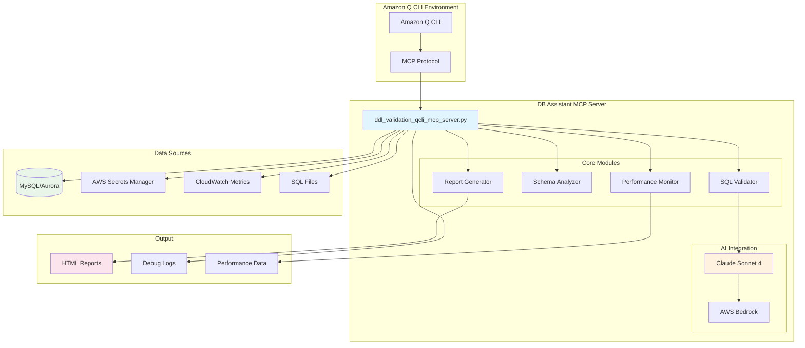
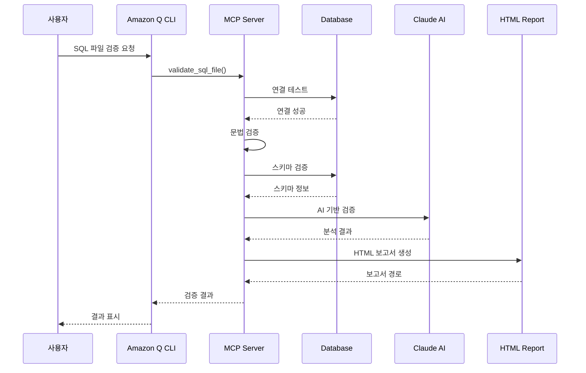

# 🗄️ DB Assistant MCP Server

**SQL 검증 및 성능분석을 위한 Amazon Q CLI MCP 서버**

[](https://python.org)
[](https://aws.amazon.com)
[](https://modelcontextprotocol.io)
[](LICENSE)

## 📋 목차

- [🎯 개요](#-개요)
- [🏗️ 아키텍처](#️-아키텍처)
- [✨ 주요 기능](#-주요-기능)
- [🔧 시스템 요구사항](#-시스템-요구사항)
- [⚙️ 설치 및 설정](#️-설치-및-설정)
- [🚀 사용 예시](#-사용-예시)
- [📊 보고서 예시](#-보고서-예시)
- [🛠️ 고급 기능](#️-고급-기능)
- [📁 파일 구조](#-파일-구조)
- [🔍 문제 해결](#-문제-해결)
- [🤝 기여하기](#-기여하기)

## 🎯 개요

DB Assistant MCP Server는 **DDL 검증**, **데이터베이스 스키마 분석**, **성능 모니터링**을 하나의 통합 서버에서 제공하는 Amazon Q CLI용 MCP(Model Context Protocol) 서버입니다.

### 🌟 핵심 가치

- **🔍 포괄적 검증**: 문법, 스키마, 제약조건, AI 기반 검증을 통합 제공
- **⚡ 실시간 분석**: 데이터베이스 성능 메트릭 실시간 모니터링
- **🤖 AI 지원**: Claude Sonnet 4를 활용한 고급 SQL 분석
- **📊 시각화**: HTML 기반 상세 보고서 자동 생성
- **🔗 통합 연결**: SSH 터널, AWS Secrets Manager 완벽 지원

### 🎯 주요 사용 사례

- **개발팀**: SQL 코드 품질 검증 및 최적화
- **DBA**: 데이터베이스 성능 모니터링 및 문제 진단
- **DevOps**: CI/CD 파이프라인에서 자동화된 SQL 검증
- **데이터 엔지니어**: 스키마 변경 영향도 분석

## 🏗️ 아키텍처

> 🏗️ **상세한 아키텍처 다이어그램은 [ARCHITECTURE_DIAGRAM.md](ARCHITECTURE_DIAGRAM.md)에서 확인하세요**

### 시스템 아키텍처 다이어그램



### 데이터 플로우



## ✨ 주요 기능

### 🔍 SQL 검증 엔진

#### 1. 다층 검증 시스템
- **문법 검증**: SQL 구문 오류 탐지
- **스키마 검증**: 테이블/컬럼 존재성 확인
- **제약조건 검증**: 외래키, 인덱스 충돌 검사
- **AI 검증**: Claude를 활용한 고급 분석

#### 2. 지원하는 SQL 구문
```sql
-- DDL 구문
CREATE TABLE, ALTER TABLE, DROP TABLE
CREATE INDEX, DROP INDEX
CREATE VIEW, DROP VIEW

-- DML 구문  
SELECT, INSERT, UPDATE, DELETE
WITH (CTE) 구문

-- 고급 구문
STORED PROCEDURES, FUNCTIONS
TRIGGERS, CONSTRAINTS
```

### 📊 성능 모니터링

#### 1. 실시간 메트릭 수집
- CPU 사용률, 메모리 사용량
- I/O 통계, 네트워크 처리량
- 연결 수, 락 상태
- 느린 쿼리 분석

#### 2. CloudWatch 통합
```python
# 지원하는 메트릭
default_metrics = [
    "CPUUtilization",
    "DatabaseConnections", 
    "DBLoad",
    "FreeableMemory",
    "ReadIOPS",
    "WriteIOPS",
    "ReadLatency",
    "WriteLatency"
]
```

### 🤖 AI 기반 분석

#### Claude Sonnet 4 통합
- **코드 품질 분석**: 성능 최적화 제안
- **보안 취약점 탐지**: SQL 인젝션 등
- **베스트 프랙티스 검증**: 네이밍 규칙, 인덱스 설계
- **성능 최적화 권장사항**: 쿼리 튜닝 제안

### 📈 보고서 생성

#### HTML 보고서 특징
- **반응형 디자인**: 모바일/데스크톱 최적화
- **인터랙티브 차트**: 성능 메트릭 시각화  
- **상세 분석**: 문제점별 해결방안 제시
- **다운로드 가능**: PDF 변환 지원

## 🔧 시스템 요구사항

### 필수 요구사항
- **Python**: 3.8 이상
- **AWS CLI**: 구성된 자격 증명
- **MySQL Connector**: Python 라이브러리
- **MCP**: Model Context Protocol 지원

### 권장 환경
- **OS**: macOS, Linux, Windows WSL
- **메모리**: 4GB 이상
- **디스크**: 1GB 여유 공간
- **네트워크**: AWS 서비스 접근 가능

### AWS 권한 요구사항
```json
{
    "Version": "2012-10-17",
    "Statement": [
        {
            "Effect": "Allow",
            "Action": [
                "bedrock:InvokeModel",
                "secretsmanager:GetSecretValue",
                "secretsmanager:ListSecrets",
                "cloudwatch:GetMetricData",
                "rds:DescribeDBInstances",
                "rds:DescribeDBClusters"
            ],
            "Resource": "*"
        }
    ]
}
```

## ⚙️ 설치 및 설정

### 1. 저장소 클론 및 환경 설정

```bash
# 저장소 클론
git clone <repository-url>
cd DB-Assistant

# Python 가상환경 생성
python -m venv venv
source venv/bin/activate  # Linux/Mac
# 또는 Windows의 경우
venv\Scripts\activate

# 의존성 설치
pip install -r requirements.txt
```

### 2. 필수 패키지 설치

```bash
# 핵심 패키지
pip install boto3 mysql-connector-python mcp

# 분석 패키지 (선택사항)
pip install pandas numpy matplotlib scikit-learn sqlparse
```

### 3. AWS 자격 증명 설정

```bash
# AWS CLI 설정
aws configure
# 또는 환경 변수 설정
export AWS_ACCESS_KEY_ID=your_access_key
export AWS_SECRET_ACCESS_KEY=your_secret_key
export AWS_DEFAULT_REGION=ap-northeast-2
```

### 4. MCP 서버 등록

`~/.kiro/settings/mcp.json` 파일에 다음 설정 추가:

```json
{
  "mcpServers": {
    "db-assistant": {
      "command": "/path/to/python",
      "args": [
        "/path/to/ddl_validation_qcli_mcp_server.py"
      ],
      "env": {
        "AWS_DEFAULT_REGION": "ap-northeast-2",
        "PYTHONPATH": "/path/to/DB-Assistant"
      },
      "disabled": false,
      "autoApprove": [
        "list_sql_files",
        "list_database_secrets", 
        "get_schema_summary",
        "get_performance_metrics"
      ]
    }
  }
}
```

### 5. 데이터베이스 연결 설정

#### AWS Secrets Manager에 DB 정보 저장
```json
{
  "host": "your-db-host.amazonaws.com",
  "port": 3306,
  "username": "admin",
  "password": "your-password",
  "database": "your-database"
}
```

#### SSH 터널 설정 (선택사항)
```bash
# SSH 키 파일 권한 설정
chmod 400 /path/to/your-key.pem

# 터널 테스트
ssh -i /path/to/your-key.pem ec2-user@your-bastion-host
```

## 🚀 사용 예시

### 기본 워크플로우

#### 1단계: SQL 파일 목록 확인
```bash
# Amazon Q CLI에서 실행
q chat
```

```
사용자: "SQL 파일 목록을 보여주세요"

응답:
📁 SQL 파일 목록 (총 15개):
✅ sample_create_table.sql (264 bytes)
✅ test_good_alter.sql (320 bytes)  
❌ test_bad_naming.sql (374 bytes)
❌ test_syntax_error.sql (685 bytes)
✅ sample_alter_table.sql (83 bytes)
...
```

#### 2단계: 데이터베이스 연결 테스트
```
사용자: "rds-mysql-dev-secret으로 데이터베이스 연결을 테스트해주세요"

응답:
✅ 데이터베이스 연결 성공!

🔗 연결 정보:
• 호스트: mysql-dev.cluster-xxx.ap-northeast-2.rds.amazonaws.com
• 포트: 3306
• 데이터베이스: testdb
• 서버 버전: 8.0.35-mysql
• 연결 방식: SSH Tunnel (ec2-user@54.180.79.255)

📊 데이터베이스 목록:
1. testdb (현재 선택됨)
2. userdb  
3. productdb
4. analytics_db
```

#### 3단계: 개별 SQL 파일 검증
```
사용자: "sample_create_table.sql 파일을 검증해주세요"

응답:
🔍 SQL 파일 검증 결과: sample_create_table.sql

✅ 모든 검증을 통과했습니다!

📊 검증 단계별 결과:
• 문법 검증: ✅ 통과 (0개 오류)
• 데이터베이스 연결: ✅ 성공
• 스키마 검증: ✅ 통과 (0개 문제)
• 제약조건 검증: ✅ 통과 (0개 충돌)
• Claude AI 검증: ✅ 통과 (우수한 코드 품질)

📄 상세 보고서: output/validation_report_sample_create_table.sql_20250820_143022.html

💡 Claude AI 분석:
"잘 구조화된 CREATE TABLE 구문입니다. 적절한 데이터 타입 선택과 
인덱스 설계가 돋보입니다. 성능상 문제없이 운영 환경에 적용 가능합니다."
```

#### 4단계: 전체 파일 일괄 검증
```
사용자: "모든 SQL 파일을 일괄 검증해주세요"

응답:
🔍 전체 SQL 파일 검증 완료

📊 검증 요약:
• 총 파일: 15개
• ✅ 통과: 9개 (60.0%)
• ❌ 실패: 6개 (40.0%)
• ⚠️ 경고: 3개 (20.0%)

📈 성공률: 60% (권장: 80% 이상)

📄 종합 보고서: output/consolidated_validation_report_20250820_143045.html

📋 개별 결과:
✅ sample_create_table.sql - 완벽 (0개 문제)
✅ test_good_alter.sql - 양호 (0개 문제)
⚠️ test_bad_naming.sql - 경고 (2개 네이밍 문제)
❌ test_syntax_error.sql - 실패 (1개 구문 오류)
✅ sample_alter_table.sql - 완벽 (0개 문제)
...

🔧 주요 문제점:
1. 네이밍 규칙 위반 (3개 파일)
2. 구문 오류 (2개 파일)  
3. 성능 최적화 필요 (1개 파일)
```

### 고급 사용 시나리오

#### 성능 분석 및 모니터링
```
사용자: "데이터베이스 성능 메트릭을 분석해주세요"

응답:
📊 데이터베이스 성능 분석 결과

🔥 주요 지표:
• CPU 사용률: 45.2% (정상)
• 메모리 사용률: 67.8% (주의)
• 활성 연결: 23/100 (양호)
• 평균 응답시간: 1.2ms (우수)

⚠️ 느린 쿼리 TOP 5:
1. SELECT * FROM users WHERE email LIKE '%@gmail.com%'
   - 실행횟수: 1,234회
   - 평균시간: 2.456초
   - 권장사항: email 컬럼에 인덱스 추가

2. SELECT u.*, p.* FROM users u JOIN posts p ON u.id = p.user_id
   - 실행횟수: 856회  
   - 평균시간: 1.892초
   - 권장사항: JOIN 조건 최적화

📈 시간대별 부하:
• 09:00-12:00: 높음 (평균 CPU 78%)
• 12:00-14:00: 보통 (평균 CPU 45%)
• 14:00-18:00: 높음 (평균 CPU 82%)
• 18:00-09:00: 낮음 (평균 CPU 23%)

💡 최적화 권장사항:
1. 인덱스 추가: users.email, posts.user_id
2. 쿼리 캐싱 활성화
3. 연결 풀 크기 조정 (현재: 100 → 권장: 150)
```

#### 스키마 상세 분석
```
사용자: "현재 데이터베이스 스키마를 상세 분석해주세요"

응답:
🗄️ 스키마 상세 분석 (데이터베이스: testdb)

📊 전체 요약:
• 총 테이블: 12개
• 총 컬럼: 89개  
• 총 인덱스: 23개
• 외래키: 8개
• 예상 데이터 크기: 2.3GB

📋 테이블별 상세 정보:

🔹 users (InnoDB, 1,250행)
   📝 컬럼 (5개):
   • id: INT(11) NOT NULL AUTO_INCREMENT [PRIMARY KEY]
   • email: VARCHAR(255) NOT NULL [UNIQUE]
   • name: VARCHAR(100) NOT NULL
   • created_at: TIMESTAMP DEFAULT CURRENT_TIMESTAMP
   • updated_at: TIMESTAMP DEFAULT CURRENT_TIMESTAMP ON UPDATE

   🔍 인덱스 (2개):
   • PRIMARY KEY (id) - BTREE
   • UNIQUE email_unique (email) - BTREE

   🔗 관계:
   • posts.user_id → users.id (1:N)
   • user_profiles.user_id → users.id (1:1)

🔹 posts (InnoDB, 5,430행)
   📝 컬럼 (7개):
   • id: INT(11) NOT NULL AUTO_INCREMENT [PRIMARY KEY]
   • user_id: INT(11) NOT NULL [FOREIGN KEY]
   • title: VARCHAR(200) NOT NULL
   • content: TEXT
   • status: ENUM('draft','published','archived') DEFAULT 'draft'
   • created_at: TIMESTAMP DEFAULT CURRENT_TIMESTAMP
   • updated_at: TIMESTAMP DEFAULT CURRENT_TIMESTAMP ON UPDATE

   🔍 인덱스 (3개):
   • PRIMARY KEY (id) - BTREE
   • INDEX idx_user_id (user_id) - BTREE
   • INDEX idx_status_created (status, created_at) - BTREE

⚠️ 발견된 문제점:
1. posts 테이블의 content 컬럼이 TEXT 타입 - 성능 영향 가능
2. 일부 테이블에 created_at 인덱스 누락
3. user_profiles 테이블에 불필요한 중복 인덱스 존재

💡 최적화 제안:
1. content 컬럼을 별도 테이블로 분리 고려
2. 자주 조회되는 날짜 컬럼에 인덱스 추가
3. 중복 인덱스 제거로 저장공간 절약
```
## 📊 보고서 예시

> 📄 **상세한 보고서 예시는 [SAMPLE_REPORT.md](SAMPLE_REPORT.md)에서 확인하세요**

### HTML 검증 보고서 구조

DB Assistant는 상세한 HTML 보고서를 자동 생성합니다:

#### 1. 개별 파일 검증 보고서
```html
<!DOCTYPE html>
<html lang="ko">
<head>
    <title>SQL 검증보고서 - sample_create_table.sql</title>
    <!-- 반응형 CSS 스타일 -->
</head>
<body>
    <!-- 헤더 섹션 -->
    <div class="header">
        <h1>SQL 검증 보고서</h1>
        <div class="status-badge success">✅ 검증 통과</div>
    </div>
    
    <!-- 요약 섹션 -->
    <div class="summary-grid">
        <div class="summary-card">
            <h3>문법 검증</h3>
            <div class="status success">통과</div>
        </div>
        <div class="summary-card">
            <h3>스키마 검증</h3>
            <div class="status success">통과</div>
        </div>
        <!-- ... 더 많은 카드들 -->
    </div>
    
    <!-- 상세 분석 섹션 -->
    <div class="analysis-section">
        <h2>Claude AI 분석</h2>
        <div class="ai-analysis">
            <!-- AI 분석 결과 -->
        </div>
    </div>
</body>
</html>
```

#### 2. 통합 검증 보고서
- **전체 요약**: 성공률, 실패율, 경고 수
- **파일별 상세**: 각 파일의 검증 결과
- **문제점 분류**: 오류 유형별 통계
- **개선 권장사항**: AI 기반 최적화 제안

### 보고서 스크린샷 예시

#### ✅ 성공적인 검증 결과
```
📊 검증 결과 요약
┌─────────────────┬─────────┐
│ 검증 항목       │ 결과    │
├─────────────────┼─────────┤
│ 문법 검증       │ ✅ 통과 │
│ 스키마 검증     │ ✅ 통과 │
│ 제약조건 검증   │ ✅ 통과 │
│ AI 품질 검증    │ ✅ 통과 │
└─────────────────┴─────────┘

💡 Claude AI 평가: "우수한 코드 품질"
```

#### ❌ 문제가 발견된 경우
```
📊 검증 결과 요약
┌─────────────────┬─────────┐
│ 검증 항목       │ 결과    │
├─────────────────┼─────────┤
│ 문법 검증       │ ❌ 실패 │
│ 스키마 검증     │ ⚠️ 경고 │
│ 제약조건 검증   │ ✅ 통과 │
│ AI 품질 검증    │ ❌ 실패 │
└─────────────────┴─────────┘

🔍 발견된 문제점:
1. 구문 오류: 라인 15 - 세미콜론 누락
2. 네이밍 규칙: 테이블명 'userTable' → 'user_table' 권장
3. 성능 이슈: WHERE 절에 인덱스 없는 컬럼 사용

💡 해결 방안:
• 세미콜론 추가: ALTER TABLE userTable ADD COLUMN status VARCHAR(20);
• 네이밍 수정: snake_case 규칙 적용
• 인덱스 생성: CREATE INDEX idx_status ON user_table(status);
```

## 🛠️ 고급 기능

### 1. 도구 목록 (총 25개)

#### 📋 SQL 파일 관리 (4개)
```python
# 1. SQL 파일 목록 조회
list_sql_files()

# 2. 외부 SQL 파일 복사
copy_sql_to_directory(
    source_path="/path/to/external.sql",
    target_name="imported_query.sql"
)

# 3. 개별 파일 검증
validate_sql_file(
    filename="test_query.sql",
    database_secret="my-db-secret"  # 선택사항
)

# 4. 전체 파일 일괄 검증
validate_all_sql(database_secret="my-db-secret")
```

#### 🗄️ 데이터베이스 연결 관리 (6개)
```python
# 1. AWS Secrets 목록 조회
list_database_secrets(keyword="mysql")

# 2. 데이터베이스 연결 테스트
test_database_connection(
    database_secret="rds-mysql-dev",
    use_ssh_tunnel=True
)

# 3. 데이터베이스 목록 조회
list_databases(database_secret="rds-mysql-dev")

# 4. 데이터베이스 선택
select_database(
    database_secret="rds-mysql-dev",
    database_selection="testdb"
)

# 5. 스키마 요약 정보
get_schema_summary(database_secret="rds-mysql-dev")

# 6. 테이블 상세 스키마
get_table_schema(
    database_secret="rds-mysql-dev",
    table_name="users"
)
```

#### ⚡ 성능 모니터링 (9개)
```python
# 1. 전체 성능 메트릭
get_performance_metrics(
    database_secret="rds-mysql-dev",
    metric_type="all"  # all, query, io, memory, connection
)

# 2. CloudWatch 메트릭 수집
collect_db_metrics(
    db_instance_identifier="mysql-prod-instance",
    hours=24,
    region="ap-northeast-2"
)

# 3. 메트릭 상관관계 분석
analyze_metric_correlation(
    csv_file="db_metrics_20250820.csv",
    target_metric="CPUUtilization",
    top_n=10
)

# 4. 아웃라이어 탐지
detect_metric_outliers(
    csv_file="db_metrics_20250820.csv",
    std_threshold=2.0
)

# 5. 회귀 분석
perform_regression_analysis(
    csv_file="db_metrics_20250820.csv",
    predictor_metric="DatabaseConnections",
    target_metric="CPUUtilization"
)
```

### 2. AI 기반 고급 분석

#### Claude Sonnet 4 통합 분석
```python
# AI 검증 프로세스
async def validate_with_claude(
    ddl_content: str,
    database_secret: str = None,
    schema_info: dict = None,
    explain_info: str = None,
    sql_type: str = None
) -> str:
    """
    Claude AI를 활용한 종합적 SQL 분석
    
    분석 항목:
    - 코드 품질 평가
    - 성능 최적화 제안  
    - 보안 취약점 검사
    - 베스트 프랙티스 준수 여부
    - 네이밍 규칙 검증
    """
```

#### Knowledge Base 통합
```python
# AWS Bedrock Knowledge Base 활용
async def query_knowledge_base(
    query: str, 
    sql_type: str
) -> str:
    """
    조직의 SQL 가이드라인과 베스트 프랙티스를 
    Knowledge Base에서 조회하여 검증에 활용
    """
```

### 3. 연결 최적화 기능

#### SSH 터널 자동 관리
```python
def setup_ssh_tunnel(
    db_host: str, 
    region: str = "ap-northeast-2"
) -> bool:
    """
    SSH 터널 자동 설정 및 관리
    - 자동 연결 설정
    - 연결 상태 모니터링
    - 자동 재연결
    - 정리 작업 자동화
    """
```

#### 연결 풀링
```python
def setup_shared_connection(
    database_secret: str,
    use_ssh_tunnel: bool = True
) -> bool:
    """
    데이터베이스 연결 재사용을 통한 성능 최적화
    - 연결 풀 관리
    - 자동 연결 복구
    - 타임아웃 처리
    """
```

### 4. 보고서 커스터마이징

#### HTML 템플릿 시스템
```python
async def generate_html_report(
    report_path: Path,
    validation_results: Dict,
    sql_content: str,
    filename: str,
    claude_analysis: str = None
) -> str:
    """
    커스터마이징 가능한 HTML 보고서 생성
    
    특징:
    - 반응형 디자인
    - 다크/라이트 모드
    - 인터랙티브 차트
    - PDF 내보내기 지원
    """
```

#### 통합 보고서
```python
async def generate_consolidated_html_report(
    validation_results: List[Dict],
    database_secret: str
) -> str:
    """
    여러 파일의 검증 결과를 하나의 보고서로 통합
    
    포함 내용:
    - 전체 요약 통계
    - 파일별 상세 결과
    - 문제점 분류 및 우선순위
    - 개선 로드맵 제안
    """
```

## 📁 파일 구조

```
DB-Assistant/
├── 📄 ddl_validation_qcli_mcp_server.py    # 메인 MCP 서버
├── 📄 README.md                            # 프로젝트 문서
├── 📄 requirements.txt                     # Python 의존성
├── 📄 ssh_tunnel.sh                        # SSH 터널 스크립트
│
├── 📁 sql/                                 # SQL 테스트 파일들
│   ├── sample_create_table.sql
│   ├── test_good_alter.sql
│   ├── test_bad_naming.sql
│   ├── test_syntax_error.sql
│   ├── comprehensive_dml_test.sql
│   ├── slow_example.sql
│   └── ... (총 50+ 테스트 파일)
│
├── 📁 output/                              # 검증 결과 출력
│   ├── validation_report_*.html            # 개별 검증 보고서
│   ├── consolidated_validation_report_*.html # 통합 보고서
│   ├── debug_log_*.txt                     # 디버그 로그
│   └── metrics_*.csv                       # 성능 메트릭 데이터
│
├── 📁 data/                                # 분석 데이터
│   ├── db_metrics_*.csv                    # CloudWatch 메트릭
│   ├── correlation_analysis_*.png          # 상관관계 차트
│   └── performance_trends_*.png            # 성능 트렌드 차트
│
├── 📁 logs/                                # 로그 파일
│   ├── ddl_validation.log                  # 메인 로그
│   ├── ssh_tunnel.log                      # SSH 터널 로그
│   └── performance_monitor.log             # 성능 모니터링 로그
│
├── 📁 backup files/                        # 백업 파일들
│   ├── ddl_validation_qcli_mcp_server_backup_*.py
│   └── ...
│
└── 📁 docs/                                # 추가 문서
    ├── API_REFERENCE.md                    # API 레퍼런스
    ├── TROUBLESHOOTING.md                  # 문제 해결 가이드
    ├── PERFORMANCE_TUNING.md               # 성능 튜닝 가이드
    └── EXAMPLES.md                         # 사용 예시 모음
```

### 주요 파일 설명

#### 🔧 핵심 서버 파일
- **`ddl_validation_qcli_mcp_server.py`**: 메인 MCP 서버 (6,000+ 라인)
  - 25개 도구 함수 구현
  - AI 통합 검증 엔진
  - 성능 모니터링 시스템
  - HTML 보고서 생성기

#### 📊 테스트 SQL 파일들
```sql
-- 📁 sql/ 디렉토리 주요 파일들

-- ✅ 성공 케이스
sample_create_table.sql     # 기본 테이블 생성
test_good_alter.sql         # 올바른 ALTER 구문
optimized_queries.sql       # 최적화된 쿼리들

-- ❌ 실패 케이스  
test_bad_naming.sql         # 네이밍 규칙 위반
test_syntax_error.sql       # 구문 오류 포함
performance_issue_*.sql     # 성능 문제 쿼리들

-- 🔍 복합 테스트
comprehensive_dml_test.sql  # 종합 DML 테스트
advanced_complex_queries_test.sql # 고급 쿼리 테스트
slow_example.sql           # 느린 쿼리 시뮬레이션
```

#### 📈 출력 파일 예시
```
📁 output/ 디렉토리 구조:

validation_report_sample_create_table.sql_20250820_143022.html
├── 📊 검증 요약 섹션
├── 🔍 상세 분석 결과  
├── 🤖 Claude AI 평가
├── 📈 성능 메트릭
└── 💡 개선 권장사항

consolidated_validation_report_20250820_143045.html
├── 📊 전체 통계 대시보드
├── 📋 파일별 결과 매트릭스
├── 🎯 문제점 우선순위
└── 🗺️ 개선 로드맵
```
## 🔍 문제 해결

### 일반적인 문제 및 해결방법

#### 1. 🔌 연결 관련 문제

##### MySQL 연결 오류
```bash
# 문제: ModuleNotFoundError: No module named 'mysql.connector'
# 해결:
pip install mysql-connector-python

# 문제: Access denied for user 'admin'@'%'
# 해결: AWS Secrets Manager 자격 증명 확인
aws secretsmanager get-secret-value --secret-id your-secret-name
```

##### SSH 터널 설정 실패
```bash
# 문제: Permission denied (publickey)
# 해결: SSH 키 파일 권한 설정
chmod 400 /path/to/your-key.pem

# 문제: Connection timeout
# 해결: 보안 그룹 및 네트워크 ACL 확인
# - SSH 포트 22 허용
# - MySQL 포트 3306 허용
```

#### 2. 🤖 AI 서비스 관련 문제

##### Claude API 호출 오류
```python
# 문제: AccessDeniedException
# 해결: Bedrock 서비스 권한 확인
{
    "Effect": "Allow",
    "Action": [
        "bedrock:InvokeModel",
        "bedrock:GetModel"
    ],
    "Resource": "arn:aws:bedrock:us-west-2::foundation-model/anthropic.claude-*"
}

# 문제: Model not found
# 해결: 지원되는 모델 ID 확인
MODEL_ID = "us.anthropic.claude-sonnet-4-20250514-v1:0"
```

##### Knowledge Base 연결 실패
```python
# 문제: Knowledge base not found
# 해결: Knowledge Base ID 확인 및 권한 설정
KNOWLEDGE_BASE_ID = "0WQUBRHVR8"  # 실제 ID로 변경

# 필요 권한:
{
    "Effect": "Allow", 
    "Action": [
        "bedrock:Retrieve",
        "bedrock:RetrieveAndGenerate"
    ],
    "Resource": "arn:aws:bedrock:*:*:knowledge-base/*"
}
```

#### 3. 📊 성능 및 메모리 문제

##### 대용량 SQL 파일 처리
```python
# 문제: Memory error when processing large SQL files
# 해결: 청크 단위 처리 구현
def process_large_sql_file(file_path: str, chunk_size: int = 1000):
    with open(file_path, 'r') as f:
        while True:
            chunk = f.read(chunk_size)
            if not chunk:
                break
            # 청크 단위로 처리
            yield chunk
```

##### CloudWatch 메트릭 수집 지연
```python
# 문제: CloudWatch API throttling
# 해결: 재시도 로직 및 백오프 구현
import time
from botocore.exceptions import ClientError

def get_metrics_with_retry(cloudwatch_client, **kwargs):
    max_retries = 3
    for attempt in range(max_retries):
        try:
            return cloudwatch_client.get_metric_data(**kwargs)
        except ClientError as e:
            if e.response['Error']['Code'] == 'Throttling':
                time.sleep(2 ** attempt)  # 지수 백오프
                continue
            raise
```

### 디버깅 가이드

#### 로그 레벨 설정
```python
import logging

# 디버그 모드 활성화
logging.basicConfig(
    level=logging.DEBUG,
    format='%(asctime)s - %(name)s - %(levelname)s - %(message)s',
    handlers=[
        logging.FileHandler('debug.log'),
        logging.StreamHandler()
    ]
)
```

#### 상세 디버그 정보 확인
```bash
# 디버그 로그 파일 위치
tail -f logs/ddl_validation.log

# SSH 터널 로그 확인  
tail -f logs/ssh_tunnel.log

# 성능 모니터링 로그
tail -f logs/performance_monitor.log
```

### 성능 최적화 팁

#### 1. 연결 최적화
```python
# 연결 풀링 활용
def optimize_db_connections():
    # 공용 연결 재사용
    if not self.shared_connection:
        self.setup_shared_connection(database_secret)
    
    # 연결 상태 확인 및 복구
    if not self.shared_connection.is_connected():
        self.shared_connection.reconnect()
```

#### 2. 메모리 사용량 최적화
```python
# 대용량 결과셋 처리
def process_large_resultset(cursor):
    cursor.execute("SELECT * FROM large_table")
    
    # 한 번에 모든 결과를 가져오지 않고 배치 처리
    while True:
        rows = cursor.fetchmany(1000)
        if not rows:
            break
        
        for row in rows:
            # 행별 처리
            process_row(row)
```

#### 3. AI 호출 최적화
```python
# 토큰 수 제한으로 응답 시간 단축
def optimize_claude_calls():
    # 입력 텍스트 길이 제한
    max_input_length = 8000
    if len(sql_content) > max_input_length:
        sql_content = sql_content[:max_input_length] + "..."
    
    # 응답 길이 제한
    max_tokens = 1000
```

## 🤝 기여하기

### 개발 환경 설정

#### 1. 개발용 설치
```bash
# 개발 모드로 설치
git clone <repository-url>
cd DB-Assistant

# 개발 의존성 포함 설치
pip install -r requirements-dev.txt

# pre-commit 훅 설정
pre-commit install
```

#### 2. 코드 스타일 가이드
```python
# Black 포매터 사용
black ddl_validation_qcli_mcp_server.py

# isort로 import 정리
isort ddl_validation_qcli_mcp_server.py

# flake8로 코드 품질 검사
flake8 ddl_validation_qcli_mcp_server.py
```

### 기여 방법

#### 1. 버그 리포트
```markdown
## 버그 리포트 템플릿

### 환경 정보
- OS: macOS 14.0
- Python: 3.9.7
- AWS CLI: 2.13.0

### 재현 단계
1. SQL 파일 검증 실행
2. 특정 DDL 구문에서 오류 발생
3. 오류 메시지: "..."

### 예상 결과
정상적인 검증 완료

### 실제 결과  
오류 발생 및 프로세스 중단

### 추가 정보
- 로그 파일 첨부
- SQL 파일 샘플 (민감 정보 제거)
```

#### 2. 기능 요청
```markdown
## 기능 요청 템플릿

### 기능 설명
PostgreSQL 데이터베이스 지원 추가

### 사용 사례
PostgreSQL을 사용하는 프로젝트에서도 
동일한 SQL 검증 기능 필요

### 제안하는 구현 방법
- psycopg2 라이브러리 추가
- PostgreSQL 전용 검증 로직 구현
- 설정 파일에서 DB 타입 선택 가능

### 우선순위
Medium (중간)
```

#### 3. Pull Request 가이드라인
```bash
# 1. 브랜치 생성
git checkout -b feature/postgresql-support

# 2. 개발 및 테스트
# ... 코드 작성 ...

# 3. 테스트 실행
python -m pytest tests/

# 4. 커밋 메시지 규칙
git commit -m "feat: Add PostgreSQL database support

- Add psycopg2 dependency
- Implement PostgreSQL-specific validation logic  
- Update configuration to support multiple DB types
- Add comprehensive tests for PostgreSQL features

Closes #123"

# 5. Pull Request 생성
git push origin feature/postgresql-support
```

### 테스트 가이드

#### 단위 테스트 작성
```python
import pytest
from unittest.mock import Mock, patch
from ddl_validation_qcli_mcp_server import DBAssistantMCPServer

class TestDBAssistantMCPServer:
    @pytest.fixture
    def server(self):
        return DBAssistantMCPServer()
    
    @patch('boto3.client')
    def test_database_connection(self, mock_boto3, server):
        # 테스트 구현
        mock_secrets = Mock()
        mock_boto3.return_value = mock_secrets
        
        result = server.test_database_connection("test-secret")
        assert "연결 성공" in result
    
    def test_sql_validation(self, server):
        sql_content = "CREATE TABLE test (id INT PRIMARY KEY);"
        result = server.validate_ddl(sql_content, None, "test.sql")
        assert "검증 통과" in result
```

#### 통합 테스트
```python
@pytest.mark.integration
class TestIntegration:
    def test_end_to_end_validation(self):
        # 실제 데이터베이스 연결 테스트
        # 실제 SQL 파일 검증 테스트
        # 실제 보고서 생성 테스트
        pass
```

## 📄 라이선스

이 프로젝트는 MIT 라이선스 하에 배포됩니다.

```
MIT License

Copyright (c) 2024 DB Assistant Contributors

Permission is hereby granted, free of charge, to any person obtaining a copy
of this software and associated documentation files (the "Software"), to deal
in the Software without restriction, including without limitation the rights
to use, copy, modify, merge, publish, distribute, sublicense, and/or sell
copies of the Software, and to permit persons to whom the Software is
furnished to do so, subject to the following conditions:

The above copyright notice and this permission notice shall be included in all
copies or substantial portions of the Software.

THE SOFTWARE IS PROVIDED "AS IS", WITHOUT WARRANTY OF ANY KIND, EXPRESS OR
IMPLIED, INCLUDING BUT NOT LIMITED TO THE WARRANTIES OF MERCHANTABILITY,
FITNESS FOR A PARTICULAR PURPOSE AND NONINFRINGEMENT. IN NO EVENT SHALL THE
AUTHORS OR COPYRIGHT HOLDERS BE LIABLE FOR ANY CLAIM, DAMAGES OR OTHER
LIABILITY, WHETHER IN AN ACTION OF CONTRACT, TORT OR OTHERWISE, ARISING FROM,
OUT OF OR IN CONNECTION WITH THE SOFTWARE OR THE USE OR OTHER DEALINGS IN THE
SOFTWARE.
```

## 🙏 감사의 말

### 기여자들
- **개발팀**: 핵심 기능 개발 및 유지보수
- **테스터들**: 다양한 환경에서의 테스트 및 피드백
- **문서 작성자들**: 사용자 가이드 및 API 문서 작성

### 사용된 오픈소스 프로젝트
- **[MCP](https://modelcontextprotocol.io)**: Model Context Protocol
- **[boto3](https://boto3.amazonaws.com)**: AWS SDK for Python
- **[mysql-connector-python](https://dev.mysql.com/doc/connector-python/)**: MySQL 드라이버
- **[sqlparse](https://sqlparse.readthedocs.io)**: SQL 파서
- **[pandas](https://pandas.pydata.org)**: 데이터 분석 라이브러리

## 📞 지원 및 문의

### 문제 신고
- **GitHub Issues**: [이슈 생성하기](https://github.com/your-repo/issues/new)
- **이메일**: support@db-assistant.com

### 커뮤니티
- **Discord**: [DB Assistant 커뮤니티](https://discord.gg/db-assistant)
- **Slack**: [워크스페이스 참여](https://db-assistant.slack.com)

### 문서 및 리소스
- **API 문서**: [docs.db-assistant.com](https://docs.db-assistant.com)
- **튜토리얼**: [tutorials.db-assistant.com](https://tutorials.db-assistant.com)
- **블로그**: [blog.db-assistant.com](https://blog.db-assistant.com)

---

## 🆕 최신 업데이트 (2025-01-20)

### 새로운 기능
- **🤖 Claude Sonnet 4 통합**: 고급 AI 기반 SQL 분석
- **📊 실시간 성능 모니터링**: CloudWatch 메트릭 실시간 수집
- **🔗 SSH 터널 자동화**: 안전한 데이터베이스 연결 자동 관리
- **📈 상관관계 분석**: 메트릭 간 상관관계 및 회귀 분석
- **🎨 반응형 HTML 보고서**: 모바일 최적화된 검증 보고서

### 개선사항
- **⚡ 성능 최적화**: 연결 풀링 및 메모리 사용량 최적화
- **🛡️ 보안 강화**: AWS IAM 역할 기반 인증 지원
- **🔍 오류 처리 개선**: 상세한 오류 메시지 및 복구 가이드
- **📝 로깅 시스템**: 구조화된 로그 및 디버그 정보

### 호환성
- **Python**: 3.8+ 지원
- **MySQL**: 5.7, 8.0+ 지원  
- **Aurora MySQL**: 2.x, 3.x 지원
- **AWS 서비스**: Bedrock, Secrets Manager, CloudWatch 완벽 통합

---

**🚀 지금 시작하세요!**

```bash
git clone <repository-url>
cd DB-Assistant
pip install -r requirements.txt
python ddl_validation_qcli_mcp_server.py
```

**DB Assistant와 함께 SQL 품질을 한 단계 높여보세요!** ✨
