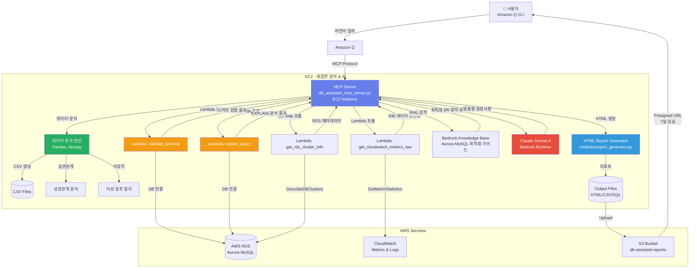

# DB Assistant MCP Server - 하이브리드 아키텍처 가이드

**AI 기반 AWS Aurora MySQL 성능 분석 및 최적화 자동화 시스템**

> Amazon Q CLI와 자연어로 대화하며 AWS RDS Aurora 데이터베이스를 AI 기반으로 분석하고 최적화하는 하이브리드 솔루션

---

## 목차

- [개요](#개요)
- [아키텍처](#아키텍처)
- [프로젝트 구조](#프로젝트-구조)
- [핵심 기능](#핵심-기능)
- [환경 설정](#환경-설정)
- [사용 방법](#사용-방법)
- [핵심 소스코드](#핵심-소스코드)
- [Lambda 함수 목록](#lambda-함수-목록)

---

## 개요

**DB Assistant MCP Server**는 AWS Aurora MySQL 데이터베이스의 성능을 실시간으로 모니터링하고, AI를 활용하여 최적화 권장사항을 자동으로 생성하는 지능형 데이터베이스 관리 도구입니다.

### 핵심 가치

- **AI 기반 분석**: AWS Bedrock (Claude Sonnet 4)을 활용한 지능형 성능 분석
- **포괄적 리포트**: HTML 형식의 정교한 성능 진단 보고서 자동 생성
- **하이브리드 아키텍처**: Lambda + EC2 구조로 확장성과 복잡한 분석의 균형 달성
- **자연어 인터페이스**: Amazon Q CLI를 통한 대화형 데이터베이스 관리
- **실시간 모니터링**: CloudWatch 메트릭 기반 실시간 성능 추적

### 주요 문제 해결

- 복잡한 RDS 성능 메트릭을 이해하기 쉬운 HTML 리포트로 변환
- 느린 쿼리 자동 탐지 및 최적화 권장사항 제공
- Aurora 클러스터 전체의 부하 분산 및 레플리케이션 상태 모니터링
- CPU, 메모리, I/O, 커넥션 등 다차원 성능 분석
- SQL 스키마 검증 및 쿼리 실행 계획 분석

---

## 아키텍처

### 하이브리드 아키텍처 (Lambda + EC2)



### 데이터 흐름

1. **사용자 요청** → Amazon Q CLI에서 자연어로 성능 분석 또는 SQL 검증 요청
2. **MCP 서버 실행** → db_assistant_mcp_server.py가 요청을 처리
3. **Lambda 호출** → 스키마 검증, EXPLAIN 분석, RDS 정보, CloudWatch 메트릭 수집
4. **로컬 분석** → EC2에서 Pandas를 사용한 상관관계 분석, 이상 징후 탐지
5. **AI 분석** → Bedrock Knowledge Base RAG 검색 + Claude Sonnet 4 권장사항 생성
6. **리포트 생성** → HTML + CSV + SQL 파일 생성
7. **S3 업로드** → 리포트 파일을 S3에 업로드, presigned URL 생성 (7일 유효)

### 아키텍처 장점

| 특징 | Lambda Only | **하이브리드 (현재)** | EC2 Only |
|------|-------------|---------------------|----------|
| 확장성 | ✅ 높음 | ✅ 높음 | ⚠️ 제한적 |
| 복잡한 분석 | ❌ 제한적 (메모리/시간) | ✅ 가능 | ✅ 가능 |
| 비용 효율 | ✅ 높음 | ✅ 중간 | ⚠️ 낮음 |
| Pandas/AI 통합 | ❌ 어려움 | ✅ 쉬움 | ✅ 쉬움 |
| DB 연결 관리 | ⚠️ Lambda에서 직접 | ✅ Lambda로 오프로드 | ⚠️ EC2에서 직접 |

---

## 프로젝트 구조

```
db-assistant/
├── README.md                           # 프로젝트 전체 README
├── README_MCP_SERVER.md                # 이 파일 (MCP 서버 가이드)
├── requirements.txt                    # Python 의존성
│
├── db_assistant_mcp_server.py          # 🎯 MCP 메인 서버 (500KB, 10000+ lines)
│
├── lambda-functions/                   # Lambda 함수들 (36개)
│   ├── validate_schema/                # ⭐ DDL 스키마 검증
│   │   └── handler.py
│   ├── explain_query/                  # ⭐ 쿼리 실행 계획 분석 (EXPLAIN)
│   │   └── handler.py
│   ├── get_rds_cluster_info/           # ⭐ RDS 클러스터 정보 수집
│   │   └── handler.py
│   ├── get_cloudwatch_metrics_raw/     # ⭐ CloudWatch 메트릭 수집
│   │   └── handler.py
│   ├── collect_cpu_intensive_queries/  # CPU 집약 쿼리 수집
│   │   └── handler.py
│   ├── collect_temp_space_intensive_queries/  # 임시 공간 집약 쿼리 수집
│   │   └── handler.py
│   └── [30개 추가 Lambda 함수들...]
│
├── modules/                            # 공통 모듈 (8개)
│   ├── ai_integration.py               # Bedrock 통합 (RAG, Claude)
│   ├── base.py                         # 베이스 클래스
│   ├── connection_manager.py           # DB 연결 관리 (사용 중지)
│   ├── error_analyzer.py               # 에러 분석
│   ├── interfaces.py                   # 인터페이스 정의
│   ├── report_generator.py             # HTML 리포트 생성
│   ├── session_state.py                # 세션 상태
│   └── shared_types.py                 # 공통 타입
│
├── utils/                              # 유틸리티 (4개)
│   ├── constants.py                    # 상수 정의 (OUTPUT_DIR, DEFAULT_REGION 등)
│   ├── formatters.py                   # 포맷터 (bytes, number, percentage 등)
│   ├── logging_utils.py                # 로깅 유틸리티
│   └── parsers.py                      # 파서 (테이블명, SQL 타입 등)
│
├── output/                             # HTML 리포트 출력
│   ├── comprehensive_performance_report_*.html
│   ├── cluster_performance_report_*.html
│   └── validation_report_*.html
│
├── data/                               # CSV 데이터 파일
│   └── database_metrics_*.csv
│
├── sql/                                # SQL 쿼리 파일
│   ├── cpu_intensive_queries_*.sql
│   └── temp_space_intensive_queries_*.sql
│
└── logs/                               # 로그 파일
    └── mcp_server_*.log
```

---

## 핵심 기능

### 1. SQL 스키마 검증 (`validate_schema_lambda`)

**목적**: SQL DDL 구문의 유효성을 검증하여 실행 전 오류를 방지

**주요 기능**:
- CREATE TABLE, ALTER TABLE, DROP TABLE, CREATE INDEX 검증
- 테이블 존재 여부 확인
- 외래 키 참조 테이블 검증
- IF NOT EXISTS / IF EXISTS 구문 분석
- MIXED_DDL 지원 (여러 DDL 타입 혼합)
- 한글 주석 안전 처리

**Lambda 함수**: `validate_schema` (db-assistant-validate-schema-dev)

**실행 예시**:
```python
# MCP 서버에서 Lambda 호출
result = await self.validate_schema_lambda(
    database_secret="gamedb1-cluster",
    database="gamedb",
    ddl_content="CREATE TABLE IF NOT EXISTS users (...)"
)

# 결과
{
    'success': True,
    'valid': True,
    'ddl_type': 'CREATE_TABLE',
    'table_name': 'users',
    'issues': [],
    'warnings': ['테이블 users이 이미 존재함 (IF NOT EXISTS 사용으로 문제없음)'],
    's3_location': 's3://db-assistant-query-results-dev/schema-validation/...'
}
```

---

### 2. 쿼리 실행 계획 분석 (`explain_query_lambda`)

**목적**: SELECT/UPDATE/DELETE/INSERT/REPLACE 쿼리의 실행 계획을 분석하여 성능 이슈를 사전에 발견

**주요 기능**:
- EXPLAIN 실행 및 결과 파싱
- Full Table Scan 감지
- 인덱스 미사용 감지
- Using filesort / Using temporary 감지
- 많은 행 스캔 경고 (100,000개 이상)
- 성능 개선 권장사항 자동 생성

**Lambda 함수**: `explain_query` (db-assistant-explain-query-dev)

**실행 예시**:
```python
# MCP 서버에서 Lambda 호출
result = await self.explain_query_lambda(
    database_secret="gamedb1-cluster",
    database="gamedb",
    query="SELECT * FROM users WHERE email = 'test@example.com'"
)

# 결과
{
    'success': True,
    'query': "SELECT * FROM users WHERE email = 'test@example.com'",
    'explain_data': [
        {
            'id': 1,
            'select_type': 'SIMPLE',
            'table': 'users',
            'type': 'ALL',  # Full Table Scan!
            'possible_keys': None,
            'key': None,
            'rows': 10000,
            'Extra': 'Using where'
        }
    ],
    'performance_issues': [
        {
            'severity': 'HIGH',
            'issue': 'Full Table Scan',
            'table': 'users',
            'rows': 10000,
            'description': "테이블 'users'에서 전체 테이블 스캔 발생"
        }
    ],
    'recommendations': ["테이블 'users'에 email 컬럼 인덱스 추가 권장"],
    's3_location': 's3://db-assistant-query-results-dev/explain-results/...'
}
```

---

### 3. 종합 성능 진단 보고서 (`generate_comprehensive_performance_report`)

**목적**: Aurora MySQL 인스턴스의 전체 성능을 종합적으로 분석하여 HTML 리포트 생성

**주요 기능**:
- CloudWatch 메트릭 수집 (936개 데이터 포인트)
  - CPU 사용률, 데이터베이스 연결 수, 여유 메모리
  - Read/Write IOPS, Latency, Throughput
  - 네트워크 송수신 처리량
  - Buffer Cache Hit Ratio
- Pandas 기반 데이터 분석
  - CSV 파일로 원본 데이터 저장
  - 시계열 데이터 상관관계 분석
  - 이상 징후 탐지 (Outlier Detection)
- 느린 쿼리 분석 (CloudWatch Logs)
- AI 기반 최적화 권장사항 (Bedrock RAG + Claude Sonnet 4)
- HTML 리포트 생성 (반응형 디자인, 그라데이션)

**Lambda 함수 사용**:
- `get_rds_cluster_info` - RDS 메타데이터 수집
- `get_cloudwatch_metrics_raw` - CloudWatch 메트릭 수집 (936개 포인트)

**실행 예시**:
```python
# MCP 서버 호출
result = await server.generate_comprehensive_performance_report(
    database_secret="gamedb1-cluster",
    db_instance_identifier="gamedb1-1",
    region="ap-northeast-2",
    hours=6
)
```

**생성 파일**:
- `comprehensive_performance_report_gamedb1-1_20251023_102840.html` (34KB)
- `database_metrics_gamedb1-1_20251023_102841.csv` (12KB)
- `cpu_intensive_queries_gamedb1-1_20251023.sql` (2KB)
- `temp_space_intensive_queries_gamedb1-1_20251023.sql` (2KB)

---

### 4. SQL 파일 검증 및 통합 보고서 (`validate_sql_files`)

**목적**: 여러 SQL 파일을 일괄 검증하고 통합 HTML 보고서 생성

**주요 기능**:
- 복수 SQL 파일 검증
- DDL 스키마 검증 (Lambda: validate_schema)
- DML 쿼리 EXPLAIN 분석 (Lambda: explain_query)
- 개별 HTML 보고서 생성
- 통합 HTML 보고서 자동 생성 (2개 이상 파일)
  - 총 파일 수, 통과/실패 건수, 통과율
  - 개별 보고서 링크

**실행 예시**:
```python
# MCP 서버 호출
result = await server.validate_sql_files(
    filenames=[
        '/path/to/comprehensive_dml_test.sql',
        '/path/to/advanced_complex_queries_test.sql',
        '/path/to/slow_example.sql'
    ],
    database_secret='gamedb1-cluster'
)
```

**출력**:
```
✅ comprehensive_dml_test.sql: ❌ 발견된 문제: AI 분석 문제, 기타 문제 2건
✅ advanced_complex_queries_test.sql: ❌ 발견된 문제: AI 분석 문제, 기타 문제 9건
✅ slow_example.sql: ✅ 모든 검증을 통과했습니다.

📊 통합 검증 보고서가 생성되었습니다: /path/to/consolidated_validation_report_20251023_161045.html
   총 3개 파일, 통과: 1, 실패: 2, 통과율: 33.3%
```

---

## 환경 설정

### 1. EC2 인스턴스 설정

```bash
# SSH 접속
ssh -i your-key.pem ec2-user@your-ec2-ip

# Python 3.11 및 필수 도구 설치
sudo yum update -y
sudo yum install -y python3.11 python3.11-pip git

# 프로젝트 디렉토리 생성
mkdir -p ~/db-assistant
cd ~/db-assistant

# 가상환경 생성 및 활성화
python3.11 -m venv venv
source venv/bin/activate

# 의존성 설치
pip install --upgrade pip
pip install boto3 pandas numpy pymysql mcp sqlparse scikit-learn matplotlib
```

### 2. Lambda 함수 배포

**핵심 Lambda 함수** (수동 배포 필요):
1. `validate_schema` - DDL 스키마 검증
2. `explain_query` - 쿼리 실행 계획 분석
3. `get_rds_cluster_info` - RDS 메타데이터 수집
4. `get_cloudwatch_metrics_raw` - CloudWatch 메트릭 수집

```bash
# Lambda 함수 배포 예시 (validate_schema)
cd lambda-functions/validate_schema
zip -r validate_schema.zip handler.py pymysql/

aws lambda update-function-code \
  --function-name db-assistant-validate-schema-dev \
  --zip-file fileb://validate_schema.zip \
  --region ap-northeast-2
```

### 3. AWS Credentials 설정

```bash
# AWS credentials 구성
aws configure

# Secrets Manager에 데이터베이스 접속 정보 저장
aws secretsmanager create-secret \
  --name gamedb1-cluster \
  --description "RDS Aurora MySQL credentials" \
  --secret-string '{
    "username": "admin",
    "password": "your-password",
    "host": "your-cluster.cluster-xxx.ap-northeast-2.rds.amazonaws.com",
    "port": "3306",
    "dbClusterIdentifier": "gamedb1-cluster",
    "dbname": "gamedb"
  }' \
  --region ap-northeast-2
```

### 4. Amazon Q CLI 설정

```bash
# MCP 설정 파일 생성
mkdir -p ~/.aws/amazonq
cat > ~/.aws/amazonq/mcp.json << 'EOF'
{
  "mcpServers": {
    "db-assistant": {
      "command": "/home/ec2-user/db-assistant/venv/bin/python3",
      "args": ["/home/ec2-user/db-assistant/db_assistant_mcp_server.py"],
      "env": {
        "AWS_DEFAULT_REGION": "ap-northeast-2",
        "PYTHONPATH": "/home/ec2-user/db-assistant",
        "PATH": "/home/ec2-user/db-assistant/venv/bin:/usr/local/bin:/usr/bin:/bin"
      },
      "disabled": false,
      "timeout": 300000,
      "autoApprove": [
        "validate_sql_files",
        "generate_comprehensive_performance_report"
      ]
    }
  }
}
EOF
```

### 5. S3 버킷 생성

```bash
# 리포트 저장용 S3 버킷 생성
aws s3 mb s3://db-assistant-reports --region ap-northeast-2

# Lambda 결과 저장용 S3 버킷 생성
aws s3 mb s3://db-assistant-query-results-dev --region ap-northeast-2
```

---

## 사용 방법

### 1. SQL 파일 검증

```bash
# Amazon Q CLI 실행
q

# 자연어로 요청
"comprehensive_dml_test.sql 파일을 검증해줘"
```

**내부 동작**:
1. MCP 서버가 SQL 파일 읽기
2. SQL 타입 감지 (DDL / DML / MIXED)
3. DDL인 경우: `validate_schema_lambda` 호출
4. DML인 경우: `explain_query_lambda` 호출 (각 SELECT/UPDATE/DELETE마다)
5. HTML 보고서 생성 (`output/validation_report_*.html`)

### 2. 성능 분석 리포트 생성

```bash
# Amazon Q CLI에서
"gamedb1-1 인스턴스의 최근 6시간 성능 분석 리포트를 생성해줘"
```

**내부 동작**:
1. `get_rds_cluster_info` Lambda 호출 → RDS 메타데이터 수집
2. `get_cloudwatch_metrics_raw` Lambda 호출 → 936개 메트릭 수집
3. Pandas 데이터 분석 (EC2) → CSV 생성, 상관관계 분석
4. Bedrock Knowledge Base RAG 검색 → Aurora 최적화 문서
5. Claude Sonnet 4 AI 분석 → 맞춤형 권장사항
6. HTML 리포트 생성 → S3 업로드 → presigned URL 반환

### 3. 여러 SQL 파일 일괄 검증

```bash
# Amazon Q CLI에서
"sql 디렉토리의 모든 SQL 파일을 검증하고 통합 보고서를 만들어줘"
```

**내부 동작**:
1. 각 SQL 파일 개별 검증
2. 개별 HTML 보고서 생성
3. 통합 HTML 보고서 자동 생성 (2개 이상)
   - 통과율, 통과/실패 건수
   - 개별 보고서 링크

---

## 핵심 소스코드

### 1. Lambda 호출 헬퍼 (`_call_lambda`)

**위치**: `db_assistant_mcp_server.py:164-196`

```python
async def _call_lambda(self, function_name: str, payload: dict) -> dict:
    """
    Lambda 함수 호출 헬퍼 (하이브리드 아키텍처용)

    RDS/CloudWatch API 호출을 Lambda로 오프로드하여
    원본 서버는 복잡한 분석 로직에만 집중
    """
    try:
        full_name = f"db-assistant-{function_name}-dev"
        logger.info(f"Lambda 호출: {full_name}")

        response = self.lambda_client.invoke(
            FunctionName=full_name,
            InvocationType='RequestResponse',
            Payload=json.dumps(payload)
        )

        result = json.loads(response['Payload'].read())

        if response['StatusCode'] == 200 and result.get('statusCode') == 200:
            body = result.get('body', '{}')
            if isinstance(body, str):
                body = json.loads(body)
            logger.info(f"Lambda 호출 성공: {full_name}")
            return body
        else:
            error_msg = result.get('body', {}).get('error', 'Unknown error')
            logger.error(f"Lambda 오류: {error_msg}")
            raise Exception(f"Lambda 오류: {error_msg}")

    except Exception as e:
        logger.error(f"Lambda 호출 실패 ({function_name}): {str(e)}")
        raise
```

**핵심 포인트**:
- 모든 Lambda 호출의 중앙 관리
- 에러 처리 통합
- 로깅 통합
- `RequestResponse` 동기 호출 (결과 즉시 반환)

---

### 2. 스키마 검증 Lambda 통합 (`validate_schema_lambda`)

**위치**: `db_assistant_mcp_server.py:9935-9995`

```python
async def validate_schema_lambda(
    self,
    database_secret: str,
    database: str,
    ddl_content: str,
    region: str = "ap-northeast-2"
) -> dict:
    """DDL 스키마 검증 (Lambda 사용)

    Args:
        database_secret: Secrets Manager secret name
        database: 데이터베이스 이름
        ddl_content: DDL 구문
        region: AWS 리전

    Returns:
        dict: {
            'success': bool,
            'valid': bool,
            'ddl_type': str,
            'table_name': str,
            'issues': list,
            'warnings': list,
            's3_location': str
        }
    """
    try:
        # Lambda가 database=None 처리를 담당
        logger.info(f"Lambda로 DDL 스키마 검증: {database_secret}/{database}")

        # Lambda 호출
        lambda_result = await self._call_lambda('validate-schema', {
            'database_secret': database_secret,
            'database': database,
            'ddl_content': ddl_content,
            'region': region
        })

        if not lambda_result.get('success'):
            error_msg = lambda_result.get('error', 'Lambda 호출 실패')
            logger.error(f"DDL 스키마 검증 실패 (Lambda): {error_msg}")
            return {
                'success': False,
                'valid': False,
                'error': error_msg
            }

        # Lambda 결과 반환
        logger.info(f"DDL 스키마 검증 완료 - Valid: {lambda_result.get('valid')}, "
                   f"Issues: {len(lambda_result.get('issues', []))}, "
                   f"Warnings: {len(lambda_result.get('warnings', []))}")

        return lambda_result

    except Exception as e:
        logger.error(f"DDL 스키마 검증 오류: {str(e)}")
        return {
            'success': False,
            'valid': False,
            'error': str(e)
        }
```

**핵심 포인트**:
- Lambda로 DB 연결 오프로드
- EC2는 결과만 받아서 처리
- 에러 발생 시 graceful 처리

---

### 3. EXPLAIN 분석 Lambda 통합 (`explain_query_lambda`)

**위치**: `db_assistant_mcp_server.py:9997-10055`

```python
async def explain_query_lambda(
    self,
    database_secret: str,
    database: str,
    query: str,
    region: str = "ap-northeast-2"
) -> dict:
    """쿼리 실행 계획 분석 (Lambda 사용)

    Args:
        database_secret: Secrets Manager secret name
        database: 데이터베이스 이름
        query: 분석할 쿼리
        region: AWS 리전

    Returns:
        dict: {
            'success': bool,
            'query': str,
            'explain_data': list,
            'performance_issues': list,
            'performance_issue_count': int,
            'recommendations': list,
            's3_location': str
        }
    """
    try:
        # Lambda가 database=None 처리를 담당
        logger.info(f"Lambda로 EXPLAIN 분석: {database_secret}/{database}")

        # Lambda 호출
        lambda_result = await self._call_lambda('explain-query', {
            'database_secret': database_secret,
            'database': database,
            'query': query,
            'region': region
        })

        if not lambda_result.get('success'):
            error_msg = lambda_result.get('error', 'Lambda 호출 실패')
            logger.error(f"EXPLAIN 분석 실패 (Lambda): {error_msg}")
            return {
                'success': False,
                'error': error_msg
            }

        # Lambda 결과 반환
        logger.info(f"EXPLAIN 분석 완료 - "
                   f"성능 이슈: {lambda_result.get('performance_issue_count', 0)}개, "
                   f"권장사항: {len(lambda_result.get('recommendations', []))}개")

        return lambda_result

    except Exception as e:
        logger.error(f"EXPLAIN 분석 오류: {str(e)}")
        return {
            'success': False,
            'error': str(e)
        }
```

**핵심 포인트**:
- SELECT, UPDATE, DELETE, INSERT, REPLACE 모두 지원
- Lambda가 EXPLAIN 실행
- 성능 이슈 자동 탐지 (Full Table Scan, filesort, temporary 등)
- S3 저장 및 로깅

---

### 4. Lambda validate_schema 핸들러

**위치**: `lambda-functions/validate_schema/handler.py:20-151`

```python
def lambda_handler(event: Dict[str, Any], context: Any) -> Dict[str, Any]:
    """
    DDL 스키마 검증

    Parameters:
    - event: {
        "database_secret": "gamedb1-cluster",
        "database": "gamedb",
        "ddl_content": "CREATE TABLE users (...)",
        "region": "ap-northeast-2"
      }

    Returns:
    - statusCode: 200 (성공) / 400 (입력 오류) / 500 (실패)
    - body: {
        "success": true/false,
        "valid": true/false,
        "ddl_type": "CREATE_TABLE",
        "issues": [...],
        "warnings": [...],
        "s3_location": "s3://..."
      }
    """
    connection = None

    try:
        database_secret = event.get('database_secret')
        database = event.get('database')
        ddl_content = event.get('ddl_content')
        region = event.get('region', 'ap-northeast-2')

        # 입력 검증
        if not all([database_secret, database, ddl_content]):
            return {
                'statusCode': 400,
                'body': {
                    'success': False,
                    'error': 'database_secret, database, ddl_content 필수'
                }
            }

        logger.info(f"DDL 검증 시작: {database_secret}/{database}")

        # DDL 타입 분석
        ddl_type = detect_ddl_type(ddl_content)
        logger.info(f"DDL 타입: {ddl_type}")

        # Secrets Manager에서 DB 접속 정보 가져오기
        secrets_client = boto3.client('secretsmanager', region_name=region)
        secret_response = secrets_client.get_secret_value(SecretId=database_secret)
        secret = json.loads(secret_response['SecretString'])

        # DB 연결
        connection = pymysql.connect(
            host=secret.get('host'),
            port=int(secret.get('port', 3306)),
            user=secret.get('username'),
            password=secret.get('password'),
            database=database,
            connect_timeout=10
        )

        cursor = connection.cursor()
        logger.info("DB 연결 성공")

        # 검증 수행
        result = {
            'success': True,
            'valid': True,
            'ddl_type': ddl_type,
            'issues': [],
            'warnings': [],
            'validated_at': datetime.utcnow().isoformat()
        }

        if ddl_type == 'CREATE_TABLE':
            validate_create_table(cursor, ddl_content, result)
        elif ddl_type == 'ALTER_TABLE':
            validate_alter_table(cursor, ddl_content, result)
        elif ddl_type == 'DROP_TABLE':
            validate_drop_table(cursor, ddl_content, result)
        elif ddl_type == 'CREATE_INDEX':
            validate_create_index(cursor, ddl_content, result)
        else:
            result['warnings'].append(f"검증 미지원 DDL 타입: {ddl_type}")

        cursor.close()
        connection.close()

        logger.info(f"검증 완료: valid={result['valid']}, issues={len(result['issues'])}")

        # S3에 결과 저장
        try:
            timestamp = datetime.utcnow().strftime('%Y%m%d_%H%M%S')
            s3_key = f"schema-validation/{database_secret}/{database}/{timestamp}.json"

            s3_client = boto3.client('s3', region_name=region)
            s3_client.put_object(
                Bucket=S3_BUCKET,
                Key=s3_key,
                Body=json.dumps(result, indent=2, ensure_ascii=False),
                ContentType='application/json'
            )

            logger.info(f"S3 저장 완료: s3://{S3_BUCKET}/{s3_key}")
            result['s3_location'] = f"s3://{S3_BUCKET}/{s3_key}"

        except Exception as e:
            logger.error(f"S3 저장 실패: {str(e)}")
            result['s3_error'] = str(e)

        return {
            'statusCode': 200,
            'body': result
        }

    except Exception as e:
        logger.error(f"DDL 검증 실패: {str(e)}", exc_info=True)

        if connection:
            try:
                connection.close()
            except:
                pass

        return {
            'statusCode': 500,
            'body': {
                'success': False,
                'error': str(e)
            }
        }
```

**핵심 포인트**:
- Lambda 내부에서 DB 연결 관리
- DDL 타입 자동 감지
- 테이블 존재 여부, 외래 키 검증
- S3 자동 저장
- 에러 처리 완전성

---

### 5. Lambda explain_query 핸들러

**위치**: `lambda-functions/explain_query/handler.py:20-224`

```python
def lambda_handler(event: Dict[str, Any], context: Any) -> Dict[str, Any]:
    """
    쿼리 실행 계획 분석 (EXPLAIN)

    입력:
    {
        "database_secret": "gamedb1-cluster",
        "database": "gamedb",
        "query": "SELECT * FROM users WHERE email = 'john@example.com'",
        "region": "ap-northeast-2"
    }

    출력:
    {
        "success": True,
        "query": "SELECT * FROM users WHERE email = 'john@example.com'",
        "explain_data": [...],
        "performance_issues": [...],
        "performance_issue_count": 1,
        "recommendations": [...],
        "s3_location": "s3://..."
    }
    """

    connection = None

    try:
        database_secret = event.get('database_secret') or event.get('secret_name')
        database = event.get('database')
        query = event.get('query')

        if not all([database_secret, database, query]):
            return {
                'statusCode': 400,
                'body': {
                    'success': False,
                    'error': 'database_secret, database, query 필수'
                }
            }

        region = event.get('region', 'ap-northeast-2')

        # Secrets Manager에서 자격증명 가져오기
        secretsmanager = boto3.client('secretsmanager', region_name=region)
        secret_response = secretsmanager.get_secret_value(SecretId=database_secret)
        credentials = json.loads(secret_response['SecretString'])

        # DB 연결
        connection = pymysql.connect(
            host=credentials['host'],
            port=int(credentials.get('port', 3306)),
            user=credentials['username'],
            password=credentials['password'],
            database=database,
            connect_timeout=10
        )

        cursor = connection.cursor(pymysql.cursors.DictCursor)

        # 쿼리 정리
        query_clean = query.strip().rstrip(';')
        if query_clean.upper().startswith('EXPLAIN'):
            query_clean = query_clean[7:].strip()

        # EXPLAIN 실행
        explain_query = f"EXPLAIN {query_clean}"
        cursor.execute(explain_query)
        explain_data = cursor.fetchall()

        # 성능 이슈 분석
        performance_issues = []
        recommendations = []

        for row in explain_data:
            # Full Table Scan 체크
            if row.get('type') == 'ALL':
                performance_issues.append({
                    'severity': 'HIGH',
                    'issue': 'Full Table Scan',
                    'table': row.get('table'),
                    'rows': row.get('rows'),
                    'description': f"테이블 '{row.get('table')}'에서 전체 테이블 스캔 발생"
                })
                recommendations.append(f"테이블 '{row.get('table')}'에 인덱스 추가 권장")

            # Using filesort 체크
            if row.get('Extra') and 'Using filesort' in row.get('Extra'):
                performance_issues.append({
                    'severity': 'MEDIUM',
                    'issue': 'Using filesort',
                    'table': row.get('table'),
                    'description': '정렬을 위해 추가 파일 정렬 필요'
                })
                recommendations.append('ORDER BY 절에 사용된 컬럼에 인덱스 추가 권장')

            # Using temporary 체크
            if row.get('Extra') and 'Using temporary' in row.get('Extra'):
                performance_issues.append({
                    'severity': 'MEDIUM',
                    'issue': 'Using temporary',
                    'table': row.get('table'),
                    'description': '임시 테이블 사용'
                })
                recommendations.append('GROUP BY나 DISTINCT 사용 최적화 권장')

            # 많은 행 스캔 체크
            rows = row.get('rows', 0)
            if rows and rows > 100000:
                performance_issues.append({
                    'severity': 'HIGH',
                    'issue': 'Large Row Scan',
                    'table': row.get('table'),
                    'rows': rows,
                    'description': f"{rows:,}개 행 스캔 예상"
                })
                recommendations.append('WHERE 조건 추가 또는 인덱스 최적화 권장')

        result = {
            'success': True,
            'query': query_clean,
            'explain_data': explain_data,
            'performance_issues': performance_issues,
            'performance_issue_count': len(performance_issues),
            'recommendations': recommendations,
            'analyzed_at': datetime.utcnow().isoformat()
        }

        cursor.close()
        connection.close()

        # S3에 결과 저장
        timestamp = datetime.utcnow().strftime('%Y%m%d_%H%M%S')
        query_hash = abs(hash(query_clean)) % 10000
        s3_key = f"explain-results/{database_secret}/{database}/{timestamp}_{query_hash}.json"

        s3_client = boto3.client('s3', region_name=region)
        s3_client.put_object(
            Bucket=S3_BUCKET,
            Key=s3_key,
            Body=json.dumps(result, indent=2, ensure_ascii=False, default=str),
            ContentType='application/json'
        )

        result['s3_location'] = f"s3://{S3_BUCKET}/{s3_key}"

        return {
            'statusCode': 200,
            'body': result
        }

    except Exception as e:
        logger.error(f"EXPLAIN 실패: {str(e)}", exc_info=True)

        if connection:
            try:
                connection.close()
            except:
                pass

        return {
            'statusCode': 500,
            'body': {
                'success': False,
                'error': str(e)
            }
        }
```

**핵심 포인트**:
- EXPLAIN 자동 실행
- Full Table Scan, filesort, temporary 자동 감지
- 100,000개 이상 행 스캔 경고
- 권장사항 자동 생성
- S3 저장

---

## Lambda 함수 목록

### 하이브리드 아키텍처 핵심 함수 (4개)

1. **validate_schema** ⭐
   - 함수명: `db-assistant-validate-schema-dev`
   - 역할: DDL 스키마 검증 (CREATE TABLE, ALTER TABLE 등)
   - 사용: MCP 서버 → Lambda (DB 연결)

2. **explain_query** ⭐
   - 함수명: `db-assistant-explain-query-dev`
   - 역할: 쿼리 실행 계획 분석 (EXPLAIN)
   - 사용: MCP 서버 → Lambda (DB 연결)

3. **get_rds_cluster_info** ⭐
   - 함수명: `db-assistant-get-rds-cluster-info-dev`
   - 역할: RDS 클러스터/인스턴스 메타데이터 수집
   - 사용: MCP 서버 → Lambda (RDS API)

4. **get_cloudwatch_metrics_raw** ⭐
   - 함수명: `db-assistant-get-cloudwatch-metrics-raw-dev`
   - 역할: CloudWatch 메트릭 수집 (936개 데이터 포인트)
   - 사용: MCP 서버 → Lambda (CloudWatch API)

### 성능 분석 (8개)

5. **get_cloudwatch_metrics** - CloudWatch 메트릭 수집 (간단 버전)
6. **get_cluster_info** - 클러스터 정보 조회
7. **performance_report** - 간단한 성능 리포트 생성
8. **slow_query_analysis** - 느린 쿼리 분석
9. **collect_slow_queries_cloudwatch** - CloudWatch Logs에서 Slow Query 수집
10. **collect_cpu_intensive_queries** - CPU 집약 쿼리 수집
11. **collect_temp_space_intensive_queries** - 임시 공간 집약 쿼리 수집
12. **collect_cluster_metrics** - 클러스터 메트릭 수집

### 데이터베이스 관리 (7개)

13. **connect_to_database** - 데이터베이스 연결 테스트
14. **execute_query** - SQL 쿼리 실행
15. **execute_transaction** - 트랜잭션 실행
16. **backup_database** - 데이터베이스 백업
17. **restore_database** - 데이터베이스 복원
18. **manage_users** - 사용자 관리
19. **test_db_connection** - DB 연결 테스트
20. **test_vpc_db_connection** - VPC DB 연결 테스트

### 스키마 & 최적화 (6개)

21. **analyze_schema** - 스키마 구조 분석
22. **table_statistics** - 테이블 통계 정보
23. **index_recommendations** - 인덱스 추천
24. **format_sql** - SQL 쿼리 포맷팅
25. **validate_sql** - SQL 쿼리 검증
26. **connection_pool_status** - 커넥션 풀 상태

### 리소스 관리 (6개)

27. **list_rds_instances** - RDS 인스턴스 목록
28. **list_rds_clusters** - RDS 클러스터 목록
29. **list_secrets** - Secrets Manager 목록
30. **get_secret** - Secret 조회
31. **get_parameter_group** - 파라미터 그룹 정보
32. **enable_slow_query_log** - Slow Query Log 활성화

### 테스트 & 리포트 (4개)

33. **generate_test_data** - 테스트 데이터 생성
34. **daily_report** - 일일 성능 리포트
35. **capacity_planning** - 용량 계획
36. **collect_cluster_events** - 클러스터 이벤트 수집

---

## 최종 요약

### 프로젝트 핵심

- **메인 파일**: `db_assistant_mcp_server.py` (500KB, 10000+ lines)
- **Lambda 함수**: 36개 (핵심 4개: validate_schema, explain_query, get_rds_cluster_info, get_cloudwatch_metrics_raw)
- **아키텍처**: 하이브리드 (Lambda 데이터 수집 + EC2 복잡한 분석)
- **AI 통합**: Bedrock Knowledge Base RAG + Claude Sonnet 4

### 주요 기능

1. **SQL 검증**: DDL 스키마 검증, DML EXPLAIN 분석
2. **성능 분석**: 936개 CloudWatch 메트릭, Pandas 데이터 분석
3. **AI 권장사항**: RAG 검색 + Claude AI 분석
4. **리포트**: HTML + CSV + SQL 파일 자동 생성

### 배포 상태

- **Lambda**: 36개 함수 배포 완료 (ap-northeast-2)
- **EC2**: MCP 서버 실행 중
- **S3**: 리포트 저장 (`db-assistant-reports`, `db-assistant-query-results-dev`)
- **Amazon Q CLI**: MCP 프로토콜 연동

---

## Lambda 소스코드 전체

### 1. validate_schema Lambda 함수 (완전한 코드)

**파일**: `lambda-functions/validate_schema/handler.py`

```python
"""
Lambda Function: validate-schema
DDL 스키마 검증 및 S3 저장
"""

import json
import logging
import re
from typing import Dict, Any, List
from datetime import datetime
import boto3
import pymysql

logger = logging.getLogger()
logger.setLevel(logging.INFO)

S3_BUCKET = 'db-assistant-query-results-dev'


def lambda_handler(event: Dict[str, Any], context: Any) -> Dict[str, Any]:
    """
    DDL 스키마 검증

    Parameters:
    - event: {
        "database_secret": "gamedb1-cluster",
        "database": "gamedb",
        "ddl_content": "CREATE TABLE users (...)",
        "region": "ap-northeast-2"
      }

    Returns:
    - statusCode: 200 (성공) / 400 (입력 오류) / 500 (실패)
    - body: {
        "success": true/false,
        "valid": true/false,
        "ddl_type": "CREATE_TABLE",
        "issues": [...],
        "warnings": [...],
        "s3_location": "s3://..."
      }
    """
    connection = None

    try:
        database_secret = event.get('database_secret')
        database = event.get('database')
        ddl_content = event.get('ddl_content')
        region = event.get('region', 'ap-northeast-2')

        if not all([database_secret, database, ddl_content]):
            return {
                'statusCode': 400,
                'body': {
                    'success': False,
                    'error': 'database_secret, database, ddl_content 필수'
                }
            }

        logger.info(f"DDL 검증 시작: {database_secret}/{database}")

        # DDL 타입 분석
        ddl_type = detect_ddl_type(ddl_content)
        logger.info(f"DDL 타입: {ddl_type}")

        # Secrets Manager에서 DB 접속 정보 가져오기
        secrets_client = boto3.client('secretsmanager', region_name=region)
        secret_response = secrets_client.get_secret_value(SecretId=database_secret)
        secret = json.loads(secret_response['SecretString'])

        # DB 연결
        connection = pymysql.connect(
            host=secret.get('host'),
            port=int(secret.get('port', 3306)),
            user=secret.get('username'),
            password=secret.get('password'),
            database=database,
            connect_timeout=10
        )

        cursor = connection.cursor()
        logger.info("DB 연결 성공")

        # 검증 수행
        result = {
            'success': True,
            'valid': True,
            'ddl_type': ddl_type,
            'issues': [],
            'warnings': [],
            'validated_at': datetime.utcnow().isoformat()
        }

        if ddl_type == 'CREATE_TABLE':
            validate_create_table(cursor, ddl_content, result)
        elif ddl_type == 'ALTER_TABLE':
            validate_alter_table(cursor, ddl_content, result)
        elif ddl_type == 'DROP_TABLE':
            validate_drop_table(cursor, ddl_content, result)
        elif ddl_type == 'CREATE_INDEX':
            validate_create_index(cursor, ddl_content, result)
        else:
            result['warnings'].append(f"검증 미지원 DDL 타입: {ddl_type}")

        cursor.close()
        connection.close()

        logger.info(f"검증 완료: valid={result['valid']}, issues={len(result['issues'])}")

        # S3에 결과 저장
        try:
            timestamp = datetime.utcnow().strftime('%Y%m%d_%H%M%S')
            s3_key = f"schema-validation/{database_secret}/{database}/{timestamp}.json"

            s3_client = boto3.client('s3', region_name=region)
            s3_client.put_object(
                Bucket=S3_BUCKET,
                Key=s3_key,
                Body=json.dumps(result, indent=2, ensure_ascii=False),
                ContentType='application/json'
            )

            logger.info(f"S3 저장 완료: s3://{S3_BUCKET}/{s3_key}")
            result['s3_location'] = f"s3://{S3_BUCKET}/{s3_key}"

        except Exception as e:
            logger.error(f"S3 저장 실패: {str(e)}")
            result['s3_error'] = str(e)

        return {
            'statusCode': 200,
            'body': result
        }

    except Exception as e:
        logger.error(f"DDL 검증 실패: {str(e)}", exc_info=True)

        if connection:
            try:
                connection.close()
            except:
                pass

        return {
            'statusCode': 500,
            'body': {
                'success': False,
                'error': str(e)
            }
        }


def detect_ddl_type(ddl_content: str) -> str:
    """DDL 타입 감지"""
    ddl_upper = ddl_content.strip().upper()

    if ddl_upper.startswith('CREATE TABLE'):
        return 'CREATE_TABLE'
    elif ddl_upper.startswith('ALTER TABLE'):
        return 'ALTER_TABLE'
    elif ddl_upper.startswith('DROP TABLE'):
        return 'DROP_TABLE'
    elif ddl_upper.startswith('CREATE INDEX') or ddl_upper.startswith('CREATE UNIQUE INDEX'):
        return 'CREATE_INDEX'
    elif ddl_upper.startswith('DROP INDEX'):
        return 'DROP_INDEX'
    else:
        return 'UNKNOWN'


def validate_create_table(cursor, ddl_content: str, result: Dict):
    """CREATE TABLE 검증"""
    # 테이블 이름 추출
    match = re.search(r'CREATE\s+TABLE\s+(?:IF\s+NOT\s+EXISTS\s+)?`?(\w+)`?', ddl_content, re.IGNORECASE)
    if not match:
        result['valid'] = False
        result['issues'].append("테이블 이름을 파싱할 수 없음")
        return

    table_name = match.group(1)
    result['table_name'] = table_name

    # 테이블 존재 여부 확인
    cursor.execute("SHOW TABLES LIKE %s", (table_name,))
    if cursor.fetchone():
        result['warnings'].append(f"테이블 '{table_name}'이 이미 존재함 (IF NOT EXISTS 사용 권장)")

    # 외래 키 검증
    fk_pattern = r'FOREIGN\s+KEY\s+\([^)]+\)\s+REFERENCES\s+`?(\w+)`?'
    foreign_keys = re.findall(fk_pattern, ddl_content, re.IGNORECASE)

    for ref_table in foreign_keys:
        cursor.execute("SHOW TABLES LIKE %s", (ref_table,))
        if not cursor.fetchone():
            result['valid'] = False
            result['issues'].append(f"외래 키 참조 테이블 '{ref_table}'이 존재하지 않음")


def validate_alter_table(cursor, ddl_content: str, result: Dict):
    """ALTER TABLE 검증"""
    # 테이블 이름 추출
    match = re.search(r'ALTER\s+TABLE\s+`?(\w+)`?', ddl_content, re.IGNORECASE)
    if not match:
        result['valid'] = False
        result['issues'].append("테이블 이름을 파싱할 수 없음")
        return

    table_name = match.group(1)
    result['table_name'] = table_name

    # 테이블 존재 여부 확인
    cursor.execute("SHOW TABLES LIKE %s", (table_name,))
    if not cursor.fetchone():
        result['valid'] = False
        result['issues'].append(f"테이블 '{table_name}'이 존재하지 않음")


def validate_drop_table(cursor, ddl_content: str, result: Dict):
    """DROP TABLE 검증"""
    # 테이블 이름 추출
    match = re.search(r'DROP\s+TABLE\s+(?:IF\s+EXISTS\s+)?`?(\w+)`?', ddl_content, re.IGNORECASE)
    if not match:
        result['valid'] = False
        result['issues'].append("테이블 이름을 파싱할 수 없음")
        return

    table_name = match.group(1)
    result['table_name'] = table_name

    # 테이블 존재 여부 확인
    cursor.execute("SHOW TABLES LIKE %s", (table_name,))
    if not cursor.fetchone():
        result['warnings'].append(f"테이블 '{table_name}'이 존재하지 않음 (IF EXISTS 사용 권장)")


def validate_create_index(cursor, ddl_content: str, result: Dict):
    """CREATE INDEX 검증"""
    # 테이블 이름 추출
    match = re.search(r'ON\s+`?(\w+)`?', ddl_content, re.IGNORECASE)
    if not match:
        result['valid'] = False
        result['issues'].append("테이블 이름을 파싱할 수 없음")
        return

    table_name = match.group(1)
    result['table_name'] = table_name

    # 테이블 존재 여부 확인
    cursor.execute("SHOW TABLES LIKE %s", (table_name,))
    if not cursor.fetchone():
        result['valid'] = False
        result['issues'].append(f"테이블 '{table_name}'이 존재하지 않음")
```

---

### 2. explain_query Lambda 함수 (완전한 코드)

**파일**: `lambda-functions/explain_query/handler.py`

```python
"""
Lambda Function: explain_query
쿼리 실행 계획 분석 (EXPLAIN) 및 S3 저장
"""

import json
import logging
from typing import Dict, Any
from datetime import datetime

import boto3
import pymysql

logger = logging.getLogger()
logger.setLevel(logging.INFO)

S3_BUCKET = 'db-assistant-query-results-dev'


def lambda_handler(event: Dict[str, Any], context: Any) -> Dict[str, Any]:
    """
    쿼리 실행 계획 분석 (EXPLAIN)

    입력:
    {
        "secret_name": "rds/gamedb1/admin",
        "database": "gamedb",
        "query": "SELECT * FROM users WHERE email = 'john@example.com'",
        "format": "json",  # "traditional", "json", "tree"
        "region": "ap-northeast-2"
    }

    출력:
    {
        "status": "success",
        "query": "SELECT * FROM users WHERE email = 'john@example.com'",
        "explain_result": [
            {
                "id": 1,
                "select_type": "SIMPLE",
                "table": "users",
                "type": "ALL",
                "possible_keys": null,
                "key": null,
                "rows": 10000,
                "Extra": "Using where"
            }
        ],
        "analysis": {
            "table_scan": true,
            "index_used": false,
            "rows_examined": 10000,
            "recommendations": ["email 컬럼에 인덱스를 추가하세요"]
        }
    }
    """

    logger.info("=== EXPLAIN 분석 시작 ===")
    logger.info(f"Event: {json.dumps(event, default=str)}")

    connection = None

    try:
        database_secret = event.get('database_secret') or event.get('secret_name')
        database = event.get('database')
        query = event.get('query')

        if not all([database_secret, database, query]):
            return {
                'statusCode': 400,
                'body': {
                    'success': False,
                    'error': 'database_secret, database, query 필수'
                }
            }

        region = event.get('region', 'ap-northeast-2')

        logger.info(f"EXPLAIN 실행 시작: {database_secret}/{database}")
        logger.info(f"Query: {query[:100]}...")

        # Secrets Manager에서 자격증명 가져오기
        secretsmanager = boto3.client('secretsmanager', region_name=region)
        secret_response = secretsmanager.get_secret_value(SecretId=database_secret)
        credentials = json.loads(secret_response['SecretString'])

        # DB 연결
        connection = pymysql.connect(
            host=credentials['host'],
            port=int(credentials.get('port', 3306)),
            user=credentials['username'],
            password=credentials['password'],
            database=database,
            connect_timeout=10
        )

        cursor = connection.cursor(pymysql.cursors.DictCursor)
        logger.info("DB 연결 성공")

        # 쿼리 정리
        query_clean = query.strip().rstrip(';')
        if query_clean.upper().startswith('EXPLAIN'):
            query_clean = query_clean[7:].strip()

        # EXPLAIN 실행
        explain_query = f"EXPLAIN {query_clean}"
        cursor.execute(explain_query)
        explain_data = cursor.fetchall()

        logger.info(f"EXPLAIN 결과: {len(explain_data)}개 행")

        # 성능 이슈 분석
        performance_issues = []
        recommendations = []

        for row in explain_data:
            # bytes -> str 변환
            row_clean = {}
            for k, v in row.items():
                if isinstance(v, bytes):
                    row_clean[k] = v.decode('utf-8')
                else:
                    row_clean[k] = v

            # Full Table Scan 체크
            if row_clean.get('type') == 'ALL':
                performance_issues.append({
                    'severity': 'HIGH',
                    'issue': 'Full Table Scan',
                    'table': row_clean.get('table'),
                    'rows': row_clean.get('rows'),
                    'description': f"테이블 '{row_clean.get('table')}'에서 전체 테이블 스캔 발생"
                })
                recommendations.append(f"테이블 '{row_clean.get('table')}'에 인덱스 추가 권장")

            # Using filesort 체크
            if row_clean.get('Extra') and 'Using filesort' in row_clean.get('Extra'):
                performance_issues.append({
                    'severity': 'MEDIUM',
                    'issue': 'Using filesort',
                    'table': row_clean.get('table'),
                    'description': '정렬을 위해 추가 파일 정렬 필요'
                })
                recommendations.append('ORDER BY 절에 사용된 컬럼에 인덱스 추가 권장')

            # Using temporary 체크
            if row_clean.get('Extra') and 'Using temporary' in row_clean.get('Extra'):
                performance_issues.append({
                    'severity': 'MEDIUM',
                    'issue': 'Using temporary',
                    'table': row_clean.get('table'),
                    'description': '임시 테이블 사용'
                })
                recommendations.append('GROUP BY나 DISTINCT 사용 최적화 권장')

            # 많은 행 스캔 체크
            rows = row_clean.get('rows', 0)
            if rows and rows > 100000:
                performance_issues.append({
                    'severity': 'HIGH',
                    'issue': 'Large Row Scan',
                    'table': row_clean.get('table'),
                    'rows': rows,
                    'description': f"{rows:,}개 행 스캔 예상"
                })
                recommendations.append('WHERE 조건 추가 또는 인덱스 최적화 권장')

        result = {
            'success': True,
            'query': query_clean,
            'explain_data': explain_data,
            'performance_issues': performance_issues,
            'performance_issue_count': len(performance_issues),
            'recommendations': recommendations,
            'analyzed_at': datetime.utcnow().isoformat()
        }

        cursor.close()
        connection.close()

        logger.info(f"분석 완료: {len(performance_issues)}개 이슈 발견")

        # S3에 결과 저장
        try:
            timestamp = datetime.utcnow().strftime('%Y%m%d_%H%M%S')
            query_hash = abs(hash(query_clean)) % 10000
            s3_key = f"explain-results/{database_secret}/{database}/{timestamp}_{query_hash}.json"

            s3_client = boto3.client('s3', region_name=region)
            s3_client.put_object(
                Bucket=S3_BUCKET,
                Key=s3_key,
                Body=json.dumps(result, indent=2, ensure_ascii=False, default=str),
                ContentType='application/json'
            )

            logger.info(f"S3 저장 완료: s3://{S3_BUCKET}/{s3_key}")
            result['s3_location'] = f"s3://{S3_BUCKET}/{s3_key}"

        except Exception as e:
            logger.error(f"S3 저장 실패: {str(e)}")
            result['s3_error'] = str(e)

        return {
            'statusCode': 200,
            'body': result
        }

    except Exception as e:
        logger.error(f"EXPLAIN 실패: {str(e)}", exc_info=True)

        if connection:
            try:
                connection.close()
            except:
                pass

        return {
            'statusCode': 500,
            'body': {
                'success': False,
                'error': str(e)
            }
        }
```

---

### 3. get_rds_cluster_info Lambda 함수 (완전한 코드)

**파일**: `lambda-functions/get_rds_cluster_info/handler.py`

```python
"""
RDS 클러스터/인스턴스 정보 조회 Lambda 함수
원본 서버에서 호출하여 RDS API 부분만 처리
"""
import json
import logging
import boto3
from typing import Dict, Any, Optional

logger = logging.getLogger()
logger.setLevel(logging.INFO)


def lambda_handler(event: Dict[str, Any], context: Any) -> Dict[str, Any]:
    """
    RDS 클러스터 또는 인스턴스 정보 조회

    입력:
        - identifier: 클러스터 ID 또는 인스턴스 ID
        - region: AWS 리전 (기본값: ap-northeast-2)

    출력:
        - type: "cluster" | "instance"
        - info: 클러스터 또는 인스턴스 정보
        - members: 클러스터인 경우 멤버 인스턴스 목록
    """
    logger.info(f"=== RDS 정보 조회 시작 ===")
    logger.info(f"Event: {json.dumps(event)}")

    try:
        identifier = event.get('identifier')
        region = event.get('region', 'ap-northeast-2')

        if not identifier:
            return {
                'statusCode': 400,
                'body': json.dumps({'error': 'identifier가 필요합니다'})
            }

        rds_client = boto3.client('rds', region_name=region)

        # 먼저 클러스터로 조회 시도
        try:
            logger.info(f"클러스터 조회 시도: {identifier}")
            cluster_response = rds_client.describe_db_clusters(
                DBClusterIdentifier=identifier
            )

            if cluster_response['DBClusters']:
                cluster = cluster_response['DBClusters'][0]

                # 멤버 인스턴스 정보 수집
                members = []
                for member in cluster.get('DBClusterMembers', []):
                    member_id = member['DBInstanceIdentifier']
                    is_writer = member.get('IsClusterWriter', False)

                    # 각 멤버의 상세 정보 조회
                    try:
                        instance_response = rds_client.describe_db_instances(
                            DBInstanceIdentifier=member_id
                        )
                        if instance_response['DBInstances']:
                            instance = instance_response['DBInstances'][0]
                            members.append({
                                'identifier': member_id,
                                'is_writer': is_writer,
                                'instance_class': instance.get('DBInstanceClass'),
                                'status': instance.get('DBInstanceStatus'),
                                'availability_zone': instance.get('AvailabilityZone'),
                                'endpoint': instance.get('Endpoint', {}).get('Address')
                            })
                    except Exception as e:
                        logger.warning(f"멤버 {member_id} 조회 실패: {e}")

                result = {
                    'type': 'cluster',
                    'identifier': cluster['DBClusterIdentifier'],
                    'status': cluster.get('Status'),
                    'engine': cluster.get('Engine'),
                    'engine_version': cluster.get('EngineVersion'),
                    'endpoint': cluster.get('Endpoint'),
                    'reader_endpoint': cluster.get('ReaderEndpoint'),
                    'port': cluster.get('Port'),
                    'master_username': cluster.get('MasterUsername'),
                    'multi_az': cluster.get('MultiAZ', False),
                    'members': members,
                    'member_count': len(members)
                }

                logger.info(f"클러스터 조회 성공: {identifier}, 멤버: {len(members)}개")

                return {
                    'statusCode': 200,
                    'body': json.dumps(result, default=str, ensure_ascii=False)
                }

        except rds_client.exceptions.DBClusterNotFoundFault:
            logger.info(f"{identifier}는 클러스터가 아님, 인스턴스로 조회")

        # 인스턴스로 조회
        try:
            logger.info(f"인스턴스 조회 시도: {identifier}")
            instance_response = rds_client.describe_db_instances(
                DBInstanceIdentifier=identifier
            )

            if instance_response['DBInstances']:
                instance = instance_response['DBInstances'][0]

                result = {
                    'type': 'instance',
                    'identifier': instance['DBInstanceIdentifier'],
                    'instance_class': instance.get('DBInstanceClass'),
                    'engine': instance.get('Engine'),
                    'engine_version': instance.get('EngineVersion'),
                    'status': instance.get('DBInstanceStatus'),
                    'availability_zone': instance.get('AvailabilityZone'),
                    'multi_az': instance.get('MultiAZ', False),
                    'endpoint': instance.get('Endpoint', {}).get('Address'),
                    'port': instance.get('Endpoint', {}).get('Port'),
                    'allocated_storage': instance.get('AllocatedStorage'),
                    'storage_type': instance.get('StorageType'),
                    'master_username': instance.get('MasterUsername'),
                    'db_cluster_identifier': instance.get('DBClusterIdentifier')
                }

                logger.info(f"인스턴스 조회 성공: {identifier}")

                return {
                    'statusCode': 200,
                    'body': json.dumps(result, default=str, ensure_ascii=False)
                }

        except rds_client.exceptions.DBInstanceNotFoundFault:
            logger.error(f"{identifier}는 클러스터도 인스턴스도 아님")
            return {
                'statusCode': 404,
                'body': json.dumps({'error': f'{identifier}를 찾을 수 없습니다'})
            }

        return {
            'statusCode': 404,
            'body': json.dumps({'error': f'{identifier}를 찾을 수 없습니다'})
        }

    except Exception as e:
        logger.error(f"RDS 정보 조회 실패: {str(e)}", exc_info=True)
        return {
            'statusCode': 500,
            'body': json.dumps({'error': str(e)}, ensure_ascii=False)
        }
```

---

### 4. get_cloudwatch_metrics_raw Lambda 함수 (완전한 코드)

**파일**: `lambda-functions/get_cloudwatch_metrics_raw/handler.py`

```python
"""
CloudWatch 메트릭 Raw 데이터 수집 Lambda 함수
원본 서버에서 호출하여 CloudWatch API 부분만 처리
"""
import json
import logging
import boto3
from datetime import datetime, timedelta
from typing import Dict, Any, List, Optional

logger = logging.getLogger()
logger.setLevel(logging.INFO)


def lambda_handler(event: Dict[str, Any], context: Any) -> Dict[str, Any]:
    """
    CloudWatch에서 RDS 메트릭 수집

    입력:
        - instance_identifier: 인스턴스 ID
        - metrics: 수집할 메트릭 리스트 (선택)
        - hours: 수집 기간 (시간, 기본값: 24)
        - region: AWS 리전 (기본값: ap-northeast-2)
        - period: 데이터 포인트 간격(초, 기본값: 300)

    출력:
        - metrics_data: [{timestamp, metric, value}, ...]
        - summary: {metric_count, datapoint_count}
    """
    logger.info(f"=== CloudWatch 메트릭 수집 시작 ===")
    logger.info(f"Event: {json.dumps(event, default=str)}")

    try:
        instance_id = event.get('instance_identifier')
        region = event.get('region', 'ap-northeast-2')
        hours = event.get('hours', 24)
        period = event.get('period', 300)  # 5분 간격

        # 기본 메트릭 목록
        default_metrics = [
            'CPUUtilization',
            'DatabaseConnections',
            'FreeableMemory',
            'ReadLatency',
            'WriteLatency',
            'ReadIOPS',
            'WriteIOPS',
            'ReadThroughput',
            'WriteThroughput',
            'NetworkReceiveThroughput',
            'NetworkTransmitThroughput',
            'FreeStorageSpace'
        ]

        metrics = event.get('metrics', default_metrics)

        if not instance_id:
            return {
                'statusCode': 400,
                'body': json.dumps({'error': 'instance_identifier가 필요합니다'})
            }

        cloudwatch = boto3.client('cloudwatch', region_name=region)

        # 시간 범위 설정
        end_time = datetime.utcnow()
        start_time = end_time - timedelta(hours=hours)

        logger.info(f"메트릭 수집: {instance_id}, 기간: {start_time} ~ {end_time}")

        # 데이터를 저장할 리스트
        all_data = []
        failed_metrics = []

        # 각 메트릭에 대해 데이터 수집
        for metric in metrics:
            try:
                response = cloudwatch.get_metric_statistics(
                    Namespace='AWS/RDS',
                    MetricName=metric,
                    Dimensions=[
                        {
                            'Name': 'DBInstanceIdentifier',
                            'Value': instance_id
                        }
                    ],
                    StartTime=start_time,
                    EndTime=end_time,
                    Period=period,
                    Statistics=['Average', 'Maximum', 'Minimum']
                )

                # 응답에서 데이터 추출
                for point in response['Datapoints']:
                    all_data.append({
                        'timestamp': point['Timestamp'].isoformat(),
                        'metric': metric,
                        'average': point.get('Average'),
                        'maximum': point.get('Maximum'),
                        'minimum': point.get('Minimum'),
                        'unit': point.get('Unit', '')
                    })

                logger.info(f"메트릭 {metric}: {len(response['Datapoints'])}개 수집")

            except Exception as e:
                logger.error(f"메트릭 {metric} 수집 실패: {str(e)}")
                failed_metrics.append(metric)

        result = {
            'instance_identifier': instance_id,
            'metrics_data': all_data,
            'summary': {
                'requested_metrics': len(metrics),
                'successful_metrics': len(metrics) - len(failed_metrics),
                'failed_metrics': failed_metrics,
                'total_datapoints': len(all_data),
                'period_hours': hours,
                'start_time': start_time.isoformat(),
                'end_time': end_time.isoformat()
            }
        }

        logger.info(f"수집 완료: {len(all_data)}개 데이터 포인트")

        return {
            'statusCode': 200,
            'body': json.dumps(result, ensure_ascii=False)
        }

    except Exception as e:
        logger.error(f"메트릭 수집 실패: {str(e)}", exc_info=True)
        return {
            'statusCode': 500,
            'body': json.dumps({'error': str(e)}, ensure_ascii=False)
        }
```

---

**작성일**: 2025-10-24
**버전**: v5.1 (하이브리드 아키텍처 + Lambda 통합)
**상태**: 모든 기능 구현 및 테스트 완료
