# DB Assistant MCP Server - AWS Aurora MySQL 성능 분석 및 최적화 시스템

**AI 기반 AWS Aurora MySQL 성능 분석 및 최적화 자동화 시스템**

> Amazon Q CLI와 자연어로 대화하며 AWS RDS Aurora 데이터베이스를 AI 기반으로 분석하고 최적화하는 하이브리드 솔루션

[](https://opensource.org/licenses/MIT)
[](https://www.python.org/downloads/)
[](https://aws.amazon.com/)

---

## 목차

- [개요](#개요)
- [📺 데모 및 튜토리얼 영상](#-데모-및-튜토리얼-영상)
- [주요 특징](#주요-특징)
- [아키텍처](#아키텍처)
- [프로젝트 구조](#프로젝트-구조)
- [핵심 기능](#핵심-기능)
- [환경 설정](#환경-설정)
- [사용 방법](#사용-방법)

---

## 개요

**DB Assistant MCP Server**는 AWS Aurora MySQL 데이터베이스의 성능을 실시간으로 모니터링하고, AI를 활용하여 최적화 권장사항을 자동으로 생성하는 지능형 데이터베이스 관리 도구입니다.

### 핵심 가치

- **AI 기반 분석**: AWS Bedrock (Claude Sonnet 4)을 활용한 지능형 성능 분석
- **RAG 기반 권장사항**: Bedrock Knowledge Base 를 통한 Aurora MySQL 최적화 가이드 검색
- **포괄적 리포트**: HTML 형식의 정교한 성능 진단 보고서 자동 생성
- **하이브리드 아키텍처**: Lambda + EC2 구조로 확장성과 복잡한 분석의 균형 달성
- **자연어 인터페이스**: Amazon Q CLI를 통한 대화형 데이터베이스 관리
- **실시간 모니터링**: CloudWatch 메트릭 기반 실시간 성능 추적
- **모듈화된 구조**: Week 1~4 리팩토링을 통한 깔끔한 코드베이스

### 주요 문제 해결

- 복잡한 RDS 성능 메트릭을 이해하기 쉬운 HTML 리포트로 변환
- 느린 쿼리 자동 탐지 및 최적화 권장사항 제공
- Aurora 클러스터 전체의 부하 분산 및 레플리케이션 상태 모니터링
- CPU, 메모리, I/O, 커넥션 등 다차원 성능 분석
- SQL 스키마 검증 및 쿼리 실행 계획 분석

---

## 📺 데모 및 튜토리얼 영상

프로젝트의 주요 기능과 사용법을 영상으로 확인하세요.

### 1. 📝 SQL 검증
**DDL 스키마 검증 및 분석**
- DDL 문법 검증
- 스키마 구조 분석
- 테이블 및 인덱스 검증
- S3 저장 및 결과 확인

[](https://www.youtube.com/watch?v=2BuMIutiUEY)

### 2. 🐌 슬로우쿼리 수집 및 분석
**Performance Schema 기반 슬로우 쿼리 탐지**
- Slow Query 자동 수집
- 쿼리 실행 시간 분석
- 병목 지점 파악
- 최적화 권장사항

[](https://www.youtube.com/watch?v=XfisOWzUm5Y)

### 3. 📊 메트릭 수집 및 분석
**CloudWatch 메트릭 기반 성능 모니터링**
- CPU, 메모리, I/O 메트릭 수집
- 데이터 포인트 분석
- 상관관계 분석
- CSV 리포트 생성

[](https://www.youtube.com/watch?v=FZ7TZjS03FE)

### 4. 🤖 성능분석 및 벡터 저장
**AI 기반 성능 분석 및 Knowledge Base 통합**
- Bedrock Claude를 활용한 성능 분석
- Knowledge Base RAG 검색
- 최적화 권장사항 생성
- 벡터 저장소에 분석 결과 저장

[](https://www.youtube.com/watch?v=Zt3X8I6oqu4)

### 5. 🚨 장애이력 불러오기
**RDS 이벤트 및 로그 수집**
- RDS 클러스터 이벤트 조회
- CloudWatch Logs 분석
- 장애 패턴 탐지
- 이력 관리 및 리포팅

[](https://www.youtube.com/watch?v=enckshfYsSQ)

> **플레이리스트**: 전체 영상을 순서대로 보려면 [여기](https://www.youtube.com/playlist?list=PLtrKveME8VY4itt6VAhR0ZyyWDj21d8Bx)를 클릭하세요.

---

## 주요 특징

### 1. 하이브리드 아키텍처 (Lambda + EC2)
- **Lambda**: 데이터 수집 (RDS API, CloudWatch API, DB 연결)
- **EC2**: 복잡한 분석 (Pandas, Numpy, Scikit-learn), AI 통합 (Bedrock)
- **S3**: 리포트 저장 및 presigned URL 제공 (7일 유효)

### 2. 모듈화된 구조 (Week 1~4 리팩토링 완료)
- `modules/lambda_client.py` - Lambda 함수 호출 관리
- `modules/cloudwatch_manager.py` - CloudWatch 메트릭 수집 및 분석
- `modules/report_generator.py` - HTML/CSV 리포트 생성
- `modules/sql_parser.py` - SQL 파싱 및 타입 분석
- `utils/` - 공통 유틸리티 (상수, 파서, 포맷터, 로깅)

### 3. 실제 사용 Lambda 함수 11개
#### 핵심 4개 (하이브리드 아키텍처)
- `validate_schema` - DDL 스키마 검증
- `explain_query` - DML EXPLAIN 분석
- `get_rds_cluster_info` - RDS 메타데이터 수집
- `get_cloudwatch_metrics_raw` - CloudWatch 메트릭 수집 (936개 데이터 포인트)

#### 성능 분석 5개
- `collect_cpu_intensive_queries` - CPU 집약 쿼리
- `collect_temp_space_intensive_queries` - 임시 공간 집약 쿼리
- `collect_slow_queries_cloudwatch` - CloudWatch Slow Query
- `collect_cluster_metrics` - 클러스터 메트릭
- `collect_cluster_events` - 클러스터 이벤트

#### 리소스 관리 2개
- `get_secret` - Secrets Manager 조회
- `list_secrets` - Secrets Manager 목록

### 4. AI 통합
- **Bedrock Knowledge Base RAG**: Aurora MySQL 최적화 가이드 검색
- **Claude Sonnet 4**: 맞춤형 권장사항 생성
- **자연어 분석**: SQL 성능 이슈 설명 및 해결 방법 제시

---

## 아키텍처

### 하이브리드 아키텍처 다이어그램

```mermaid
graph TB
    subgraph User["👤 사용자"]
        CLI[Amazon Q CLI<br/>자연어 쿼리 입력]
    end

    subgraph EC2["☁️ EC2 - MCP Server"]
        Main[메인 오케스트레이터<br/>db_assistant_mcp_server.py]

        subgraph Modules["모듈 (Week 1~4 리팩토링)"]
            Lambda[LambdaClient<br/>Lambda 호출 관리]
            CW[CloudWatchManager<br/>메트릭 수집/분석]
            Parser[SQLParser<br/>SQL 파싱]
            Report[ReportGenerator<br/>리포트 생성]
        end

        Main -->|SQL 타입 감지| Parser
        Main -->|Lambda 호출| Lambda
        Main -->|메트릭 분석| CW
        Main -->|리포트 생성| Report
    end

    subgraph LambdaFunctions["⚡ AWS Lambda 함수 (12개)"]
        subgraph Core["핵심 4개"]
            L1[validate_schema<br/>DDL 스키마 검증]
            L2[explain_query<br/>EXPLAIN 분석]
            L3[get_rds_cluster_info<br/>RDS 메타데이터]
            L4[get_cloudwatch_metrics_raw<br/>CloudWatch 메트릭]
        end

        subgraph Perf["성능 분석 6개"]
            L5[collect_cpu_intensive_queries]
            L6[collect_temp_space_intensive_queries]
            L7[collect_slow_queries_cloudwatch]
            L8[collect_cluster_metrics]
        end

        subgraph Resource["리소스 2개"]
            L9[get_secret]
            L10[list_secrets]
        end
    end

    subgraph AWSServices["🗄️ AWS Services"]
        RDS[(AWS RDS<br/>Aurora MySQL)]
        CloudWatch[CloudWatch<br/>Metrics & Logs]
        Secrets[Secrets Manager]
    end

    subgraph AI["🤖 AWS Bedrock"]
        KB[Knowledge Base<br/>RAG 검색<br/>us-east-1]
        Claude[Claude Sonnet 4<br/>AI 분석<br/>us-east-1]
        KB -.-> Claude
    end

    subgraph Storage["📦 S3"]
        S3[db-assistant-reports<br/>- HTML 리포트<br/>- CSV 데이터<br/>- SQL 쿼리<br/>- Presigned URL 7일]
    end

    CLI -->|MCP Protocol| Main
    Lambda -->|호출| L1
    Lambda -->|호출| L2
    Lambda -->|호출| L3
    Lambda -->|호출| L4
    Lambda -->|호출| L5
    Lambda -->|호출| L6

    L1 --> RDS
    L2 --> RDS
    L3 --> RDS
    L4 --> CloudWatch
    L5 --> CloudWatch
    L6 --> CloudWatch
    L7 --> CloudWatch
    L8 --> CloudWatch
    L9 --> Secrets
    L10 --> Secrets

    Main -->|RAG 검색| KB
    Main -->|AI 분석 요청| Claude
    Claude -.->|권장사항| Main

    Report -->|업로드| S3
    S3 -.->|Presigned URL| CLI

    style CLI fill:#667eea,stroke:#333,stroke-width:2px,color:#fff
    style Main fill:#48bb78,stroke:#333,stroke-width:2px,color:#fff
    style Lambda fill:#ed8936,stroke:#333,stroke-width:2px,color:#fff
    style L1 fill:#f6ad55,stroke:#333,stroke-width:1px
    style L2 fill:#f6ad55,stroke:#333,stroke-width:1px
    style L3 fill:#f6ad55,stroke:#333,stroke-width:1px
    style L4 fill:#f6ad55,stroke:#333,stroke-width:1px
    style Claude fill:#e53e3e,stroke:#333,stroke-width:2px,color:#fff
    style KB fill:#d69e2e,stroke:#333,stroke-width:2px,color:#fff
    style S3 fill:#3182ce,stroke:#333,stroke-width:2px,color:#fff
```



### 데이터 흐름

1. **사용자 요청** → Amazon Q CLI에서 자연어로 성능 분석 또는 SQL 검증 요청
2. **MCP 서버 실행** → `db_assistant_mcp_server.py`가 요청을 처리
3. **Lambda 호출** → `LambdaClient`를 통한 검증/수집 Lambda 함수 호출
4. **로컬 분석** → EC2에서 Pandas를 사용한 상관관계 분석, 이상 징후 탐지
5. **AI 분석** → Bedrock Knowledge Base RAG 검색 + Claude Sonnet 4 권장사항 생성
6. **리포트 생성** → `ReportGenerator`를 통한 HTML + CSV + SQL 파일 생성
7. **S3 업로드** → 리포트 파일을 S3에 업로드, presigned URL 생성 (7일 유효)

### 아키텍처 장점

| 특징 | Lambda Only | **하이브리드 (현재)** | EC2 Only |
|------|-------------|---------------------|----------|
| 확장성 | ✅ 높음 | ✅ 높음 | ⚠️ 제한적 |
| 복잡한 분석 | ❌ 제한적 (메모리/시간) | ✅ 가능 | ✅ 가능 |
| 비용 효율 | ✅ 높음 | ✅ 중간 | ⚠️ 낮음 |
| Pandas/AI 통합 | ❌ 어려움 | ✅ 쉬움 | ✅ 쉬움 |
| DB 연결 관리 | ⚠️ Lambda에서 직접 | ✅ Lambda로 오프로드 | ⚠️ EC2에서 직접 |

---

## 프로젝트 구조

```
db-assistant/
├── README.md                           # 이 파일
├── requirements.txt                    # Python 의존성
│
├── db_assistant_mcp_server.py          # 🎯 MCP 메인 서버 
│
├── modules/                            # 모듈화된 컴포넌트 
│   ├── __init__.py                     # 모듈 초기화
│   ├── lambda_client.py                # Week 1: Lambda 함수 호출 관리 
│   ├── cloudwatch_manager.py           # Week 2: CloudWatch 메트릭 수집/분석 
│   ├── report_generator.py             # Week 3: HTML/CSV 리포트 생성 
│   └── sql_parser.py                   # Week 4: SQL 파싱 및 타입 분석 
│
├── lambda-functions/                   # Lambda 함수들 (실제 사용: 12개) : 각 폴더밑에 파일명은 handler.py
│   │
│   ├── validate_schema/                # ⭐ DDL 스키마 검증
│   │   └── handler.py
│   ├── explain_query/                  # ⭐ 쿼리 실행 계획 분석 (EXPLAIN)
│   │   └── handler.py
│   ├── get_rds_cluster_info/           # ⭐ RDS 클러스터 정보 수집
│   │   └── handler.py
│   ├── get_cloudwatch_metrics_raw/     # ⭐ CloudWatch 메트릭 수집
│   │   └── handler.py
│   │
│   ├── collect_cpu_intensive_queries/  # CPU 집약 쿼리 수집
│   │   └── handler.py
│   ├── collect_temp_space_intensive_queries/  # 임시 공간 집약 쿼리 수집
│   │   └── handler.py
│   ├── collect_slow_queries_cloudwatch/  # CloudWatch Slow Query 수집
│   │   └── handler.py
│   ├── collect_cluster_metrics/        # 클러스터 메트릭 수집
│   │   └── handler.py
│   ├── collect_cluster_events/         # 클러스터 이벤트 수집
│   │   └── handler.py
│   │
│   ├── get_secret/                     # Secret 조회
│   │   └── handler.py
│   └── list_secrets/                   # Secret 목록
│       └── handler.py
│
├── utils/                              # 유틸리티 모듈
│   ├── constants.py                    # 상수 정의 (OUTPUT_DIR, DEFAULT_REGION 등)
│   ├── formatters.py                   # 포맷터 (bytes, number, percentage 등)
│   ├── logging_utils.py                # 로깅 유틸리티
│   └── parsers.py                      # 파서 (테이블명, SQL 타입 등)
│
├── output/                             # HTML 리포트 출력
│   ├── comprehensive_performance_report_*.html
│   ├── cluster_performance_report_*.html
│   └── validation_report_*.html
│
├── data/                               # Cloudwatch metric CSV 데이터 파일
│   └── database_metrics_*.csv
│
├── sql/                                # 검증할 SQL 쿼리 파일
│   ├── create_table_*.sql
│   └── select_*.sql
│
└── logs/                               # 디버깅 로그 파일
    └── mcp_server_*.log

```

---

## 핵심 기능

### 1. SQL 스키마 검증 (`validate_schema`)

**목적**: SQL DDL 구문의 유효성을 검증하여 실행 전 오류를 방지

**주요 기능**:
- CREATE TABLE, ALTER TABLE, DROP TABLE, CREATE INDEX 검증
- 테이블 존재 여부 확인
- 외래 키 참조 테이블 검증
- IF NOT EXISTS / IF EXISTS 구문 분석
- MIXED_DDL 지원 (여러 DDL 타입 혼합)
- 한글 주석 안전 처리

**Lambda 함수**: `db-assistant-validate-schema-dev`

**실행 예시**:
```python
# MCP 서버에서 Lambda 호출
result = await self.lambda_client.validate_schema(
    database_secret="gamedb1-cluster",
    database="gamedb",
    ddl_content="CREATE TABLE IF NOT EXISTS users (...)"
)

# 결과
{
    'success': True,
    'valid': True,
    'ddl_type': 'CREATE_TABLE',
    'table_name': 'users',
    'issues': [],
    'warnings': ['테이블 users이 이미 존재함 (IF NOT EXISTS 사용으로 문제없음)'],
    's3_location': 's3://db-assistant-query-results-dev/schema-validation/...'
}
```

---

### 2. 쿼리 실행 계획 분석 (`explain_query`)

**목적**: SELECT/UPDATE/DELETE/INSERT/REPLACE 쿼리의 실행 계획을 분석하여 성능 이슈를 사전에 발견

**주요 기능**:
- EXPLAIN 실행 및 결과 파싱
- Full Table Scan 감지
- 인덱스 미사용 감지
- Using filesort / Using temporary 감지
- 많은 행 스캔 경고 (100,000개 이상)
- 성능 개선 권장사항 자동 생성

**Lambda 함수**: `db-assistant-explain-query-dev`

**실행 예시**:
```python
# MCP 서버에서 Lambda 호출
result = await self.lambda_client.explain_query(
    database_secret="gamedb1-cluster",
    database="gamedb",
    query="SELECT * FROM users WHERE email = 'test@example.com'"
)

# 결과
{
    'success': True,
    'query': "SELECT * FROM users WHERE email = 'test@example.com'",
    'explain_data': [
        {
            'id': 1,
            'select_type': 'SIMPLE',
            'table': 'users',
            'type': 'ALL',  # Full Table Scan!
            'possible_keys': None,
            'key': None,
            'rows': 10000,
            'Extra': 'Using where'
        }
    ],
    'performance_issues': [
        {
            'severity': 'HIGH',
            'issue': 'Full Table Scan',
            'table': 'users',
            'rows': 10000,
            'description': "테이블 'users'에서 전체 테이블 스캔 발생"
        }
    ],
    'recommendations': ["테이블 'users'에 email 컬럼 인덱스 추가 권장"],
    's3_location': 's3://db-assistant-query-results-dev/explain-results/...'
}
```

---

### 3. 종합 성능 진단 보고서 (`generate_comprehensive_performance_report`)

**목적**: Aurora MySQL 인스턴스의 전체 성능을 종합적으로 분석하여 HTML 리포트 생성

**주요 기능**:
- CloudWatch 메트릭 수집 (936개 데이터 포인트)
  - CPU 사용률, 데이터베이스 연결 수, 여유 메모리
  - Read/Write IOPS, Latency, Throughput
  - 네트워크 송수신 처리량
  - Buffer Cache Hit Ratio
- Pandas 기반 데이터 분석
  - CSV 파일로 원본 데이터 저장
  - 시계열 데이터 상관관계 분석
  - 이상 징후 탐지 (Outlier Detection)
- 느린 쿼리 분석 (CloudWatch Logs)
- AI 기반 최적화 권장사항 (Bedrock RAG + Claude Sonnet 4)
- HTML 리포트 생성 (반응형 디자인, 그라데이션)

**Lambda 함수 사용**:
- `get_rds_cluster_info` - RDS 메타데이터 수집
- `get_cloudwatch_metrics_raw` - CloudWatch 메트릭 수집 (936개 포인트)

**실행 예시**:
```python
# MCP 서버 호출
result = await server.generate_comprehensive_performance_report(
    database_secret="gamedb1-cluster",
    db_instance_identifier="gamedb1-1",
    region="ap-northeast-2",
    hours=6
)
```

**생성 파일**:
- `comprehensive_performance_report_gamedb1-1_20251025_102840.html` (34KB)
- `database_metrics_gamedb1-1_20251025_102841.csv` (12KB)
- `cpu_intensive_queries_gamedb1-1_20251025.sql` (2KB)
- `temp_space_intensive_queries_gamedb1-1_20251025.sql` (2KB)

---

### 4. SQL 파일 검증 및 통합 보고서 (`validate_sql_files`)

**목적**: 여러 SQL 파일을 일괄 검증하고 통합 HTML 보고서 생성

**주요 기능**:
- 복수 SQL 파일 검증
- DDL 스키마 검증 (Lambda: validate_schema)
- DML 쿼리 EXPLAIN 분석 (Lambda: explain_query)
- 개별 HTML 보고서 생성
- 통합 HTML 보고서 자동 생성 (2개 이상 파일)
  - 총 파일 수, 통과/실패 건수, 통과율
  - 개별 보고서 링크

**실행 예시**:
```python
# MCP 서버 호출
result = await server.validate_sql_files(
    filenames=[
        '/path/to/comprehensive_dml_test.sql',
        '/path/to/advanced_complex_queries_test.sql',
        '/path/to/slow_example.sql'
    ],
    database_secret='gamedb1-cluster'
)
```

**출력**:
```
✅ comprehensive_dml_test.sql: ❌ 발견된 문제: AI 분석 문제, 기타 문제 2건
✅ advanced_complex_queries_test.sql: ❌ 발견된 문제: AI 분석 문제, 기타 문제 9건
✅ slow_example.sql: ✅ 모든 검증을 통과했습니다.

📊 통합 검증 보고서가 생성되었습니다: /path/to/consolidated_validation_report_20251025_161045.html
   총 3개 파일, 통과: 1, 실패: 2, 통과율: 33.3%
```

---

## 환경 설정

### Prerequisites

#### 시스템 요구사항
- **Python 버전**: Python 3.11 이상 (권장: Python 3.11+)
- **운영체제**: Linux (Amazon Linux 2023, Ubuntu 20.04+), macOS
- **메모리**: 최소 4GB RAM (권장: 8GB+)
- **디스크**: 10GB 이상 여유 공간

#### 필수 Python 패키지
다음 패키지들이 필요합니다:
- **boto3** (>=1.34.0) - AWS SDK
- **pymysql** (>=1.1.0) - MySQL 데이터베이스 연결
- **pandas** (>=2.2.0) - 데이터 분석
- **numpy** (>=1.26.0) - 수치 연산
- **matplotlib** (>=3.8.0) - 데이터 시각화
- **scikit-learn** (>=1.4.0) - 머신러닝 분석
- **sqlparse** (>=0.4.4) - SQL 파싱
- **mcp** (>=0.9.0) - Model Context Protocol

### 1. EC2 인스턴스 설정

```bash
# SSH 접속
ssh -i your-key.pem ec2-user@your-ec2-ip

# Python 3.11 및 필수 도구 설치
sudo yum update -y
sudo yum install -y python3.11 python3.11-pip git

# 프로젝트 디렉토리 생성 및 클론
mkdir -p ~/db-assistant
cd ~/db-assistant
git clone https://github.com/heungh/db_assistant_mcp.git
cd db_assistant_mcp

# 가상환경 생성 및 활성화
python3.11 -m venv venv
source venv/bin/activate

# 의존성 설치
pip install --upgrade pip
pip install -r requirements.txt
```

### 1.5. 환경 변수 설정

`.env.example` 파일을 복사하여 `.env` 파일을 생성하고 실제 값을 입력합니다:

```bash
# .env 파일 생성
cp .env.example .env

# .env 파일 편집
vi .env
```

`.env` 파일 예시:
```bash
# AWS Bedrock Configuration
KNOWLEDGE_BASE_ID=your-actual-knowledge-base-id
DATA_SOURCE_ID=your-actual-data-source-id

# AWS S3 Bucket Configuration
QUERY_RESULTS_BUCKET=your-production-bucket
QUERY_RESULTS_DEV_BUCKET=your-dev-bucket
BEDROCK_AGENT_BUCKET=your-bedrock-bucket

# AWS Region Configuration
AWS_DEFAULT_REGION=ap-northeast-2
BEDROCK_REGION=us-west-2
KNOWLEDGE_BASE_REGION=us-east-1

# Environment
ENVIRONMENT=production
SSL_VERIFY=true
```

**중요**: `.env` 파일은 절대 Git에 커밋하지 마세요! (`.gitignore`에 이미 포함되어 있음)

### 1.6. Lambda 함수 환경 변수 설정

각 Lambda 함수에도 환경 변수를 설정해야 합니다:

```bash
# AWS CLI를 통한 Lambda 환경 변수 설정 예시
aws lambda update-function-configuration \
  --function-name collect-cpu-intensive-queries \
  --environment Variables="{QUERY_RESULTS_BUCKET=your-bucket-name}"

# 다른 Lambda 함수들도 동일하게 설정
```

또는 AWS 콘솔에서:
1. Lambda > Functions > [함수 선택]
2. Configuration > Environment variables
3. Edit 클릭
4. `QUERY_RESULTS_BUCKET` 추가 및 값 입력
5. Save

### 2. IAM Role 생성 (DBAssistantRole)

DB Assistant가 사용하는 모든 AWS 서비스에 접근하기 위한 통합 IAM Role을 먼저 생성합니다. 이 역할은 **Lambda 함수**와 **EC2 인스턴스** 모두에서 사용됩니다.

#### 2.1. 신뢰 관계 정책 (Trust Policy)

```json
{
  "Version": "2012-10-17",
  "Statement": [
    {
      "Effect": "Allow",
      "Principal": {
        "Service": [
          "lambda.amazonaws.com",
          "ec2.amazonaws.com"
        ]
      },
      "Action": "sts:AssumeRole"
    }
  ]
}
```

#### 2.2. IAM Policy 생성 (DBAssistantPolicy)

```bash
# Policy JSON 파일 생성
cat > /tmp/db-assistant-policy.json << 'EOF'
{
  "Version": "2012-10-17",
  "Statement": [
    {
      "Sid": "LambdaInvoke",
      "Effect": "Allow",
      "Action": [
        "lambda:InvokeFunction",
        "lambda:GetFunction",
        "lambda:ListFunctions"
      ],
      "Resource": "arn:aws:lambda:*:*:function:db-assistant-*"
    },
    {
      "Sid": "RDSAccess",
      "Effect": "Allow",
      "Action": [
        "rds:DescribeDBClusters",
        "rds:DescribeDBInstances",
        "rds:DescribeDBLogFiles",
        "rds:DownloadDBLogFilePortion",
        "rds:DescribeEvents",
        "rds:DescribeDBSubnetGroups",
        "rds:ModifyDBCluster"
      ],
      "Resource": "*"
    },
    {
      "Sid": "SecretsManagerAccess",
      "Effect": "Allow",
      "Action": [
        "secretsmanager:GetSecretValue",
        "secretsmanager:DescribeSecret",
        "secretsmanager:ListSecrets"
      ],
      "Resource": "*"
    },
    {
      "Sid": "S3Access",
      "Effect": "Allow",
      "Action": [
        "s3:PutObject",
        "s3:GetObject",
        "s3:ListBucket",
        "s3:DeleteObject"
      ],
      "Resource": [
        "arn:aws:s3:::db-assistant-*",
        "arn:aws:s3:::db-assistant-*/*",
        "arn:aws:s3:::bedrockagent-hhs",
        "arn:aws:s3:::bedrockagent-hhs/*"
      ]
    },
    {
      "Sid": "CloudWatchMetrics",
      "Effect": "Allow",
      "Action": [
        "cloudwatch:GetMetricStatistics",
        "cloudwatch:ListMetrics",
        "cloudwatch:PutMetricData"
      ],
      "Resource": "*"
    },
    {
      "Sid": "CloudWatchLogs",
      "Effect": "Allow",
      "Action": [
        "logs:CreateLogGroup",
        "logs:CreateLogStream",
        "logs:PutLogEvents",
        "logs:DescribeLogStreams",
        "logs:DescribeLogGroups",
        "logs:FilterLogEvents",
        "logs:GetLogEvents"
      ],
      "Resource": "*"
    },
    {
      "Sid": "BedrockRuntime",
      "Effect": "Allow",
      "Action": [
        "bedrock:InvokeModel",
        "bedrock:InvokeModelWithResponseStream"
      ],
      "Resource": [
        "arn:aws:bedrock:us-east-1::foundation-model/anthropic.claude-*",
        "arn:aws:bedrock:us-east-1::foundation-model/anthropic.claude-*"
      ]
    },
    {
      "Sid": "BedrockKnowledgeBase",
      "Effect": "Allow",
      "Action": [
        "bedrock:Retrieve",
        "bedrock:RetrieveAndGenerate"
      ],
      "Resource": "*"
    },
    {
      "Sid": "VPCAccess",
      "Effect": "Allow",
      "Action": [
        "ec2:CreateNetworkInterface",
        "ec2:DescribeNetworkInterfaces",
        "ec2:DeleteNetworkInterface",
        "ec2:AssignPrivateIpAddresses",
        "ec2:UnassignPrivateIpAddresses",
        "ec2:DescribeSubnets",
        "ec2:DescribeSecurityGroups",
        "ec2:DescribeVpcs"
      ],
      "Resource": "*"
    }
  ]
}
EOF

# IAM Policy 생성
aws iam create-policy \
  --policy-name DBAssistantPolicy \
  --policy-document file:///tmp/db-assistant-policy.json \
  --description "DB Assistant가 사용하는 모든 AWS 서비스 접근 권한"

# Policy ARN 출력 (다음 단계에서 사용)
aws iam list-policies --query 'Policies[?PolicyName==`DBAssistantPolicy`].Arn' --output text
```

#### 2.3. IAM Role 생성 및 Policy 연결

```bash
# 신뢰 관계 정책 파일 생성
cat > /tmp/trust-policy.json << 'EOF'
{
  "Version": "2012-10-17",
  "Statement": [
    {
      "Effect": "Allow",
      "Principal": {
        "Service": [
          "lambda.amazonaws.com",
          "ec2.amazonaws.com"
        ]
      },
      "Action": "sts:AssumeRole"
    }
  ]
}
EOF

# IAM Role 생성
aws iam create-role \
  --role-name DBAssistantRole \
  --assume-role-policy-document file:///tmp/trust-policy.json \
  --description "DB Assistant Lambda 및 EC2 통합 역할"

# 생성한 Policy 연결
POLICY_ARN=$(aws iam list-policies --query 'Policies[?PolicyName==`DBAssistantPolicy`].Arn' --output text)
aws iam attach-role-policy \
  --role-name DBAssistantRole \
  --policy-arn $POLICY_ARN

# Role ARN 확인 (Lambda 배포 시 사용)
aws iam get-role --role-name DBAssistantRole --query 'Role.Arn' --output text
```

#### 2.4. EC2 인스턴스에 Role 연결

```bash
# Instance Profile 생성
aws iam create-instance-profile --instance-profile-name DBAssistantInstanceProfile

# Role을 Instance Profile에 추가
aws iam add-role-to-instance-profile \
  --instance-profile-name DBAssistantInstanceProfile \
  --role-name DBAssistantRole

# EC2 인스턴스에 Instance Profile 연결
aws ec2 associate-iam-instance-profile \
  --instance-id i-xxxxxxxxx \
  --iam-instance-profile Name=DBAssistantInstanceProfile
```

---

### 3. Lambda 함수 배포

**핵심 Lambda 함수** (수동 배포 필요):
1. `validate_schema` - DDL 스키마 검증
2. `explain_query` - 쿼리 실행 계획 분석
3. `get_rds_cluster_info` - RDS 메타데이터 수집
4. `get_cloudwatch_metrics_raw` - CloudWatch 메트릭 수집

#### 3.1. 처음 배포 시 (create-function)

```bash
# 1. 배포 패키지 생성 (validate_schema 예시)
cd lambda-functions/validate_schema
zip -r validate_schema.zip handler.py pymysql/

# 2. IAM 역할 ARN 확인 (위에서 생성한 DBAssistantRole 사용)
ROLE_ARN=$(aws iam get-role --role-name DBAssistantRole --query 'Role.Arn' --output text)
echo $ROLE_ARN

# 3. VPC 설정 확인 (RDS 접근용)
# Subnet IDs와 Security Group ID를 확인
aws ec2 describe-subnets --filters "Name=tag:Name,Values=*private*" --query 'Subnets[*].[SubnetId,AvailabilityZone,Tags[?Key==`Name`].Value|[0]]' --output table

aws ec2 describe-security-groups --filters "Name=tag:Name,Values=*lambda*" --query 'SecurityGroups[*].[GroupId,GroupName,VpcId]' --output table

# 4. Lambda 함수 생성
aws lambda create-function \
  --function-name db-assistant-validate-schema-dev \
  --runtime python3.11 \
  --role $ROLE_ARN \
  --handler handler.lambda_handler \
  --zip-file fileb://validate_schema.zip \
  --timeout 300 \
  --memory-size 256 \
  --vpc-config SubnetIds=subnet-xxx,subnet-yyy,SecurityGroupIds=sg-zzz \
  --environment Variables="{REGION=ap-northeast-2}" \
  --region ap-northeast-2

# 5. Lambda Layer 연결 (pymysql 등 - 선택사항)
# 필요 시 pymysql Layer를 미리 생성해두고 연결
aws lambda update-function-configuration \
  --function-name db-assistant-validate-schema-dev \
  --layers arn:aws:lambda:ap-northeast-2:YOUR_ACCOUNT_ID:layer:pymysql:1 \
  --region ap-northeast-2
```

#### 3.2. 코드 업데이트 시 (update-function-code)

```bash
# 1. 배포 패키지 재생성
cd lambda-functions/validate_schema
zip -r validate_schema.zip handler.py pymysql/

# 2. 코드만 업데이트 (설정은 그대로 유지)
aws lambda update-function-code \
  --function-name db-assistant-validate-schema-dev \
  --zip-file fileb://validate_schema.zip \
  --region ap-northeast-2
```

#### 3.3. 다른 핵심 함수 배포

위와 동일한 방식으로 다른 핵심 함수들도 배포합니다:

```bash
# IAM Role ARN 확인
ROLE_ARN=$(aws iam get-role --role-name DBAssistantRole --query 'Role.Arn' --output text)

# explain_query
cd lambda-functions/explain_query
zip -r explain_query.zip handler.py pymysql/
aws lambda create-function \
  --function-name db-assistant-explain-query-dev \
  --runtime python3.11 \
  --role $ROLE_ARN \
  --handler handler.lambda_handler \
  --zip-file fileb://explain_query.zip \
  --timeout 300 \
  --memory-size 256 \
  --vpc-config SubnetIds=subnet-xxx,subnet-yyy,SecurityGroupIds=sg-zzz \
  --environment Variables="{REGION=ap-northeast-2}" \
  --region ap-northeast-2

# get_rds_cluster_info
cd lambda-functions/get_rds_cluster_info
zip -r get_rds_cluster_info.zip handler.py
aws lambda create-function \
  --function-name db-assistant-get-rds-cluster-info-dev \
  --runtime python3.11 \
  --role $ROLE_ARN \
  --handler handler.lambda_handler \
  --zip-file fileb://get_rds_cluster_info.zip \
  --timeout 300 \
  --memory-size 256 \
  --vpc-config SubnetIds=subnet-xxx,subnet-yyy,SecurityGroupIds=sg-zzz \
  --environment Variables="{REGION=ap-northeast-2}" \
  --region ap-northeast-2

# get_cloudwatch_metrics_raw
cd lambda-functions/get_cloudwatch_metrics_raw
zip -r get_cloudwatch_metrics_raw.zip handler.py
aws lambda create-function \
  --function-name db-assistant-get-cloudwatch-metrics-raw-dev \
  --runtime python3.11 \
  --role $ROLE_ARN \
  --handler handler.lambda_handler \
  --zip-file fileb://get_cloudwatch_metrics_raw.zip \
  --timeout 300 \
  --memory-size 512 \
  --environment Variables="{REGION=ap-northeast-2}" \
  --region ap-northeast-2
```

**참고**: `get_cloudwatch_metrics_raw`는 RDS에 직접 연결하지 않으므로 VPC 설정이 필요 없습니다.

---

### 4. AWS Credentials 설정

```bash
# AWS credentials 구성
aws configure

# Secrets Manager에 데이터베이스 접속 정보 저장
aws secretsmanager create-secret \
  --name gamedb1-cluster \
  --description "RDS Aurora MySQL credentials" \
  --secret-string '{
    "username": "admin",
    "password": "your-password",
    "host": "your-cluster.cluster-xxx.ap-northeast-2.rds.amazonaws.com",
    "port": "3306",
    "dbClusterIdentifier": "gamedb1-cluster",
    "dbname": "gamedb"
  }' \
  --region ap-northeast-2
```

### 5. Amazon Q CLI 설정

```bash
# MCP 설정 파일 생성
mkdir -p ~/.aws/amazonq
cat > ~/.aws/amazonq/mcp.json << 'EOF'
{
  "mcpServers": {
    "db-assistant": {
      "command": "/home/ec2-user/db-assistant/venv/bin/python3",
      "args": ["/home/ec2-user/db-assistant/db_assistant_mcp_server.py"],
      "env": {
        "AWS_DEFAULT_REGION": "ap-northeast-2",
        "PYTHONPATH": "/home/ec2-user/db-assistant",
        "PATH": "/home/ec2-user/db-assistant/venv/bin:/usr/local/bin:/usr/bin:/bin"
      },
      "disabled": false,
      "timeout": 300000,
      "autoApprove": [
        "validate_sql_files",
        "generate_comprehensive_performance_report"
      ]
    }
  }
}
EOF
```

### 6. S3 버킷 생성

```bash
# 리포트 저장용 S3 버킷 생성
aws s3 mb s3://db-assistant-reports --region ap-northeast-2

# Lambda 결과 저장용 S3 버킷 생성
aws s3 mb s3://db-assistant-query-results-dev --region ap-northeast-2
```

### 7. Bedrock 및 Knowledge Base 설정

```bash
# Bedrock 리전: us-east-1 (Claude Sonnet 4 사용)
# Knowledge Base 리전: us-east-1 (Aurora MySQL 최적화 가이드)

# IAM 권한은 위에서 생성한 DBAssistantRole에 이미 포함되어 있습니다:
# - bedrock:InvokeModel (us-east-1)
# - bedrock:Retrieve (us-east-1)
```

**Knowledge Base ID 설정**:
- Knowledge Base ID는 `utils/constants.py`에서 `KNOWLEDGE_BASE_ID` 변수로 관리됩니다
- 실제 Knowledge Base를 생성한 후 ID를 업데이트해야 합니다

**참고**: Bedrock 및 Knowledge Base 권한은 위에서 생성한 **DBAssistantRole**에 이미 포함되어 있으므로 추가 설정이 필요 없습니다

---

## 사용 방법

### 1. SQL 파일 검증

```bash
# Amazon Q CLI 실행
q

# 자연어로 요청
"comprehensive_dml_test.sql 파일을 검증해줘"
```

**내부 동작**:
1. MCP 서버가 SQL 파일 읽기
2. SQL 타입 감지 (DDL / DML / MIXED) - `SQLParser`
3. DDL인 경우: `validate_schema` Lambda 호출
4. DML인 경우: `explain_query` Lambda 호출 (각 SELECT/UPDATE/DELETE마다)
5. HTML 보고서 생성 (`output/validation_report_*.html`)

### 2. 성능 분석 리포트 생성

```bash
# Amazon Q CLI에서
"gamedb1-1 인스턴스의 최근 6시간 성능 분석 리포트를 생성해줘"
```

**내부 동작**:
1. `get_rds_cluster_info` Lambda 호출 → RDS 메타데이터 수집
2. `get_cloudwatch_metrics_raw` Lambda 호출 → 936개 메트릭 수집
3. Pandas 데이터 분석 (EC2) → CSV 생성, 상관관계 분석
4. Bedrock Knowledge Base RAG 검색 → Aurora 최적화 문서
5. Claude Sonnet 4 AI 분석 → 맞춤형 권장사항
6. HTML 리포트 생성 → S3 업로드 → presigned URL 반환

### 3. 여러 SQL 파일 일괄 검증

```bash
# Amazon Q CLI에서
"sql 디렉토리의 모든 SQL 파일을 검증하고 통합 보고서를 만들어줘"
```

**내부 동작**:
1. 각 SQL 파일 개별 검증
2. 개별 HTML 보고서 생성
3. 통합 HTML 보고서 자동 생성 (2개 이상)
   - 통과율, 통과/실패 건수
   - 개별 보고서 링크

---

## 라이선스

MIT License

---

## 문의

프로젝트 관련 문의사항이 있으시면 GitHub Issues를 이용해주세요.

---

**작성일**: 2025-10-25
**버전**: v6.0 (Week 1~4 리팩토링 완료, 모듈화 구조)
**상태**: ✅ 프로덕션 배포 완료, EC2 운영 중
