# DB Assistant MCP Server - AWS Aurora MySQL Performance Analysis and Optimization System

**AI-Powered AWS Aurora MySQL Performance Analysis and Optimization Automation System**

> A hybrid solution that analyzes and optimizes AWS RDS Aurora databases through natural language conversations with Amazon Q CLI, powered by AI

[](https://opensource.org/licenses/MIT)
[](https://www.python.org/downloads/)
[](https://aws.amazon.com/)

---

## Table of Contents

- [Overview](#overview)
- [📺 Demo and Tutorial Videos](#-demo-and-tutorial-videos)
- [Key Features](#key-features)
- [Architecture](#architecture)
- [Project Structure](#project-structure)
- [Core Functionality](#core-functionality)
- [Environment Setup](#environment-setup)
- [Usage](#usage)

---

## Overview

**DB Assistant MCP Server** is an intelligent database management tool that monitors AWS Aurora MySQL database performance in real-time and automatically generates AI-powered optimization recommendations.

### Core Value

- **AI-Powered Analysis**: Intelligent performance analysis using AWS Bedrock (Claude Sonnet 4)
- **RAG-Based Recommendations**: Aurora MySQL optimization guide retrieval through Bedrock Knowledge Base
- **Comprehensive Reports**: Automatic generation of sophisticated HTML-formatted performance diagnostic reports
- **Hybrid Architecture**: Balance of scalability and complex analysis with Lambda + EC2 structure
- **Natural Language Interface**: Conversational database management through Amazon Q CLI
- **Real-Time Monitoring**: Real-time performance tracking based on CloudWatch metrics
- **Modular Structure**: Clean codebase through refactoring

### Key Problem Solving

- Convert complex RDS performance metrics into easy-to-understand HTML reports
- Automatic detection of slow queries and provision of optimization recommendations
- Monitor load balancing and replication status across Aurora clusters
- Multi-dimensional performance analysis including CPU, memory, I/O, connections
- SQL schema validation and query execution plan analysis

---

## 📺 Demo and Tutorial Videos

Check out the project's key features and usage through videos.

1. [**SQL Validation**](https://www.youtube.com/watch?v=2BuMIutiUEY) - DDL schema validation, syntax check and S3 storage
2. [**Slow Query Collection and Analysis**](https://www.youtube.com/watch?v=XfisOWzUm5Y) - Performance Schema-based query performance analysis
3. [**Metrics Collection and Analysis**](https://www.youtube.com/watch?v=FZ7TZjS03FE) - CloudWatch metrics collection and CSV report generation
4. [**Performance Analysis and Vector Storage**](https://www.youtube.com/watch?v=Zt3X8I6oqu4) - AI-based performance analysis and Knowledge Base RAG
5. [**Incident History Retrieval**](https://www.youtube.com/watch?v=enckshfYsSQ) - RDS event and CloudWatch Logs analysis

📌 **Complete Playlist**: https://www.youtube.com/playlist?list=PLtrKveME8VY4itt6VAhR0ZyyWDj21d8Bx

---

## Key Features

### 1. Hybrid Architecture (Lambda + EC2)
- **Lambda**: Data collection (RDS API, CloudWatch API, DB connection)
- **EC2**: Complex analysis (Pandas, Numpy, Scikit-learn), AI integration (Bedrock)
- **S3**: Report storage and presigned URL provision (7-day validity)

### 2. Modular Structure
- `modules/lambda_client.py` - Lambda function invocation management
- `modules/cloudwatch_manager.py` - CloudWatch metrics collection and analysis
- `modules/report_generator.py` - HTML/CSV report generation
- `modules/sql_parser.py` - SQL parsing and type analysis
- `utils/` - Common utilities (constants, parsers, formatters, logging)

### 3. 11 Lambda Functions in Production
#### Core 4 (Hybrid Architecture)
- `validate_schema` - DDL schema validation
- `explain_query` - DML EXPLAIN analysis
- `get_rds_cluster_info` - RDS metadata collection
- `get_cloudwatch_metrics_raw` - CloudWatch metrics collection (936 data points)

#### Performance Analysis 5
- `collect_cpu_intensive_queries` - CPU-intensive queries
- `collect_temp_space_intensive_queries` - Temp space-intensive queries
- `collect_slow_queries_cloudwatch` - CloudWatch Slow Query
- `collect_cluster_metrics` - Cluster metrics
- `collect_cluster_events` - Cluster events

#### Resource Management 2
- `get_secret` - Secrets Manager lookup
- `list_secrets` - Secrets Manager list

### 4. AI Integration
- **Bedrock Knowledge Base RAG**: Aurora MySQL optimization guide retrieval
- **Claude Sonnet 4**: Customized recommendation generation
- **Natural Language Analysis**: SQL performance issue explanation and solution provision

---

## Architecture

### Hybrid Architecture Diagram

```mermaid
graph TB
    subgraph User["👤 User"]
        CLI[Amazon Q CLI<br/>Natural Language Query Input]
    end

    subgraph EC2["☁️ EC2 - MCP Server"]
        Main[Main Orchestrator<br/>db_assistant_mcp_server.py]

        subgraph Modules["Modules (Week 1~4 Refactoring)"]
            Lambda[LambdaClient<br/>Lambda Invocation Management]
            CW[CloudWatchManager<br/>Metrics Collection/Analysis]
            Parser[SQLParser<br/>SQL Parsing]
            Report[ReportGenerator<br/>Report Generation]
        end

        Main -->|SQL Type Detection| Parser
        Main -->|Lambda Invocation| Lambda
        Main -->|Metrics Analysis| CW
        Main -->|Report Generation| Report
    end

    subgraph LambdaFunctions["⚡ AWS Lambda Functions (12)"]
        subgraph Core["Core 4"]
            L1[validate_schema<br/>DDL Schema Validation]
            L2[explain_query<br/>EXPLAIN Analysis]
            L3[get_rds_cluster_info<br/>RDS Metadata]
            L4[get_cloudwatch_metrics_raw<br/>CloudWatch Metrics]
        end

        subgraph Perf["Performance Analysis 6"]
            L5[collect_cpu_intensive_queries]
            L6[collect_temp_space_intensive_queries]
            L7[collect_slow_queries_cloudwatch]
            L8[collect_cluster_metrics]
        end

        subgraph Resource["Resource 2"]
            L9[get_secret]
            L10[list_secrets]
        end
    end

    subgraph AWSServices["🗄️ AWS Services"]
        RDS[(AWS RDS<br/>Aurora MySQL)]
        CloudWatch[CloudWatch<br/>Metrics & Logs]
        Secrets[Secrets Manager]
    end

    subgraph AI["🤖 AWS Bedrock"]
        KB[Knowledge Base<br/>RAG Retrieval<br/>us-east-1]
        Claude[Claude Sonnet 4<br/>AI Analysis<br/>us-east-1]
        KB -.-> Claude
    end

    subgraph Storage["📦 S3"]
        S3[db-assistant-reports<br/>- HTML Reports<br/>- CSV Data<br/>- SQL Queries<br/>- Presigned URL 7-day]
    end

    CLI -->|MCP Protocol| Main
    Lambda -->|Invoke| L1
    Lambda -->|Invoke| L2
    Lambda -->|Invoke| L3
    Lambda -->|Invoke| L4
    Lambda -->|Invoke| L5
    Lambda -->|Invoke| L6

    L1 --> RDS
    L2 --> RDS
    L3 --> RDS
    L4 --> CloudWatch
    L5 --> CloudWatch
    L6 --> CloudWatch
    L7 --> CloudWatch
    L8 --> CloudWatch
    L9 --> Secrets
    L10 --> Secrets

    Main -->|RAG Retrieval| KB
    Main -->|AI Analysis Request| Claude
    Claude -.->|Recommendations| Main

    Report -->|Upload| S3
    S3 -.->|Presigned URL| CLI

    style CLI fill:#667eea,stroke:#333,stroke-width:2px,color:#fff
    style Main fill:#48bb78,stroke:#333,stroke-width:2px,color:#fff
    style Lambda fill:#ed8936,stroke:#333,stroke-width:2px,color:#fff
    style L1 fill:#f6ad55,stroke:#333,stroke-width:1px
    style L2 fill:#f6ad55,stroke:#333,stroke-width:1px
    style L3 fill:#f6ad55,stroke:#333,stroke-width:1px
    style L4 fill:#f6ad55,stroke:#333,stroke-width:1px
    style Claude fill:#e53e3e,stroke:#333,stroke-width:2px,color:#fff
    style KB fill:#d69e2e,stroke:#333,stroke-width:2px,color:#fff
    style S3 fill:#3182ce,stroke:#333,stroke-width:2px,color:#fff
```



### Data Flow

1. **User Request** → Natural language request for performance analysis or SQL validation in Amazon Q CLI
2. **MCP Server Execution** → `db_assistant_mcp_server.py` processes the request
3. **Lambda Invocation** → Validation/collection Lambda function invocation through `LambdaClient`
4. **Local Analysis** → Correlation analysis and anomaly detection using Pandas on EC2
5. **AI Analysis** → Bedrock Knowledge Base RAG retrieval + Claude Sonnet 4 recommendation generation
6. **Report Generation** → HTML + CSV + SQL file generation through `ReportGenerator`
7. **S3 Upload** → Upload report files to S3, generate presigned URL (7-day validity)

### Architecture Advantages

| Feature | Lambda Only | **Hybrid (Current)** | EC2 Only |
|---------|-------------|---------------------|----------|
| Scalability | ✅ High | ✅ High | ⚠️ Limited |
| Complex Analysis | ❌ Limited (Memory/Time) | ✅ Possible | ✅ Possible |
| Cost Efficiency | ✅ High | ✅ Medium | ⚠️ Low |
| Pandas/AI Integration | ❌ Difficult | ✅ Easy | ✅ Easy |
| DB Connection Management | ⚠️ Direct in Lambda | ✅ Offload to Lambda | ⚠️ Direct in EC2 |

---

## Project Structure

```
db-assistant/
├── README.md                           # This file
├── requirements.txt                    # Python dependencies
│
├── db_assistant_mcp_server.py          # 🎯 MCP Main Server
│
├── modules/                            # Modular Components
│   ├── __init__.py                     # Module initialization
│   ├── lambda_client.py                # Week 1: Lambda function invocation management
│   ├── cloudwatch_manager.py           # Week 2: CloudWatch metrics collection/analysis
│   ├── report_generator.py             # Week 3: HTML/CSV report generation
│   └── sql_parser.py                   # Week 4: SQL parsing and type analysis
│
├── lambda-functions/                   # Lambda Functions (Production: 12): Each folder contains handler.py
│   │
│   ├── validate_schema/                # ⭐ DDL schema validation
│   │   └── handler.py
│   ├── explain_query/                  # ⭐ Query execution plan analysis (EXPLAIN)
│   │   └── handler.py
│   ├── get_rds_cluster_info/           # ⭐ RDS cluster information collection
│   │   └── handler.py
│   ├── get_cloudwatch_metrics_raw/     # ⭐ CloudWatch metrics collection
│   │   └── handler.py
│   │
│   ├── collect_cpu_intensive_queries/  # CPU-intensive query collection
│   │   └── handler.py
│   ├── collect_temp_space_intensive_queries/  # Temp space-intensive query collection
│   │   └── handler.py
│   ├── collect_slow_queries_cloudwatch/  # CloudWatch Slow Query collection
│   │   └── handler.py
│   ├── collect_cluster_metrics/        # Cluster metrics collection
│   │   └── handler.py
│   ├── collect_cluster_events/         # Cluster events collection
│   │   └── handler.py
│   │
│   ├── get_secret/                     # Secret lookup
│   │   └── handler.py
│   └── list_secrets/                   # Secret list
│       └── handler.py
│
├── utils/                              # Utility modules
│   ├── constants.py                    # Constant definitions (OUTPUT_DIR, DEFAULT_REGION, etc.)
│   ├── formatters.py                   # Formatters (bytes, number, percentage, etc.)
│   ├── logging_utils.py                # Logging utilities
│   └── parsers.py                      # Parsers (table name, SQL type, etc.)
│
├── output/                             # HTML report output
│   ├── comprehensive_performance_report_*.html
│   ├── cluster_performance_report_*.html
│   └── validation_report_*.html
│
├── data/                               # CloudWatch metric CSV data files
│   └── database_metrics_*.csv
│
├── sql/                                # SQL query files to validate
│   ├── create_table_*.sql
│   └── select_*.sql
│
└── logs/                               # Debug log files
    └── mcp_server_*.log

```

---

## Core Functionality

### 1. SQL Schema Validation (`validate_schema`)

**Purpose**: Validate SQL DDL syntax to prevent errors before execution

**Key Features**:
- Validate CREATE TABLE, ALTER TABLE, DROP TABLE, CREATE INDEX
- Check table existence
- Validate foreign key reference tables
- Parse IF NOT EXISTS / IF EXISTS syntax
- Support MIXED_DDL (mixed multiple DDL types)
- Safe handling of Korean comments

**Lambda Function**: `db-assistant-validate-schema-dev`

**Execution Example**:
```python
# Lambda invocation from MCP server
result = await self.lambda_client.validate_schema(
    database_secret="gamedb1-cluster",
    database="gamedb",
    ddl_content="CREATE TABLE IF NOT EXISTS users (...)"
)

# Result
{
    'success': True,
    'valid': True,
    'ddl_type': 'CREATE_TABLE',
    'table_name': 'users',
    'issues': [],
    'warnings': ['Table users already exists (no problem with IF NOT EXISTS)'],
    's3_location': 's3://db-assistant-query-results-dev/schema-validation/...'
}
```

---

### 2. Query Execution Plan Analysis (`explain_query`)

**Purpose**: Analyze execution plans for SELECT/UPDATE/DELETE/INSERT/REPLACE queries to detect performance issues in advance

**Key Features**:
- Execute EXPLAIN and parse results
- Detect Full Table Scan
- Detect index non-usage
- Detect Using filesort / Using temporary
- Warning for large row scans (100,000+ rows)
- Automatic generation of performance improvement recommendations

**Lambda Function**: `db-assistant-explain-query-dev`

**Execution Example**:
```python
# Lambda invocation from MCP server
result = await self.lambda_client.explain_query(
    database_secret="gamedb1-cluster",
    database="gamedb",
    query="SELECT * FROM users WHERE email = 'test@example.com'"
)

# Result
{
    'success': True,
    'query': "SELECT * FROM users WHERE email = 'test@example.com'",
    'explain_data': [
        {
            'id': 1,
            'select_type': 'SIMPLE',
            'table': 'users',
            'type': 'ALL',  # Full Table Scan!
            'possible_keys': None,
            'key': None,
            'rows': 10000,
            'Extra': 'Using where'
        }
    ],
    'performance_issues': [
        {
            'severity': 'HIGH',
            'issue': 'Full Table Scan',
            'table': 'users',
            'rows': 10000,
            'description': "Full table scan occurring in table 'users'"
        }
    ],
    'recommendations': ["Recommend adding index on email column for table 'users'"],
    's3_location': 's3://db-assistant-query-results-dev/explain-results/...'
}
```

---

### 3. Comprehensive Performance Diagnostic Report (`generate_comprehensive_performance_report`)

**Purpose**: Comprehensively analyze overall performance of Aurora MySQL instances and generate HTML report

**Key Features**:
- CloudWatch metrics collection (936 data points)
  - CPU utilization, database connections, free memory
  - Read/Write IOPS, Latency, Throughput
  - Network transmit/receive throughput
  - Buffer Cache Hit Ratio
- Pandas-based data analysis
  - Save raw data as CSV file
  - Time-series data correlation analysis
  - Anomaly detection (Outlier Detection)
- Slow query analysis (CloudWatch Logs)
- AI-based optimization recommendations (Bedrock RAG + Claude Sonnet 4)
- HTML report generation (responsive design, gradients)

**Lambda Functions Used**:
- `get_rds_cluster_info` - RDS metadata collection
- `get_cloudwatch_metrics_raw` - CloudWatch metrics collection (936 points)

**Execution Example**:
```python
# MCP server invocation
result = await server.generate_comprehensive_performance_report(
    database_secret="gamedb1-cluster",
    db_instance_identifier="gamedb1-1",
    region="ap-northeast-2",
    hours=6
)
```

**Generated Files**:
- `comprehensive_performance_report_gamedb1-1_20251025_102840.html` (34KB)
- `database_metrics_gamedb1-1_20251025_102841.csv` (12KB)
- `cpu_intensive_queries_gamedb1-1_20251025.sql` (2KB)
- `temp_space_intensive_queries_gamedb1-1_20251025.sql` (2KB)

---

### 4. SQL File Validation and Consolidated Report (`validate_sql_files`)

**Purpose**: Batch validate multiple SQL files and generate consolidated HTML report

**Key Features**:
- Validate multiple SQL files
- DDL schema validation (Lambda: validate_schema)
- DML query EXPLAIN analysis (Lambda: explain_query)
- Generate individual HTML reports
- Auto-generate consolidated HTML report (2+ files)
  - Total files, pass/fail count, pass rate
  - Individual report links

**Execution Example**:
```python
# MCP server invocation
result = await server.validate_sql_files(
    filenames=[
        '/path/to/comprehensive_dml_test.sql',
        '/path/to/advanced_complex_queries_test.sql',
        '/path/to/slow_example.sql'
    ],
    database_secret='gamedb1-cluster'
)
```

**Output**:
```
✅ comprehensive_dml_test.sql: ❌ Issues found: AI analysis issues, 2 other issues
✅ advanced_complex_queries_test.sql: ❌ Issues found: AI analysis issues, 9 other issues
✅ slow_example.sql: ✅ All validations passed.

📊 Consolidated validation report generated: /path/to/consolidated_validation_report_20251025_161045.html
   Total 3 files, Pass: 1, Fail: 2, Pass rate: 33.3%
```

---

## Environment Setup

### Prerequisites

#### System Requirements
- **Python Version**: Python 3.11 or higher (Recommended: Python 3.11+)
- **Operating System**: Linux (Amazon Linux 2023, Ubuntu 20.04+), macOS
- **Memory**: Minimum 4GB RAM (Recommended: 8GB+)
- **Disk**: 10GB+ free space

#### Required Python Packages
The following packages are required:
- **boto3** (>=1.34.0) - AWS SDK
- **pymysql** (>=1.1.0) - MySQL database connection
- **pandas** (>=2.2.0) - Data analysis
- **numpy** (>=1.26.0) - Numerical computation
- **matplotlib** (>=3.8.0) - Data visualization
- **scikit-learn** (>=1.4.0) - Machine learning analysis
- **sqlparse** (>=0.4.4) - SQL parsing
- **mcp** (>=0.9.0) - Model Context Protocol

### 1. EC2 Instance Setup

```bash
# SSH connection
ssh -i your-key.pem ec2-user@your-ec2-ip

# Install Python 3.11 and essential tools
sudo yum update -y
sudo yum install -y python3.11 python3.11-pip git

# Create and clone project directory
mkdir -p ~/db-assistant
cd ~/db-assistant
git clone https://github.com/heungh/db_assistant_mcp.git
cd db_assistant_mcp

# Create and activate virtual environment
python3.11 -m venv venv
source venv/bin/activate

# Install dependencies
pip install --upgrade pip
pip install -r requirements.txt
```

### 1.5. Environment Variable Configuration

Copy the `.env.example` file to create a `.env` file and enter actual values:

```bash
# Create .env file
cp .env.example .env

# Edit .env file
vi .env
```

`.env` file example:
```bash
# AWS Bedrock Configuration
KNOWLEDGE_BASE_ID=your-actual-knowledge-base-id
DATA_SOURCE_ID=your-actual-data-source-id

# AWS S3 Bucket Configuration
QUERY_RESULTS_BUCKET=your-production-bucket
QUERY_RESULTS_DEV_BUCKET=your-dev-bucket
BEDROCK_AGENT_BUCKET=your-bedrock-bucket

# AWS Region Configuration
AWS_DEFAULT_REGION=ap-northeast-2
BEDROCK_REGION=us-west-2
KNOWLEDGE_BASE_REGION=us-east-1

# Environment
ENVIRONMENT=production
SSL_VERIFY=true
```

**Important**: Never commit the `.env` file to Git! (Already included in `.gitignore`)

### 1.6. Lambda Function Environment Variable Configuration

Environment variables must be configured for each Lambda function as well:

```bash
# Example of setting Lambda environment variables via AWS CLI
aws lambda update-function-configuration \
  --function-name collect-cpu-intensive-queries \
  --environment Variables="{QUERY_RESULTS_BUCKET=your-bucket-name}"

# Set other Lambda functions similarly
```

Or in AWS Console:
1. Lambda > Functions > [Select function]
2. Configuration > Environment variables
3. Click Edit
4. Add `QUERY_RESULTS_BUCKET` and enter value
5. Save

### 2. IAM Role Creation (DBAssistantRole)

First, create a unified IAM Role for accessing all AWS services used by DB Assistant. This role is used by both **Lambda functions** and **EC2 instances**.

#### 2.1. Trust Policy

```json
{
  "Version": "2012-10-17",
  "Statement": [
    {
      "Effect": "Allow",
      "Principal": {
        "Service": [
          "lambda.amazonaws.com",
          "ec2.amazonaws.com"
        ]
      },
      "Action": "sts:AssumeRole"
    }
  ]
}
```

#### 2.2. IAM Policy Creation (DBAssistantPolicy)

```bash
# Create policy JSON file
cat > /tmp/db-assistant-policy.json << 'EOF'
{
  "Version": "2012-10-17",
  "Statement": [
    {
      "Sid": "LambdaInvoke",
      "Effect": "Allow",
      "Action": [
        "lambda:InvokeFunction",
        "lambda:GetFunction",
        "lambda:ListFunctions"
      ],
      "Resource": "arn:aws:lambda:*:*:function:db-assistant-*"
    },
    {
      "Sid": "RDSAccess",
      "Effect": "Allow",
      "Action": [
        "rds:DescribeDBClusters",
        "rds:DescribeDBInstances",
        "rds:DescribeDBLogFiles",
        "rds:DownloadDBLogFilePortion",
        "rds:DescribeEvents",
        "rds:DescribeDBSubnetGroups",
        "rds:ModifyDBCluster"
      ],
      "Resource": "*"
    },
    {
      "Sid": "SecretsManagerAccess",
      "Effect": "Allow",
      "Action": [
        "secretsmanager:GetSecretValue",
        "secretsmanager:DescribeSecret",
        "secretsmanager:ListSecrets"
      ],
      "Resource": "*"
    },
    {
      "Sid": "S3Access",
      "Effect": "Allow",
      "Action": [
        "s3:PutObject",
        "s3:GetObject",
        "s3:ListBucket",
        "s3:DeleteObject"
      ],
      "Resource": [
        "arn:aws:s3:::db-assistant-*",
        "arn:aws:s3:::db-assistant-*/*",
        "arn:aws:s3:::bedrockagent-hhs",
        "arn:aws:s3:::bedrockagent-hhs/*"
      ]
    },
    {
      "Sid": "CloudWatchMetrics",
      "Effect": "Allow",
      "Action": [
        "cloudwatch:GetMetricStatistics",
        "cloudwatch:ListMetrics",
        "cloudwatch:PutMetricData"
      ],
      "Resource": "*"
    },
    {
      "Sid": "CloudWatchLogs",
      "Effect": "Allow",
      "Action": [
        "logs:CreateLogGroup",
        "logs:CreateLogStream",
        "logs:PutLogEvents",
        "logs:DescribeLogStreams",
        "logs:DescribeLogGroups",
        "logs:FilterLogEvents",
        "logs:GetLogEvents"
      ],
      "Resource": "*"
    },
    {
      "Sid": "BedrockRuntime",
      "Effect": "Allow",
      "Action": [
        "bedrock:InvokeModel",
        "bedrock:InvokeModelWithResponseStream"
      ],
      "Resource": [
        "arn:aws:bedrock:us-east-1::foundation-model/anthropic.claude-*",
        "arn:aws:bedrock:us-east-1::foundation-model/anthropic.claude-*"
      ]
    },
    {
      "Sid": "BedrockKnowledgeBase",
      "Effect": "Allow",
      "Action": [
        "bedrock:Retrieve",
        "bedrock:RetrieveAndGenerate"
      ],
      "Resource": "*"
    },
    {
      "Sid": "VPCAccess",
      "Effect": "Allow",
      "Action": [
        "ec2:CreateNetworkInterface",
        "ec2:DescribeNetworkInterfaces",
        "ec2:DeleteNetworkInterface",
        "ec2:AssignPrivateIpAddresses",
        "ec2:UnassignPrivateIpAddresses",
        "ec2:DescribeSubnets",
        "ec2:DescribeSecurityGroups",
        "ec2:DescribeVpcs"
      ],
      "Resource": "*"
    }
  ]
}
EOF

# Create IAM Policy
aws iam create-policy \
  --policy-name DBAssistantPolicy \
  --policy-document file:///tmp/db-assistant-policy.json \
  --description "Access permissions for all AWS services used by DB Assistant"

# Output Policy ARN (use in next step)
aws iam list-policies --query 'Policies[?PolicyName==`DBAssistantPolicy`].Arn' --output text
```

#### 2.3. IAM Role Creation and Policy Attachment

```bash
# Create trust policy file
cat > /tmp/trust-policy.json << 'EOF'
{
  "Version": "2012-10-17",
  "Statement": [
    {
      "Effect": "Allow",
      "Principal": {
        "Service": [
          "lambda.amazonaws.com",
          "ec2.amazonaws.com"
        ]
      },
      "Action": "sts:AssumeRole"
    }
  ]
}
EOF

# Create IAM Role
aws iam create-role \
  --role-name DBAssistantRole \
  --assume-role-policy-document file:///tmp/trust-policy.json \
  --description "DB Assistant Lambda and EC2 unified role"

# Attach created Policy
POLICY_ARN=$(aws iam list-policies --query 'Policies[?PolicyName==`DBAssistantPolicy`].Arn' --output text)
aws iam attach-role-policy \
  --role-name DBAssistantRole \
  --policy-arn $POLICY_ARN

# Check Role ARN (use when deploying Lambda)
aws iam get-role --role-name DBAssistantRole --query 'Role.Arn' --output text
```

#### 2.4. Attach Role to EC2 Instance

```bash
# Create Instance Profile
aws iam create-instance-profile --instance-profile-name DBAssistantInstanceProfile

# Add Role to Instance Profile
aws iam add-role-to-instance-profile \
  --instance-profile-name DBAssistantInstanceProfile \
  --role-name DBAssistantRole

# Attach Instance Profile to EC2 instance
aws ec2 associate-iam-instance-profile \
  --instance-id i-xxxxxxxxx \
  --iam-instance-profile Name=DBAssistantInstanceProfile
```

---

### 3. Lambda Layer Creation (Recommended)

Creating a Lambda Layer for commonly used packages (such as pymysql) across Lambda functions simplifies deployment.

#### 3.1. Create pymysql Lambda Layer

```bash
# 1. Create Layer directory structure
mkdir -p lambda-layer/python
cd lambda-layer

# 2. Install pymysql
pip install pymysql -t python/

# 3. Package Layer
zip -r pymysql-layer.zip python/

# 4. Create Lambda Layer
aws lambda publish-layer-version \
  --layer-name pymysql-layer \
  --description "PyMySQL library for Lambda functions" \
  --zip-file fileb://pymysql-layer.zip \
  --compatible-runtimes python3.11 python3.12 \
  --region ap-northeast-2

# 5. Save Layer ARN (copy the output LayerVersionArn)
# Example: arn:aws:lambda:ap-northeast-2:123456789012:layer:pymysql-layer:1
```

#### 3.2. Check Layer ARN

```bash
# Check list of created Layers
aws lambda list-layers --region ap-northeast-2

# Check specific Layer version
aws lambda list-layer-versions \
  --layer-name pymysql-layer \
  --region ap-northeast-2
```

**Save Layer ARN as environment variable** (use when creating Lambda functions later):
```bash
export PYMYSQL_LAYER_ARN="arn:aws:lambda:ap-northeast-2:YOUR_ACCOUNT_ID:layer:pymysql-layer:1"
echo $PYMYSQL_LAYER_ARN
```

---

### 4. Lambda Function Deployment

**Core Lambda Functions** (manual deployment required):
1. `validate_schema` - DDL schema validation
2. `explain_query` - Query execution plan analysis
3. `get_rds_cluster_info` - RDS metadata collection
4. `get_cloudwatch_metrics_raw` - CloudWatch metrics collection
5. `collect_cpu_intensive_queries` - CPU-intensive query collection
6. `collect_temp_space_intensive_queries` - Temp space-intensive query collection

#### 4.1. Initial Deployment (create-function)

**Method 1: Using Lambda Layer (Recommended)**

Using Lambda Layer lightens the deployment package as you don't need to include pymysql.

```bash
# 1. Create deployment package (validate_schema example - handler.py only)
cd lambda-functions/validate_schema
zip validate_schema.zip handler.py

# 2. Check IAM role ARN
ROLE_ARN=$(aws iam get-role --role-name DBAssistantRole --query 'Role.Arn' --output text)
echo $ROLE_ARN

# 3. Check VPC settings (for RDS access)
aws ec2 describe-subnets --filters "Name=tag:Name,Values=*private*" \
  --query 'Subnets[*].[SubnetId,AvailabilityZone,Tags[?Key==`Name`].Value|[0]]' --output table

aws ec2 describe-security-groups --filters "Name=tag:Name,Values=*lambda*" \
  --query 'SecurityGroups[*].[GroupId,GroupName,VpcId]' --output table

# 4. Create Lambda function (with Layer)
aws lambda create-function \
  --function-name db-assistant-validate-schema-dev \
  --runtime python3.11 \
  --role $ROLE_ARN \
  --handler handler.lambda_handler \
  --zip-file fileb://validate_schema.zip \
  --timeout 300 \
  --memory-size 256 \
  --layers $PYMYSQL_LAYER_ARN \
  --vpc-config SubnetIds=subnet-xxx,subnet-yyy,SecurityGroupIds=sg-zzz \
  --environment Variables="{QUERY_RESULTS_BUCKET=db-assistant-query-results}" \
  --region ap-northeast-2
```

**Method 2: Include pymysql directly (without Layer)**

```bash
# 1. Create deployment package (including pymysql)
cd lambda-functions/validate_schema
zip -r validate_schema.zip handler.py package/

# 2. Create Lambda function (without Layer)
aws lambda create-function \
  --function-name db-assistant-validate-schema-dev \
  --runtime python3.11 \
  --role $ROLE_ARN \
  --handler handler.lambda_handler \
  --zip-file fileb://validate_schema.zip \
  --timeout 300 \
  --memory-size 256 \
  --vpc-config SubnetIds=subnet-xxx,subnet-yyy,SecurityGroupIds=sg-zzz \
  --environment Variables="{QUERY_RESULTS_BUCKET=db-assistant-query-results}" \
  --region ap-northeast-2
```

#### 4.2. Code Update (update-function-code)

**When using Layer:**
```bash
# 1. Recreate deployment package (handler.py only)
cd lambda-functions/validate_schema
zip validate_schema.zip handler.py

# 2. Update code only
aws lambda update-function-code \
  --function-name db-assistant-validate-schema-dev \
  --zip-file fileb://validate_schema.zip \
  --region ap-northeast-2
```

**When not using Layer:**
```bash
# 1. Recreate deployment package (including pymysql)
cd lambda-functions/validate_schema
zip -r validate_schema.zip handler.py package/

# 2. Update code
aws lambda update-function-code \
  --function-name db-assistant-validate-schema-dev \
  --zip-file fileb://validate_schema.zip \
  --region ap-northeast-2
```

#### 4.3. Deploy Other Core Functions

Deploy other core functions in the same way.

**Functions requiring pymysql (Layer recommended):**

```bash
# Check IAM Role ARN
ROLE_ARN=$(aws iam get-role --role-name DBAssistantRole --query 'Role.Arn' --output text)

# explain_query (using Layer)
cd lambda-functions/explain_query
zip explain_query.zip handler.py
aws lambda create-function \
  --function-name db-assistant-explain-query-dev \
  --runtime python3.11 \
  --role $ROLE_ARN \
  --handler handler.lambda_handler \
  --zip-file fileb://explain_query.zip \
  --timeout 300 \
  --memory-size 256 \
  --layers $PYMYSQL_LAYER_ARN \
  --vpc-config SubnetIds=subnet-xxx,subnet-yyy,SecurityGroupIds=sg-zzz \
  --environment Variables="{QUERY_RESULTS_BUCKET=db-assistant-query-results}" \
  --region ap-northeast-2

# collect_cpu_intensive_queries (using Layer)
cd lambda-functions/collect_cpu_intensive_queries
zip collect_cpu_intensive_queries.zip handler.py
aws lambda create-function \
  --function-name db-assistant-collect-cpu-intensive-queries-dev \
  --runtime python3.11 \
  --role $ROLE_ARN \
  --handler handler.lambda_handler \
  --zip-file fileb://collect_cpu_intensive_queries.zip \
  --timeout 300 \
  --memory-size 256 \
  --layers $PYMYSQL_LAYER_ARN \
  --vpc-config SubnetIds=subnet-xxx,subnet-yyy,SecurityGroupIds=sg-zzz \
  --environment Variables="{QUERY_RESULTS_BUCKET=db-assistant-query-results}" \
  --region ap-northeast-2

# collect_temp_space_intensive_queries (using Layer)
cd lambda-functions/collect_temp_space_intensive_queries
zip collect_temp_space_intensive_queries.zip handler.py
aws lambda create-function \
  --function-name db-assistant-collect-temp-intensive-queries-dev \
  --runtime python3.11 \
  --role $ROLE_ARN \
  --handler handler.lambda_handler \
  --zip-file fileb://collect_temp_space_intensive_queries.zip \
  --timeout 300 \
  --memory-size 256 \
  --layers $PYMYSQL_LAYER_ARN \
  --vpc-config SubnetIds=subnet-xxx,subnet-yyy,SecurityGroupIds=sg-zzz \
  --environment Variables="{QUERY_RESULTS_BUCKET=db-assistant-query-results}" \
  --region ap-northeast-2
```

**Functions not requiring pymysql (without Layer):**

```bash
# get_rds_cluster_info (using boto3 only)
cd lambda-functions/get_rds_cluster_info
zip get_rds_cluster_info.zip handler.py
aws lambda create-function \
  --function-name db-assistant-get-rds-cluster-info-dev \
  --runtime python3.11 \
  --role $ROLE_ARN \
  --handler handler.lambda_handler \
  --zip-file fileb://get_rds_cluster_info.zip \
  --timeout 300 \
  --memory-size 256 \
  --vpc-config SubnetIds=subnet-xxx,subnet-yyy,SecurityGroupIds=sg-zzz \
  --region ap-northeast-2

# get_cloudwatch_metrics_raw (using boto3 only)
cd lambda-functions/get_cloudwatch_metrics_raw
zip get_cloudwatch_metrics_raw.zip handler.py
aws lambda create-function \
  --function-name db-assistant-get-cloudwatch-metrics-raw-dev \
  --runtime python3.11 \
  --role $ROLE_ARN \
  --handler handler.lambda_handler \
  --zip-file fileb://get_cloudwatch_metrics_raw.zip \
  --timeout 300 \
  --memory-size 512 \
  --region ap-northeast-2
```

**Note**:
- `get_cloudwatch_metrics_raw` doesn't connect directly to RDS, so VPC configuration is not required.
- boto3 is included by default in Lambda runtime, so no separate Layer is needed.

---

### 5. AWS Credentials Configuration

```bash
# Configure AWS credentials
aws configure

# Store database connection information in Secrets Manager
aws secretsmanager create-secret \
  --name gamedb1-cluster \
  --description "RDS Aurora MySQL credentials" \
  --secret-string '{
    "username": "admin",
    "password": "your-password",
    "host": "your-cluster.cluster-xxx.ap-northeast-2.rds.amazonaws.com",
    "port": "3306",
    "dbClusterIdentifier": "gamedb1-cluster",
    "dbname": "gamedb"
  }' \
  --region ap-northeast-2
```

### 5. Amazon Q CLI Configuration

```bash
# Create MCP configuration file
mkdir -p ~/.aws/amazonq
cat > ~/.aws/amazonq/mcp.json << 'EOF'
{
  "mcpServers": {
    "db-assistant": {
      "command": "/home/ec2-user/db-assistant/venv/bin/python3",
      "args": ["/home/ec2-user/db-assistant/db_assistant_mcp_server.py"],
      "env": {
        "AWS_DEFAULT_REGION": "ap-northeast-2",
        "PYTHONPATH": "/home/ec2-user/db-assistant",
        "PATH": "/home/ec2-user/db-assistant/venv/bin:/usr/local/bin:/usr/bin:/bin"
      },
      "disabled": false,
      "timeout": 300000,
      "autoApprove": [
        "validate_sql_files",
        "generate_comprehensive_performance_report"
      ]
    }
  }
}
EOF
```

### 6. S3 Bucket Creation

```bash
# Create S3 bucket for report storage
aws s3 mb s3://db-assistant-reports --region ap-northeast-2

# Create S3 bucket for Lambda result storage
aws s3 mb s3://db-assistant-query-results-dev --region ap-northeast-2
```

### 7. Bedrock and Knowledge Base Configuration

```bash
# Bedrock region: us-east-1 (using Claude Sonnet 4)
# Knowledge Base region: us-east-1 (Aurora MySQL optimization guide)

# IAM permissions are already included in the DBAssistantRole created above:
# - bedrock:InvokeModel (us-east-1)
# - bedrock:Retrieve (us-east-1)
```

**Knowledge Base ID Configuration**:
- Knowledge Base ID is managed as the `KNOWLEDGE_BASE_ID` variable in `utils/constants.py`
- Must update the ID after creating the actual Knowledge Base

**Note**: Bedrock and Knowledge Base permissions are already included in the **DBAssistantRole** created above, so no additional configuration is required

---

## Usage

### 1. SQL File Validation

```bash
# Run Amazon Q CLI
q

# Request in natural language
"Validate the comprehensive_dml_test.sql file"
```

**Internal Operation**:
1. MCP server reads SQL file
2. SQL type detection (DDL / DML / MIXED) - `SQLParser`
3. For DDL: Invoke `validate_schema` Lambda
4. For DML: Invoke `explain_query` Lambda (for each SELECT/UPDATE/DELETE)
5. Generate HTML report (`output/validation_report_*.html`)

### 2. Generate Performance Analysis Report

```bash
# In Amazon Q CLI
"Generate a performance analysis report for the gamedb1-1 instance for the last 6 hours"
```

**Internal Operation**:
1. Invoke `get_rds_cluster_info` Lambda → Collect RDS metadata
2. Invoke `get_cloudwatch_metrics_raw` Lambda → Collect 936 metrics
3. Pandas data analysis (EC2) → Generate CSV, correlation analysis
4. Bedrock Knowledge Base RAG retrieval → Aurora optimization documentation
5. Claude Sonnet 4 AI analysis → Customized recommendations
6. HTML report generation → S3 upload → Return presigned URL

### 3. Batch Validate Multiple SQL Files

```bash
# In Amazon Q CLI
"Validate all SQL files in the sql directory and create a consolidated report"
```

**Internal Operation**:
1. Validate each SQL file individually
2. Generate individual HTML reports
3. Auto-generate consolidated HTML report (2 or more files)
   - Pass rate, pass/fail count
   - Individual report links

---

## License

MIT License

---

## Contact

For project-related inquiries, please use GitHub Issues.

---

**Written**: 2025-10-25
**Version**: v6.0 (Week 1~4 refactoring completed, modular structure)
**Status**: ✅ Production deployment complete, EC2 operational
