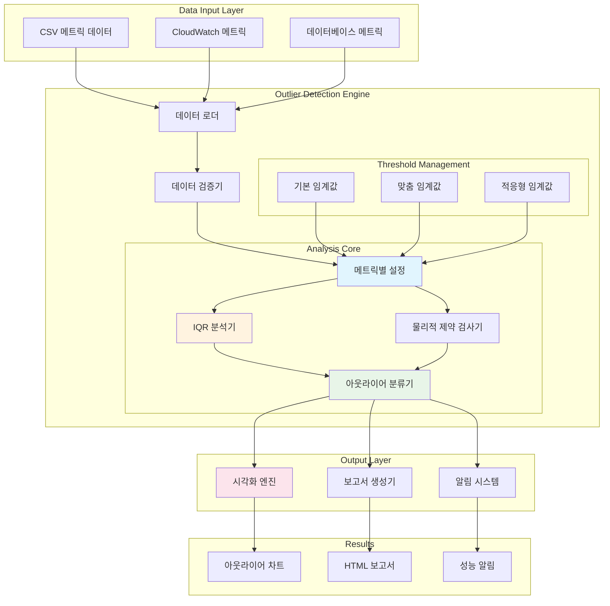
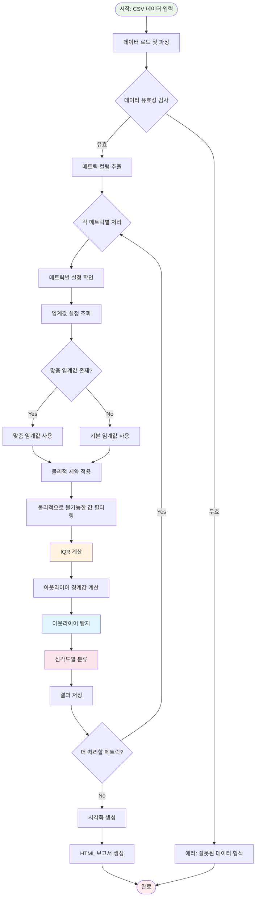
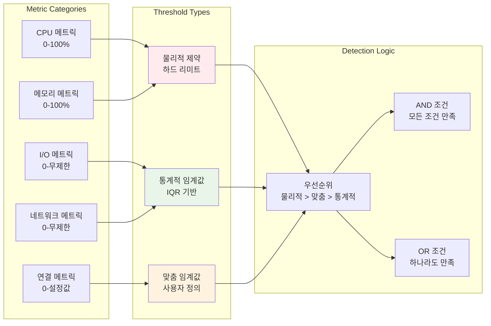

# 🔍 DB Assistant Outlier 분석 아키텍처

## 📋 목차
- [개요](#개요)
- [아키텍처 다이어그램](#아키텍처-다이어그램)
- [핵심 구성요소](#핵심-구성요소)
- [분석 알고리즘](#분석-알고리즘)
- [데이터 흐름](#데이터-흐름)
- [구현 세부사항](#구현-세부사항)
- [사용 예시](#사용-예시)

## 개요

DB Assistant의 outlier 분석은 데이터베이스 성능 메트릭에서 비정상적인 값을 탐지하여 성능 문제를 조기에 발견하는 핵심 기능입니다. 메트릭별 맞춤 임계값과 물리적 제약을 적용한 지능형 아웃라이어 탐지 시스템을 제공합니다.

### 🎯 주요 특징
- **메트릭별 맞춤 임계값**: 각 메트릭의 특성에 맞는 개별 기준 적용
- **물리적 제약 고려**: CPU 100% 초과 등 물리적으로 불가능한 값 필터링
- **IQR 기반 탐지**: Interquartile Range를 활용한 통계적 아웃라이어 탐지
- **시각화 지원**: 탐지된 아웃라이어의 시각적 표현
- **자동 분류**: 심각도별 아웃라이어 분류 및 우선순위 제공

## 아키텍처 다이어그램

### 전체 시스템 아키텍처



### 아웃라이어 탐지 알고리즘 흐름



### 메트릭별 임계값 관리 시스템



## 핵심 구성요소

### 1. 메트릭별 설정 관리자 (MetricConfig)
**📍 매칭 함수**: `detect_metric_outliers()` 내부 설정

```python
# 실제 구현된 메트릭별 맞춤 임계값 설정
METRIC_SPECIFIC_THRESHOLDS = {
    'CPUUtilization': {
        'max_physical': 100.0,
        'iqr_multiplier': 2.0,
        'severity_high': 90.0,
        'severity_medium': 70.0
    },
    'FreeableMemory': {
        'min_physical': 0.0,
        'iqr_multiplier': 2.5,
        'severity_high': 10.0,  # 10% 미만
        'severity_medium': 20.0
    },
    'DatabaseConnections': {
        'min_physical': 0.0,
        'max_physical': 1000.0,  # 설정 기반
        'iqr_multiplier': 3.0
    }
}
```

### 2. IQR 기반 아웃라이어 탐지기
**📍 매칭 함수**: `detect_metric_outliers()` - IQR 계산 로직

```python
# 실제 구현: detect_metric_outliers() 내부
Q1 = df[metric].quantile(0.25)
Q3 = df[metric].quantile(0.75)
IQR = Q3 - Q1
multiplier = config.get('iqr_multiplier', std_threshold)
lower_bound = Q1 - multiplier * IQR
upper_bound = Q3 + multiplier * IQR
```

### 3. 물리적 제약 검사기
**📍 매칭 함수**: `detect_metric_outliers()` - 물리적 제약 적용 로직

```python
# 실제 구현: detect_metric_outliers() 내부
# 물리적 제약 적용
if 'max_physical' in config:
    df_filtered = df_filtered[df_filtered[metric] <= config['max_physical']]
if 'min_physical' in config:
    df_filtered = df_filtered[df_filtered[metric] >= config['min_physical']]
```

### 4. 아웃라이어 분류기
**📍 매칭 함수**: `detect_metric_outliers()` - 심각도 분류 로직

```python
# 실제 구현: detect_metric_outliers() 내부
def get_severity(value, config):
    if 'severity_high' in config and value >= config['severity_high']:
        return 'HIGH'
    elif 'severity_medium' in config and value >= config['severity_medium']:
        return 'MEDIUM'
    return 'LOW'
```

## 분석 알고리즘

### IQR (Interquartile Range) 방식

```
아웃라이어 탐지 공식:
- Q1 = 25th percentile
- Q3 = 75th percentile  
- IQR = Q3 - Q1
- Lower Bound = Q1 - (multiplier × IQR)
- Upper Bound = Q3 + (multiplier × IQR)

아웃라이어 조건:
- value < Lower Bound OR value > Upper Bound
```

### 메트릭별 맞춤 기준

| 메트릭 | 물리적 제약 | IQR 배수 | 특별 고려사항 |
|--------|-------------|----------|---------------|
| CPUUtilization | 0-100% | 2.0 | 100% 초과 시 무효 |
| FreeableMemory | ≥0 | 2.5 | 0에 가까울수록 위험 |
| DatabaseConnections | ≥0 | 3.0 | 설정된 최대값 고려 |
| ReadIOPS/WriteIOPS | ≥0 | 2.0 | 급격한 증가 패턴 중요 |
| ReadLatency/WriteLatency | ≥0 | 1.5 | 지연시간 민감도 높음 |

## 데이터 흐름

### 1. 데이터 입력 단계
```
CSV 파일 → 데이터 로드 → 유효성 검사 → 메트릭 컬럼 추출
```

### 2. 전처리 단계
```
메트릭별 설정 조회 → 물리적 제약 적용 → 무효값 필터링
```

### 3. 분석 단계
```
IQR 계산 → 아웃라이어 경계값 산출 → 아웃라이어 탐지
```

### 4. 후처리 단계
```
심각도 분류 → 시각화 생성 → HTML 보고서 작성
```

## 구현 세부사항

### 핵심 함수: `detect_metric_outliers`
**📍 MCP 도구 함수**: `detect_metric_outliers(csv_file, std_threshold)`

```python
@server.call_tool()
async def detect_metric_outliers(csv_file: str, std_threshold: float = 3.0):
    """
    개선된 아웃라이어 탐지 - 메트릭별 맞춤 임계값과 물리적 제약 적용
    
    Args:
        csv_file: 분석할 CSV 파일명
        std_threshold: IQR 방식용 임계값 (메트릭별 맞춤 기준 우선 적용)
    
    Returns:
        dict: 아웃라이어 분석 결과
    """
```

### 관련 지원 함수들

#### 1. 데이터 수집 함수
**📍 매칭 함수**: `collect_db_metrics()`
```python
@server.call_tool()
async def collect_db_metrics(
    db_instance_identifier: str,
    hours: int = 24,
    metrics: Optional[List[str]] = None,
    region: str = "us-east-1"
):
    """CloudWatch에서 데이터베이스 메트릭을 수집합니다"""
```

#### 2. 메트릭 요약 함수
**📍 매칭 함수**: `get_metric_summary()`
```python
@server.call_tool()
async def get_metric_summary(csv_file: str):
    """CSV 파일의 메트릭 요약 정보를 조회합니다"""
```

#### 3. 상관관계 분석 함수
**📍 매칭 함수**: `analyze_metric_correlation()`
```python
@server.call_tool()
async def analyze_metric_correlation(
    csv_file: str,
    target_metric: str = "CPUUtilization",
    top_n: int = 10
):
    """메트릭 간 상관관계를 분석합니다"""
```

#### 4. 회귀 분석 함수
**📍 매칭 함수**: `perform_regression_analysis()`
```python
@server.call_tool()
async def perform_regression_analysis(
    csv_file: str,
    predictor_metric: str,
    target_metric: str = "CPUUtilization"
):
    """메트릭 간 회귀 분석을 수행합니다"""
```

#### 5. 데이터 파일 관리 함수
**📍 매칭 함수**: `list_data_files()`
```python
@server.call_tool()
async def list_data_files():
    """데이터 디렉토리의 CSV 파일 목록을 조회합니다"""
```

### 메트릭별 설정 구조
**📍 구현 위치**: `detect_metric_outliers()` 함수 내부

```python
# 실제 구현된 METRIC_SPECIFIC_THRESHOLDS
METRIC_SPECIFIC_THRESHOLDS = {
    'CPUUtilization': {
        'max_physical': 100.0,
        'iqr_multiplier': 2.0,
        'severity_high': 90.0,
        'severity_medium': 70.0,
        'description': 'CPU 사용률 (%)'
    },
    'FreeableMemory': {
        'min_physical': 0.0,
        'iqr_multiplier': 2.5,
        'severity_high': 10.0,
        'severity_medium': 20.0,
        'description': '사용 가능한 메모리 (%)'
    },
    'DatabaseConnections': {
        'min_physical': 0.0,
        'max_physical': 1000.0,
        'iqr_multiplier': 3.0,
        'description': '데이터베이스 연결 수'
    },
    'ReadIOPS': {
        'min_physical': 0.0,
        'iqr_multiplier': 2.0,
        'description': '읽기 IOPS'
    },
    'WriteIOPS': {
        'min_physical': 0.0,
        'iqr_multiplier': 2.0,
        'description': '쓰기 IOPS'
    },
    'ReadLatency': {
        'min_physical': 0.0,
        'iqr_multiplier': 1.5,
        'severity_high': 0.1,
        'severity_medium': 0.05,
        'description': '읽기 지연시간 (초)'
    },
    'WriteLatency': {
        'min_physical': 0.0,
        'iqr_multiplier': 1.5,
        'severity_high': 0.1,
        'severity_medium': 0.05,
        'description': '쓰기 지연시간 (초)'
    }
}
```

### 시각화 구성요소
**📍 구현 위치**: `detect_metric_outliers()` 함수 내부 - matplotlib 사용

```python
# 실제 시각화 코드 구조
import matplotlib.pyplot as plt
import seaborn as sns

# 1. 시계열 차트 생성
plt.figure(figsize=(15, 10))
for i, metric in enumerate(metrics_to_analyze):
    plt.subplot(rows, cols, i+1)
    # 시계열 플롯 + 아웃라이어 표시

# 2. 박스플롯 생성  
plt.figure(figsize=(12, 8))
df[metrics_to_analyze].boxplot()

# 3. 히스토그램 생성
for metric in metrics_to_analyze:
    plt.hist(df[metric], bins=30, alpha=0.7)
```

## 사용 예시

### 기본 사용법
**📍 호출 함수**: `detect_metric_outliers()`

```bash
# Amazon Q CLI에서 실행
"db_metrics_20250917.csv 파일의 아웃라이어를 분석해주세요"

# 실제 MCP 함수 호출:
detect_metric_outliers(csv_file="db_metrics_20250917.csv", std_threshold=3.0)
```

### 고급 사용법
**📍 호출 함수**: `detect_metric_outliers()` + 파라미터 조정

```bash
# 임계값 조정
"db_metrics_20250917.csv 파일을 IQR 배수 2.5로 아웃라이어 분석해주세요"

# 실제 MCP 함수 호출:
detect_metric_outliers(csv_file="db_metrics_20250917.csv", std_threshold=2.5)
```

### 연관 워크플로우 함수들

#### 1. 데이터 수집부터 분석까지
```bash
# 1단계: 메트릭 수집
collect_db_metrics(db_instance_identifier="mysql-prod", hours=24)

# 2단계: 파일 목록 확인  
list_data_files()

# 3단계: 아웃라이어 분석
detect_metric_outliers(csv_file="db_metrics_mysql-prod_20250917.csv")

# 4단계: 상관관계 분석
analyze_metric_correlation(csv_file="db_metrics_mysql-prod_20250917.csv")
```

#### 2. 종합 성능 분석 워크플로우
**📍 호출 함수**: `generate_comprehensive_performance_report()`

```bash
# 종합 분석 (아웃라이어 분석 포함)
generate_comprehensive_performance_report(
    database_secret="rds-mysql-dev",
    db_instance_identifier="mysql-prod-instance",
    hours=24
)
```

### 분석 결과 예시
**📍 출력 함수**: `detect_metric_outliers()` 반환값

```python
# 실제 함수 반환 구조
{
    "summary": {
        "total_metrics": 13,
        "total_outliers": 47,
        "high_severity": 12,
        "medium_severity": 18,
        "low_severity": 17
    },
    "outliers_by_metric": {
        "CPUUtilization": [
            {
                "timestamp": "2025-09-17 14:23:15",
                "value": 98.5,
                "severity": "HIGH",
                "normal_range": "15.2% - 65.8%"
            }
        ]
    },
    "visualization_path": "data/outlier_analysis_20250917_151350.png",
    "report_path": "output/outlier_report_20250917_151350.html"
}
```

## 🔧 확장 가능성

### 1. 머신러닝 통합
**📍 확장 가능 함수**: `detect_metric_outliers()` + ML 모델
- 시계열 예측 모델 적용
- 이상 탐지 알고리즘 (Isolation Forest, LSTM)
- 자동 임계값 학습

```python
# 향후 확장 예시
@server.call_tool()
async def detect_ml_outliers(csv_file: str, model_type: str = "isolation_forest"):
    """머신러닝 기반 아웃라이어 탐지"""
```

### 2. 실시간 모니터링
**📍 확장 가능 함수**: CloudWatch 스트리밍 + `detect_metric_outliers()`
- 스트리밍 데이터 처리
- 실시간 알림 시스템
- 자동 복구 메커니즘

```python
# 향후 확장 예시
@server.call_tool()
async def monitor_realtime_outliers(
    db_instance_identifier: str,
    alert_threshold: str = "HIGH"
):
    """실시간 아웃라이어 모니터링"""
```

### 3. 다중 데이터베이스 지원
**📍 확장 가능 함수**: 기존 함수들의 다중 DB 지원
- PostgreSQL, Oracle 메트릭 지원
- NoSQL 데이터베이스 모니터링  
- 클라우드 네이티브 메트릭 통합

```python
# 향후 확장 예시
@server.call_tool()
async def detect_multi_db_outliers(
    database_configs: List[dict],
    db_types: List[str] = ["mysql", "postgresql", "oracle"]
):
    """다중 데이터베이스 아웃라이어 탐지"""
```

## 📋 함수 매핑 요약표

| 아키텍처 구성요소 | 실제 MCP 함수 | 역할 |
|------------------|---------------|------|
| **데이터 로더** | `collect_db_metrics()` | CloudWatch 메트릭 수집 |
| **데이터 검증기** | `list_data_files()` | CSV 파일 존재성 확인 |
| **메트릭 설정 관리자** | `detect_metric_outliers()` 내부 | 메트릭별 임계값 관리 |
| **IQR 분석기** | `detect_metric_outliers()` 내부 | IQR 기반 아웃라이어 탐지 |
| **물리적 제약 검사기** | `detect_metric_outliers()` 내부 | 물리적 불가능 값 필터링 |
| **아웃라이어 분류기** | `detect_metric_outliers()` 내부 | 심각도별 분류 |
| **시각화 엔진** | `detect_metric_outliers()` 내부 | matplotlib 차트 생성 |
| **보고서 생성기** | `detect_metric_outliers()` 내부 | HTML 보고서 작성 |
| **상관관계 분석** | `analyze_metric_correlation()` | 메트릭 간 상관관계 분석 |
| **회귀 분석** | `perform_regression_analysis()` | 예측 모델링 |
| **메트릭 요약** | `get_metric_summary()` | 통계 요약 정보 |
| **종합 분석** | `generate_comprehensive_performance_report()` | 전체 성능 분석 (아웃라이어 포함) |

## 🔄 함수 호출 체인

### 기본 아웃라이어 분석 체인
```
사용자 요청 → detect_metric_outliers() → 내부 처리 체인:
├── 데이터 로드 및 검증
├── 메트릭별 설정 적용  
├── 물리적 제약 필터링
├── IQR 계산 및 아웃라이어 탐지
├── 심각도 분류
├── 시각화 생성
└── HTML 보고서 작성
```

### 종합 성능 분석 체인 (아웃라이어 포함)
```
generate_comprehensive_performance_report() → 
├── collect_db_metrics()
├── collect_slow_queries()  
├── collect_cpu_intensive_queries()
├── collect_memory_intensive_queries()
├── analyze_metric_correlation()
├── detect_metric_outliers() ← 여기서 아웃라이어 분석
├── perform_regression_analysis()
└── HTML 종합 보고서 생성
```

---

**🎯 결론**

DB Assistant의 outlier 분석 시스템은 메트릭별 맞춤 임계값과 물리적 제약을 고려한 지능형 아웃라이어 탐지를 제공합니다. IQR 기반의 통계적 접근법과 도메인 지식을 결합하여 정확하고 실용적인 성능 이상 탐지를 실현합니다.
