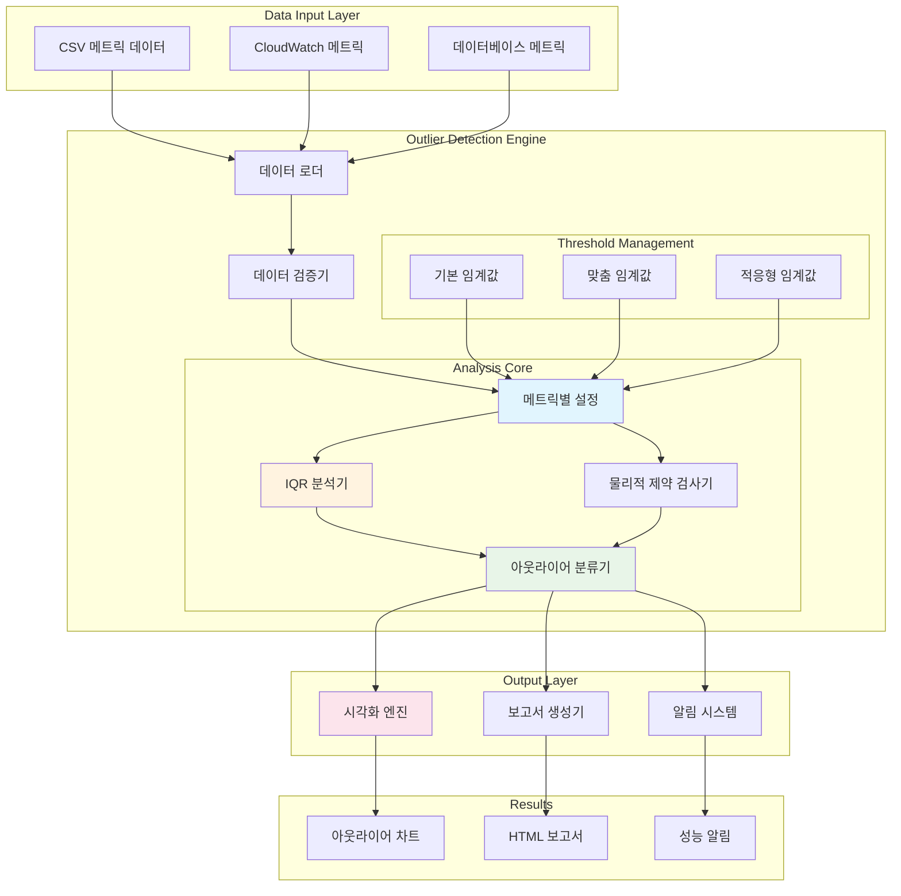
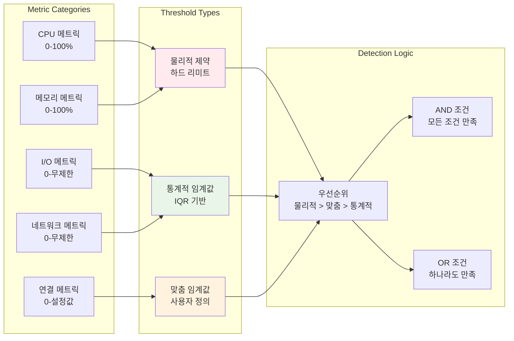

# 🔍 DB Assistant Outlier 분석 아키텍처

## 📋 목차
- [개요](#개요)
- [아키텍처 다이어그램](#아키텍처-다이어그램)
- [핵심 구성요소](#핵심-구성요소)
- [분석 알고리즘](#분석-알고리즘)
- [데이터 흐름](#데이터-흐름)
- [구현 세부사항](#구현-세부사항)
- [사용 예시](#사용-예시)

## 개요

DB Assistant의 outlier 분석은 데이터베이스 성능 메트릭에서 비정상적인 값을 탐지하여 성능 문제를 조기에 발견하는 핵심 기능입니다. 메트릭별 맞춤 임계값과 물리적 제약을 적용한 지능형 아웃라이어 탐지 시스템을 제공합니다.

### 🎯 주요 특징
- **메트릭별 맞춤 임계값**: 각 메트릭의 특성에 맞는 개별 기준 적용
- **물리적 제약 고려**: CPU 100% 초과 등 물리적으로 불가능한 값 필터링
- **IQR 기반 탐지**: Interquartile Range를 활용한 통계적 아웃라이어 탐지
- **시각화 지원**: 탐지된 아웃라이어의 시각적 표현
- **자동 분류**: 심각도별 아웃라이어 분류 및 우선순위 제공

## 아키텍처 다이어그램

### 전체 시스템 아키텍처



### 아웃라이어 탐지 알고리즘 흐름


### 메트릭별 임계값 관리 시스템



## 핵심 구성요소

### 1. 메트릭별 설정 관리자 (MetricConfig)

```python
# 메트릭별 맞춤 임계값 설정
METRIC_SPECIFIC_THRESHOLDS = {
    'CPUUtilization': {
        'max_physical': 100.0,
        'iqr_multiplier': 2.0,
        'severity_high': 90.0,
        'severity_medium': 70.0
    },
    'FreeableMemory': {
        'min_physical': 0.0,
        'iqr_multiplier': 2.5,
        'severity_high': 10.0,  # 10% 미만
        'severity_medium': 20.0
    },
    'DatabaseConnections': {
        'min_physical': 0.0,
        'max_physical': 1000.0,  # 설정 기반
        'iqr_multiplier': 3.0
    }
}
```

### 2. IQR 기반 아웃라이어 탐지기

```python
def calculate_iqr_bounds(data, multiplier=1.5):
    """IQR 방식으로 아웃라이어 경계값 계산"""
    Q1 = data.quantile(0.25)
    Q3 = data.quantile(0.75)
    IQR = Q3 - Q1
    
    lower_bound = Q1 - multiplier * IQR
    upper_bound = Q3 + multiplier * IQR
    
    return lower_bound, upper_bound
```

### 3. 물리적 제약 검사기

```python
def apply_physical_constraints(metric_name, value):
    """물리적으로 불가능한 값 필터링"""
    constraints = METRIC_SPECIFIC_THRESHOLDS.get(metric_name, {})
    
    # 최대값 제약
    if 'max_physical' in constraints:
        if value > constraints['max_physical']:
            return None  # 무효한 값
    
    # 최소값 제약
    if 'min_physical' in constraints:
        if value < constraints['min_physical']:
            return None  # 무효한 값
    
    return value
```

### 4. 아웃라이어 분류기

```python
def classify_outlier_severity(metric_name, value):
    """아웃라이어 심각도 분류"""
    config = METRIC_SPECIFIC_THRESHOLDS.get(metric_name, {})
    
    if 'severity_high' in config:
        if value >= config['severity_high']:
            return 'HIGH'
    
    if 'severity_medium' in config:
        if value >= config['severity_medium']:
            return 'MEDIUM'
    
    return 'LOW'
```

## 분석 알고리즘

### IQR (Interquartile Range) 방식

```
아웃라이어 탐지 공식:
- Q1 = 25th percentile
- Q3 = 75th percentile  
- IQR = Q3 - Q1
- Lower Bound = Q1 - (multiplier × IQR)
- Upper Bound = Q3 + (multiplier × IQR)

아웃라이어 조건:
- value < Lower Bound OR value > Upper Bound
```

### 메트릭별 맞춤 기준

| 메트릭 | 물리적 제약 | IQR 배수 | 특별 고려사항 |
|--------|-------------|----------|---------------|
| CPUUtilization | 0-100% | 2.0 | 100% 초과 시 무효 |
| FreeableMemory | ≥0 | 2.5 | 0에 가까울수록 위험 |
| DatabaseConnections | ≥0 | 3.0 | 설정된 최대값 고려 |
| ReadIOPS/WriteIOPS | ≥0 | 2.0 | 급격한 증가 패턴 중요 |
| ReadLatency/WriteLatency | ≥0 | 1.5 | 지연시간 민감도 높음 |

## 데이터 흐름

### 1. 데이터 입력 단계
```
CSV 파일 → 데이터 로드 → 유효성 검사 → 메트릭 컬럼 추출
```

### 2. 전처리 단계
```
메트릭별 설정 조회 → 물리적 제약 적용 → 무효값 필터링
```

### 3. 분석 단계
```
IQR 계산 → 아웃라이어 경계값 산출 → 아웃라이어 탐지
```

### 4. 후처리 단계
```
심각도 분류 → 시각화 생성 → HTML 보고서 작성
```

## 구현 세부사항

### 핵심 함수: `detect_metric_outliers`

```python
def detect_metric_outliers(csv_file: str, std_threshold: float = 3.0):
    """
    개선된 아웃라이어 탐지 - 메트릭별 맞춤 임계값과 물리적 제약 적용
    
    Args:
        csv_file: 분석할 CSV 파일명
        std_threshold: IQR 방식용 임계값 (메트릭별 맞춤 기준 우선 적용)
    
    Returns:
        dict: 아웃라이어 분석 결과
    """
```

### 메트릭별 설정 구조

```python
METRIC_SPECIFIC_THRESHOLDS = {
    'metric_name': {
        'max_physical': float,      # 물리적 최대값
        'min_physical': float,      # 물리적 최소값
        'iqr_multiplier': float,    # IQR 배수
        'severity_high': float,     # 높은 심각도 임계값
        'severity_medium': float,   # 중간 심각도 임계값
        'description': str          # 메트릭 설명
    }
}
```

### 시각화 구성요소

```python
# 아웃라이어 시각화 요소
- 시계열 차트: 시간에 따른 메트릭 변화
- 박스플롯: 분포 및 아웃라이어 위치
- 히스토그램: 값의 분포 패턴
- 산점도: 메트릭 간 상관관계
```

## 사용 예시

### 기본 사용법

```bash
# Amazon Q CLI에서 실행
"db_metrics_20250917.csv 파일의 아웃라이어를 분석해주세요"
```

### 고급 사용법

```bash
# 임계값 조정
"db_metrics_20250917.csv 파일을 IQR 배수 2.5로 아웃라이어 분석해주세요"

# 특정 메트릭 집중 분석
"CPU 사용률 메트릭의 아웃라이어만 분석해주세요"
```

### 분석 결과 예시

```
🔍 아웃라이어 탐지 결과

📊 전체 요약:
• 분석 메트릭: 13개
• 탐지된 아웃라이어: 47개
• 높은 심각도: 12개
• 중간 심각도: 18개
• 낮은 심각도: 17개

⚠️ 주요 아웃라이어:
1. CPUUtilization: 98.5% (2025-09-17 14:23:15)
   - 심각도: HIGH
   - 정상 범위: 15.2% - 65.8%
   - 권장조치: 즉시 부하 분산 검토

2. FreeableMemory: 2.1% (2025-09-17 14:25:30)
   - 심각도: HIGH  
   - 정상 범위: 25.5% - 78.9%
   - 권장조치: 메모리 증설 또는 쿼리 최적화

📈 시각화: outlier_analysis_20250917_151350.png
📄 상세 보고서: outlier_report_20250917_151350.html
```

## 🔧 확장 가능성

### 1. 머신러닝 통합
- 시계열 예측 모델 적용
- 이상 탐지 알고리즘 (Isolation Forest, LSTM)
- 자동 임계값 학습

### 2. 실시간 모니터링
- 스트리밍 데이터 처리
- 실시간 알림 시스템
- 자동 복구 메커니즘

### 3. 다중 데이터베이스 지원
- PostgreSQL, Oracle 메트릭 지원
- NoSQL 데이터베이스 모니터링
- 클라우드 네이티브 메트릭 통합

---

**🎯 결론**

DB Assistant의 outlier 분석 시스템은 메트릭별 맞춤 임계값과 물리적 제약을 고려한 지능형 아웃라이어 탐지를 제공합니다. IQR 기반의 통계적 접근법과 도메인 지식을 결합하여 정확하고 실용적인 성능 이상 탐지를 실현합니다.
