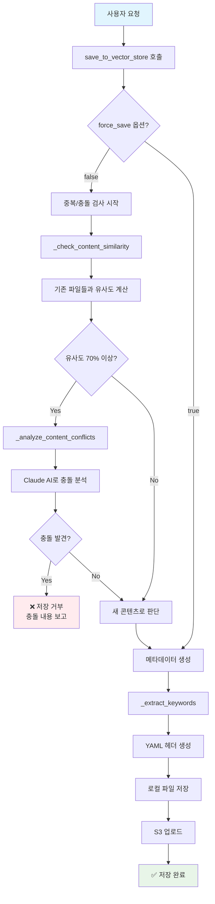
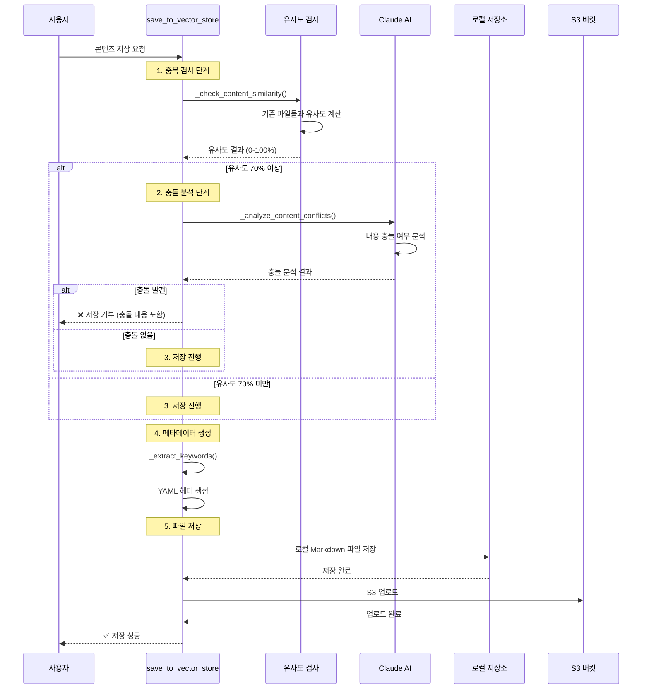
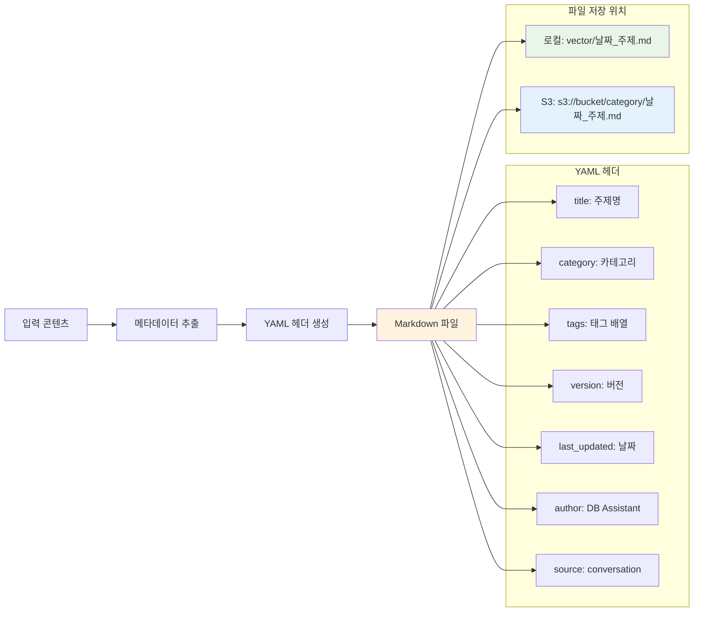
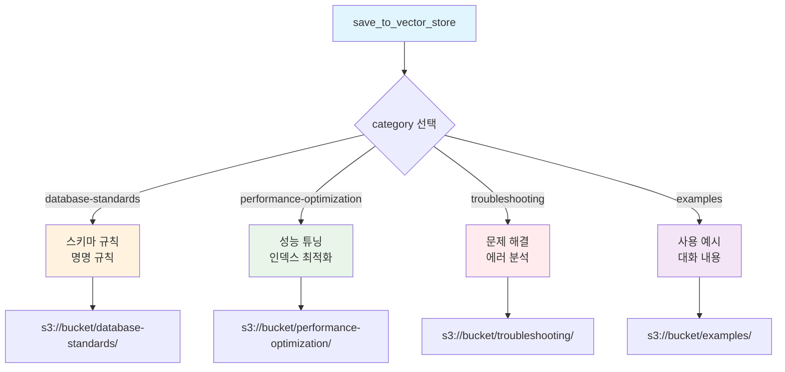
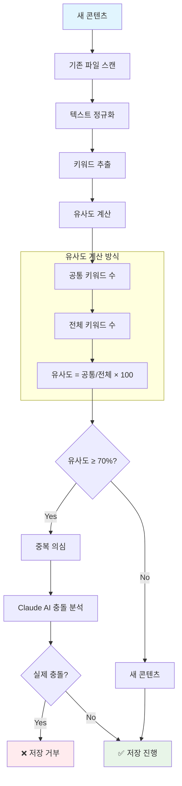

# save_to_vector_store 기능 워크플로우

## 전체 프로세스 다이어그램

```mermaid
flowchart TD
    A[사용자 요청] --> B[save_to_vector_store 호출]
    B --> C{force_save 옵션?}
    
    C -->|false| D[중복/충돌 검사 시작]
    C -->|true| M[검사 건너뛰기]
    
    D --> E[_check_content_similarity]
    E --> F[기존 파일들과 유사도 계산]
    F --> G{유사도 70% 이상?}
    
    G -->|Yes| H[_analyze_content_conflicts]
    G -->|No| L[새 콘텐츠로 판단]
    
    H --> I[Claude AI로 충돌 분석]
    I --> J{충돌 발견?}
    
    J -->|Yes| K[❌ 저장 거부<br/>충돌 내용 보고]
    J -->|No| L[새 콘텐츠로 판단]
    
    L --> M[메타데이터 생성]
    M --> N[_extract_keywords]
    N --> O[YAML 헤더 생성]
    O --> P[로컬 파일 저장]
    P --> Q[S3 업로드]
    Q --> R[✅ 저장 완료]
    
    style A fill:#e1f5fe
    style K fill:#ffebee
    style R fill:#e8f5e8
```

## 상세 검증 프로세스

```mermaid
sequenceDiagram
    participant User as 사용자
    participant API as save_to_vector_store
    participant Similarity as 유사도 검사
    participant Claude as Claude AI
    participant Local as 로컬 저장소
    participant S3 as S3 버킷
    
    User->>API: 콘텐츠 저장 요청
    
    Note over API: 1. 중복 검사 단계
    API->>Similarity: _check_content_similarity()
    Similarity->>Similarity: 기존 파일들과 유사도 계산
    Similarity-->>API: 유사도 결과 (0-100%)
    
    alt 유사도 70% 이상
        Note over API: 2. 충돌 분석 단계
        API->>Claude: _analyze_content_conflicts()
        Claude->>Claude: 내용 충돌 여부 분석
        Claude-->>API: 충돌 분석 결과
        
        alt 충돌 발견
            API-->>User: ❌ 저장 거부 (충돌 내용 포함)
        else 충돌 없음
            Note over API: 3. 저장 진행
        end
    else 유사도 70% 미만
        Note over API: 3. 저장 진행
    end
    
    Note over API: 4. 메타데이터 생성
    API->>API: _extract_keywords()
    API->>API: YAML 헤더 생성
    
    Note over API: 5. 파일 저장
    API->>Local: 로컬 Markdown 파일 저장
    Local-->>API: 저장 완료
    
    API->>S3: S3 업로드
    S3-->>API: 업로드 완료
    
    API-->>User: ✅ 저장 성공
```

## 파일 구조 및 메타데이터

```mermaid
graph LR
    A[입력 콘텐츠] --> B[메타데이터 추출]
    B --> C[YAML 헤더 생성]
    C --> D[Markdown 파일]
    
    subgraph "YAML 헤더"
        E[title: 주제명]
        F[category: 카테고리]
        G[tags: 태그 배열]
        H[version: 버전]
        I[last_updated: 날짜]
        J[author: DB Assistant]
        K[source: conversation]
    end
    
    subgraph "파일 저장 위치"
        L[로컬: vector/날짜_주제.md]
        M[S3: s3://bucket/category/날짜_주제.md]
    end
    
    D --> E
    D --> F
    D --> G
    D --> H
    D --> I
    D --> J
    D --> K
    
    D --> L
    D --> M
    
    style D fill:#fff3e0
    style L fill:#e8f5e8
    style M fill:#e3f2fd
```

## 카테고리별 저장 경로

```mermaid
graph TD
    A[save_to_vector_store] --> B{category 선택}
    
    B -->|database-standards| C[스키마 규칙<br/>명명 규칙]
    B -->|performance-optimization| D[성능 튜닝<br/>인덱스 최적화]
    B -->|troubleshooting| E[문제 해결<br/>에러 분석]
    B -->|examples| F[사용 예시<br/>대화 내용]
    
    C --> G[s3://bucket/database-standards/]
    D --> H[s3://bucket/performance-optimization/]
    E --> I[s3://bucket/troubleshooting/]
    F --> J[s3://bucket/examples/]
    
    style A fill:#e1f5fe
    style C fill:#fff3e0
    style D fill:#e8f5e8
    style E fill:#ffebee
    style F fill:#f3e5f5
```

## 유사도 검사 알고리즘

```mermaid
flowchart TD
    A[새 콘텐츠] --> B[기존 파일 스캔]
    B --> C[텍스트 정규화]
    C --> D[키워드 추출]
    D --> E[유사도 계산]
    
    subgraph "유사도 계산 방식"
        F[공통 키워드 수]
        G[전체 키워드 수]
        H[유사도 = 공통/전체 × 100]
    end
    
    E --> F
    F --> G
    G --> H
    
    H --> I{유사도 ≥ 70%?}
    I -->|Yes| J[중복 의심]
    I -->|No| K[새 콘텐츠]
    
    J --> L[Claude AI 충돌 분석]
    L --> M{실제 충돌?}
    M -->|Yes| N[❌ 저장 거부]
    M -->|No| O[✅ 저장 진행]
    
    K --> O
    
    style A fill:#e1f5fe
    style N fill:#ffebee
    style O fill:#e8f5e8
```
